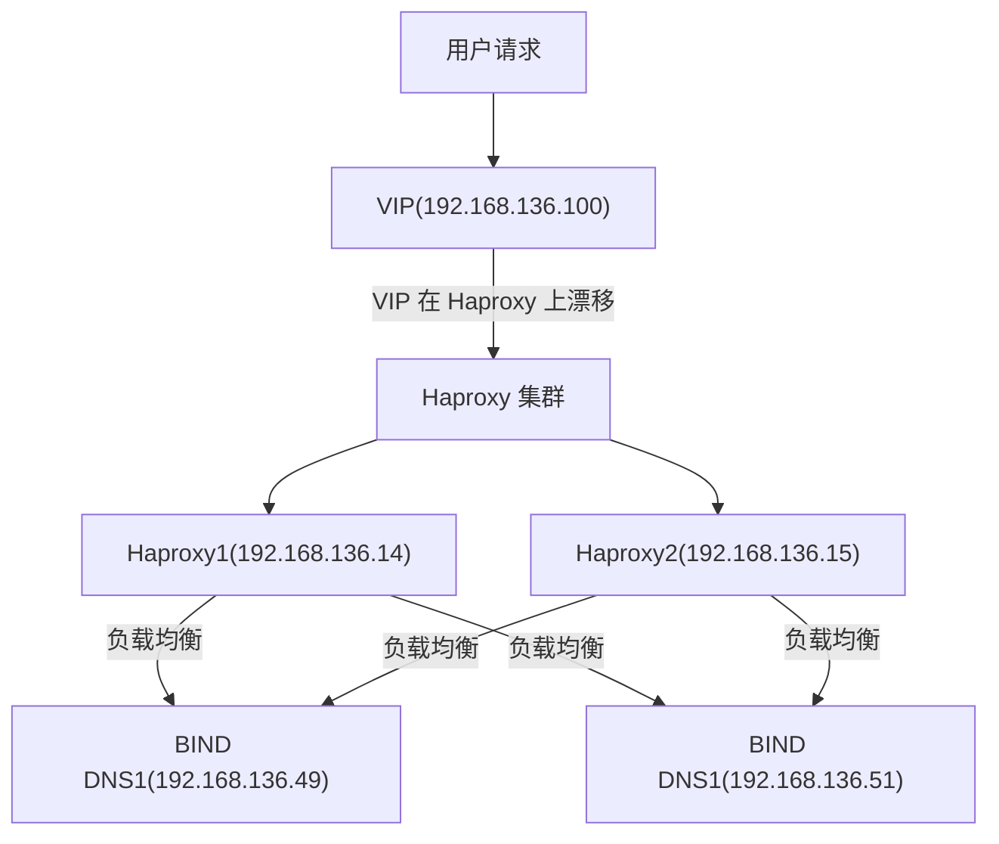

```
[应用层（HTTP、HTTPS、DNS 查询、代码指令）]
   ↑ ↓
[传输层（TCP/UDP/Unix Socket）]
   ↑ ↓
[网络层（IPv4/IPv6 分片、路由）]
   ↑ ↓
[数据链路层（以太网帧 / WiFi 帧）]
   ↑ ↓
[物理层（电流/光信号 / 无线电波）]
```


## DNS 查询全链路剖析

==1.用户发起查询==
当你在浏览器中输入一个域名（例如 `www.example.com`）时，浏览器需要将 `www.example.com` 解析成具体的 IP 地址，然后根据 IP 加 端口进行访问（HTTP 默认 80，HTTPS 默认 443）

> [!NOTE] 注意事项
> 1. HTTP 的默认端口是：80
> 2. HTTPS 的默认端口是：443


==2.浏览器查看自己的 DNS缓存==
浏览器内部会首先在内存中查找 DNS 缓存，如果该域名已经解析过且缓存未过期，则直接使用缓存结果返回，不再进行后续查询。

> [!NOTE] 注意事项
> 1. 若缓存保存在内存中（未持久化），当操作系统（电脑）关闭后，其内存中的 DNS 缓存就会被清空
> 2. Chrome 查询缓存就是存储在浏览器进程的内存中


==3.操作系统检查 Hosts==
若浏览器未在自己的内存中找到 DNS 缓存，它会向操作系统（OS）发出“解析请求”，在操作系统内部，最先被检查的是本地的 `Hosts` 文件（如 Linux 下的 `/etc/hosts`，Windows 下的 `C:\Windows\System32\drivers\etc\hosts`）


==4.操作系统检查自己的 DNS 缓存==
如果 Hosts 文件中没有匹配项，OS 会继续查看它自己维护的 DNS 缓存（由系统级缓存守护进程提供，如 macOS 的 mDNSResponder、Windows 的 DNS Client service，或 Linux 上常见的 systemd-resolved、nscd、dnsmasq 等）


==5.操作系统向 DNS 服务器发起查询==
以上都没命中的话，OS 才会根据 `/etc/resolv.conf` 或系统设置，准备向配置好的 DNS（如运营商 DNS、公共 DNS）发起真实的 UDP（或在必要时 TCP）查询，拿到结果后再缓存到系统级 DNS 缓存，最后返回给浏览器。


==6.操作系统（应用层）构造 DNS 协议报文==


假设你在网络配置中将 BIND DNS 服务器设置为首选 DNS（例如 IP 为 192.168.1.100），而将 Google 的 8.8.8.8 设置为备用 DNS，整个解析过程如下：
1. ==用户发起查询== ：
	1. 当你在浏览器中输入一个域名（例如 `www.baidu.com`）时，浏览器开始向 DNS 系统发起解析请求。
2. ==浏览器 DNS 缓存检查==：
	1. 浏览器内部会首先在内存中查找 DNS 缓存，如果该域名已经解析过且缓存未过期，则直接使用缓存结果返回，不再进行后续查询。
	2. 注意：浏览器关闭后，其内存中的 DNS 缓存就会清空。
3. ==操作系统 DNS 缓存检查==：
	1. 如果浏览器缓存中没有有效记录，操作系统（例如 Linux、Windows、macOS）会检查系统级 DNS 缓存（通常存储在内存中）
	2. 注意：若缓存存储在内存中，操作系统关闭后，其内存中的 DNS 缓存就会被清空
4. ==首选 DNS 服务器介入==
	1. 当本地缓存均未命中时，操作系统将查询请求发送给配置的首选 DNS 服务器，即你部署的 BIND DNS 服务器（通过 UDP 53 端口，必要时使用 TCP 53）
	2. <font color="#00b0f0">BIND DNS 缓存查找</font>：
		1. BIND 首先在自身的内存缓存中查找该域名的解析记录。如果有且未过期，立即返回给操作系统
		2. 如果配置了 `dump-file`（例如 `dump-file "/var/named/data/cache_dump.db";`），BIND 会定期将内存中的缓存持久化到磁盘上，以便在重启后恢复缓存，但实际查询仍以内存数据为主
	3. <font color="#00b0f0">进行权威解析</font>：
		1. BIND 检查自己是否为该域名（例如 `baidu.com`）的权威 DNS 服务器。如果 BIND 是权威服务器，则直接返回 `www.baidu.com` 对应的 IP 地址。
		2. 注意：通常，权威服务器由域名注册方（如`baidu.com` 是由百度公司）提供和管理，负责提供最终解析记录
	4. <font color="#00b0f0">进行递归解析</font>：
		1. 若 BIND 不是 `baidu.com` 的权威服务器，但配置了递归解析功能，则开始以下步骤：
		2. <font color="#7030a0">根服务器查询</font>：
			1. BIND 向全球仅有 13 组的根服务器发起查询，根服务器不保存具体 IP，而只返回顶级域（如 `.com` 或 `.cn`）的位置信息
		3. <font color="#7030a0">TLD 查询</font>：
			1. 根据根服务器的指示，BIND 向 `.com` 顶级域名服务器发出请求，询问 `baidu.com` 的权威 DNS 服务器的地址。
			2. 注意，TLD 服务器同样不存储具体 IP 地址，而是维护其下属二级域名（如 `baidu.com`、`google.com`）的权威 DNS 服务器地址，并指引查询请求前往对应的权威服务器获取最终解析结果。
		4. <font color="#7030a0">权威服务器查询</font>：
			1. TLD 服务器返回 `baidu.com` 的权威服务器地址（如 `ns1.baidu.com`）后，BIND 再向该权威服务器发起查询，最终获得 `www.baidu.com` 的真实 IP 地址
		5. <font color="#7030a0">缓存查询结果</font>：
			1. 获得解析结果后，BIND 会将结果缓存在内存中（并按配置持久化到 `dump-file`，以便后续使用），然后返回给操作系统
5. ==备用 DNS 服务器介入==：
	1. 如果首选 DNS 服务器（你的 BIND）因超时或其它原因无法返回有效结果，操作系统会自动将查询请求转向备用 DNS 服务器，即 Google 的 8.8.8.8。
	2. 8.8.8.8 并非某个域名的权威服务器，而是一个高性能的递归 DNS 服务器集群，依托 Anycast 技术在全球部署。由于其庞大的用户基数，热门域名往往已被缓存，命中率极高，从而减少了向根服务器和 TLD 服务器逐级查询的需求。如果缓存中无匹配记录，8.8.8.8 将按照标准递归解析流程，从根服务器开始查询直至获取最终 IP 地址。
6. ==返回解析结果==：
	1. <font color="#00b0f0">操作系统接受</font>：
		1. 操作系统从首选或备用 DNS 获得域名对应的 IP 地址后，将结果返回给浏览器
	2. <font color="#00b0f0">浏览器建立连接</font>：
		1. 浏览器使用该 IP 地址与目标服务器建立 HTTP/HTTPS 连接（通常是 80/443 端口），进而加载网页内容

> [!NOTE] 注意事项
> 1. <font color="#00b0f0">Anycast 技术</font>：
> 	- Google 在全球部署了数百个 8.8.8.8 服务器节点，并采用 `Anycast` 技术进行流量调度。当你访问 8.8.8.8 时，请求会自动路由到距离你最近的服务器节点。例如，在中国访问时，流量会被引导至亚洲的 Google DNS 集群，而在美国访问时，则会连接到北美的节点。这样可以避免解析请求跨国或跨大洲传输，从而大幅提升解析速度，降低网络延迟
> 2. <font color="#00b0f0">DNS 查询的本质</font>：
> 	- 简单来说，DNS 查询的流程是：首先检查缓存，如果缓存中有结果，则直接返回 IP 地址；如果缓存没有，就会通过其他方法找到该域名的权威 DNS 服务器，查询其区域记录。区域记录中会存储该域名的 IP 地址，查询到后即可返回该 IP 地址。


## 浏览器访问 HTTPS 网站的全链路剖析

### 网站服务器获取 HTTPS 证书

---


### 用户向你的网站发起访问

用户访问你的网站（如 `https://www.example.com`），当用户在地址栏按下回车后，浏览器开始准备与 `www.example.com` 的 TCP 443 端口进行连接。


---


### 1. 导图：[Map：BIND DNS](../../maps/Map：BINDDNS.xmind)

---


### 2. DNS 解析全流程

假设你在网络配置中将 BIND DNS 服务器设置为首选 DNS（例如 IP 为 192.168.1.100），而将 Google 的 8.8.8.8 设置为备用 DNS，整个解析过程如下：
1. ==用户发起查询== ：
	1. 当你在浏览器中输入一个域名（例如 `www.baidu.com`）时，浏览器开始向 DNS 系统发起解析请求。
2. ==浏览器 DNS 缓存检查==：
	1. 浏览器内部会首先在内存中查找 DNS 缓存，如果该域名已经解析过且缓存未过期，则直接使用缓存结果返回，不再进行后续查询。
	2. 注意：浏览器关闭后，其内存中的 DNS 缓存就会清空。
3. ==操作系统 DNS 缓存检查==：
	1. 如果浏览器缓存中没有有效记录，操作系统（例如 Linux、Windows、macOS）会检查系统级 DNS 缓存（通常存储在内存中）
	2. 注意：若缓存存储在内存中，操作系统关闭后，其内存中的 DNS 缓存就会被清空
4. ==首选 DNS 服务器介入==
	1. 当本地缓存均未命中时，操作系统将查询请求发送给配置的首选 DNS 服务器，即你部署的 BIND DNS 服务器（通过 UDP 53 端口，必要时使用 TCP 53）
	2. <font color="#00b0f0">BIND DNS 缓存查找</font>：
		1. BIND 首先在自身的内存缓存中查找该域名的解析记录。如果有且未过期，立即返回给操作系统
		2. 如果配置了 `dump-file`（例如 `dump-file "/var/named/data/cache_dump.db";`），BIND 会定期将内存中的缓存持久化到磁盘上，以便在重启后恢复缓存，但实际查询仍以内存数据为主
	3. <font color="#00b0f0">进行权威解析</font>：
		1. BIND 检查自己是否为该域名（例如 `baidu.com`）的权威 DNS 服务器。如果 BIND 是权威服务器，则直接返回 `www.baidu.com` 对应的 IP 地址。
		2. 注意：通常，权威服务器由域名注册方（如`baidu.com` 是由百度公司）提供和管理，负责提供最终解析记录
	4. <font color="#00b0f0">进行递归解析</font>：
		1. 若 BIND 不是 `baidu.com` 的权威服务器，但配置了递归解析功能，则开始以下步骤：
		2. <font color="#7030a0">根服务器查询</font>：
			1. BIND 向全球仅有 13 组的根服务器发起查询，根服务器不保存具体 IP，而只返回顶级域（如 `.com` 或 `.cn`）的位置信息
		3. <font color="#7030a0">TLD 查询</font>：
			1. 根据根服务器的指示，BIND 向 `.com` 顶级域名服务器发出请求，询问 `baidu.com` 的权威 DNS 服务器的地址。
			2. 注意，TLD 服务器同样不存储具体 IP 地址，而是维护其下属二级域名（如 `baidu.com`、`google.com`）的权威 DNS 服务器地址，并指引查询请求前往对应的权威服务器获取最终解析结果。
		4. <font color="#7030a0">权威服务器查询</font>：
			1. TLD 服务器返回 `baidu.com` 的权威服务器地址（如 `ns1.baidu.com`）后，BIND 再向该权威服务器发起查询，最终获得 `www.baidu.com` 的真实 IP 地址
		5. <font color="#7030a0">缓存查询结果</font>：
			1. 获得解析结果后，BIND 会将结果缓存在内存中（并按配置持久化到 `dump-file`，以便后续使用），然后返回给操作系统
5. ==备用 DNS 服务器介入==：
	1. 如果首选 DNS 服务器（你的 BIND）因超时或其它原因无法返回有效结果，操作系统会自动将查询请求转向备用 DNS 服务器，即 Google 的 8.8.8.8。
	2. 8.8.8.8 并非某个域名的权威服务器，而是一个高性能的递归 DNS 服务器集群，依托 Anycast 技术在全球部署。由于其庞大的用户基数，热门域名往往已被缓存，命中率极高，从而减少了向根服务器和 TLD 服务器逐级查询的需求。如果缓存中无匹配记录，8.8.8.8 将按照标准递归解析流程，从根服务器开始查询直至获取最终 IP 地址。
6. ==返回解析结果==：
	1. <font color="#00b0f0">操作系统接受</font>：
		1. 操作系统从首选或备用 DNS 获得域名对应的 IP 地址后，将结果返回给浏览器
	2. <font color="#00b0f0">浏览器建立连接</font>：
		1. 浏览器使用该 IP 地址与目标服务器建立 HTTP/HTTPS 连接（通常是 80/443 端口），进而加载网页内容

> [!NOTE] 注意事项
> 1. <font color="#00b0f0">Anycast 技术</font>：
> 	- Google 在全球部署了数百个 8.8.8.8 服务器节点，并采用 `Anycast` 技术进行流量调度。当你访问 8.8.8.8 时，请求会自动路由到距离你最近的服务器节点。例如，在中国访问时，流量会被引导至亚洲的 Google DNS 集群，而在美国访问时，则会连接到北美的节点。这样可以避免解析请求跨国或跨大洲传输，从而大幅提升解析速度，降低网络延迟
> 1. <font color="#00b0f0">DNS 查询的本质</font>：
> 	- 简单来说，DNS 查询的流程是：首先检查缓存，如果缓存中有结果，则直接返回 IP 地址；如果缓存没有，就会通过其他方法找到该域名的权威 DNS 服务器，查询其区域记录。区域记录中会存储该域名的 IP 地址，查询到后即可返回该 IP 地址。


---


### 3. BIND DNS 概述

BIND（Berkeley Internet Name Domain）是互联网上最常用的 DNS 服务器软件之一。BIND作为DNS服务器，支持多种DNS功能，包括但不限于：
1. <font color="#00b0f0">正向解析</font>：BIND 负责将域名（如 `www.example.com`）转换为 IP 地址（如 `192.0.2.1`），这是用户访问网站时的关键步骤。
2. <font color="#00b0f0">反向解析</font>：BIND 还支持执行反向DNS查询，即将IP地址映射回相应的域名。例如，查询`192.0.2.1`对应的域名是什么。
3. <font color="#00b0f0">递归查询</font>：BIND 可以作为递归 DNS 服务器运行，这意味着当收到一个它没有存储记录的域名查询请求时，它会代替客户端向其他DNS服务器发起查询，并通过一系列查询获取最终的域名解析结果返回给客户端
4. <font color="#00b0f0">可作为权威服务器</font>：可以作为某个域名的权威服务器（权威服务器是指拥有该域名记录最终解析权的服务器，通常由域名注册商提供。当你需要解析该域名时，要么将该域名的权威服务器设置为首选 DNS 服务器，直接由其返回解析结果；要么通过递归解析，从根节点->.com->权威服务器，最终由其返回解析结果。）

---


### 4. BIND DNS 组件

我们说 BIND DNS 实际上就是指的 BIND DNS 集群，其组件分 Master 节点和 Slave 节点：
1. ==Master 节点==
	1. 作为域名的权威 DNS 服务器，负责存储和维护 DNS 区域文件，并将数据同步给从服务器（权威、读写）
2. ==Slave 节点==
	1. 接受和同步主服务器的区域文件，可为域名提供权威回答（权威、读）
	2. 尽管从服务器未被设置为权威 DNS 服务器，但只要成功同步了区域文件，它在响应该区域内的查询时会设置 AA（权威应答）标志，表明其回答是权威的
	3. 注意：如果 Master 挂了，Slave 能继续提供查询服务，但可能会因数据过期而导致部分解析失败

---


### 5. BIND DNS 最佳实践

#### 5.1. 高可用实现

1. ==主从之间==
	1. 主从服务器采用主从复制架构，确保主服务器与从服务器之间的数据同步。
	2. BIND DNS 不支持从服务器提升为主服务器（Slave to Master）
2. ==主主之间==：
	1. BIND DNS 不支持自动的信息同步，也不支持双向复制。为了保持多个主服务器的数据一致性，需要手动配置每个主服务器的区域文件，或使用第三方工具进行文件同步。
	2. BIND DNS 不会在主服务器之间进行 leader 选举
3. ==负载均衡==：
	1. 需要配置负载均衡和反向代理，使得在主 DNS 配置中，仅需将反向代理服务器的 IP 地址设置为外部访问入口。

---


#### 5.2. 架构图


---


# 二、实操

### 1. 环境准备

#### 1.1. 节点规划

| IP             | 主机名             |
| -------------- | --------------- |
| 192.168.136.49 | DNS1            |
| 192.168.136.51 | DNS2            |
| 192.168.136.12 | DNS-keepalived1 |
| 192.168.136.13 | DNS-keepalived2 |
| 192.168.136.14 | DNS-haproxy1    |
| 192.168.136.15 | DNS-haproxy2    |

---


#### 1.2. DNS 节点环境准备

主从服务器上都需要安装 `BIND DNS`，以下是基于 `Ubuntu` 系统中安装 `BIND DNS` 步骤：
```
# 1. 安装 BIND DNS
sudo apt install bind9 bind9utils bind9-doc


# 2. 启动 BIND DNS 服务
sudo systemctl start bind9


# 3. 设置 BIND DNS 开机自启动
sudo systemctl enable bind9


# 4. 查看 BIND DNS 状态
sudo systemctl status bind9


# 5. 开放 BIND DNS 端口（默认53）
sudo ufw allow dns


# 6. 重新加载防火墙规则以使其生效
sudo ufw enable
```

---


#### 1.3. Keepalived 节点环境准备

Keepalived 节点无需任何准备，进行完 Ubuntu 初始化即可，但是 Keepalived 绑定 VIP 的服务器（Haproxy），必须进行下面的操作：
```
sudo apt install -y conntrack libseccomp2
```

---


#### 1.4. Haproxy 节点环境准备

Haproxy 节点无需任何准备，进行完 Ubuntu 初始化即可

---


### 2. 部署 Keepalived 集群

==1.安装 Keepalived==
```
sudo apt-get install -y keepalived
```


==2.编辑配置文件==
```
# 1. 编辑 Keepalived 配置文件
sudo vim /etc/keepalived/keepalived.conf


# 2. 添加以下内容
vrrp_script chk_haproxy1 {
    script "/bin/bash -c 'echo > /dev/tcp/192.168.136.14/16443'"
    interval 2
    weight -2
}

vrrp_script chk_haproxy2 {
    script "/bin/bash -c 'echo > /dev/tcp/192.168.136.15/16443'"
    interval 2
    weight -2
}

vrrp_instance VI_1 {
    state MASTER                               # 主就写 Master，从就写 BACKUP
    interface ens33
    virtual_router_id 51
    priority 100                               # 主就写 100，从就稍微低点 90
    advert_int 1

    authentication {
        auth_type PASS
        auth_pass wq666666
    }

    virtual_ipaddress {
        192.168.136.100/24
    }

    track_script {
        chk_haproxy1
        chk_haproxy2
    }
}


# 3. 重启和开机自启动 Keepalived
sudo systemctl start keepalived && sudo systemctl enable keepalived
```


==3.检查 Keepalived 状态==
```
sudo systemctl status keepalived
```

---


### 3. 部署 Haproxy 集群

==1.安装 Haproxy==
```
sudo apt-get install -y haproxy
```


==2.配置配置文件==
```
# 1. 编辑 Haproxy 配置文件
sudo vim /etc/haproxy/haproxy.cfg


# 2. 写入以下内容
#---------------------------------------------------------------------
# Global settings
#---------------------------------------------------------------------
global 
    log                     127.0.0.1 local2
    chroot                  /var/lib/haproxy
    pidfile                 /var/run/haproxy.pid
    maxconn                 4000
    user                    haproxy
    group                   haproxy
    daemon
    stats socket            /var/lib/haproxy/stats

#---------------------------------------------------------------------
# 默认配置
#---------------------------------------------------------------------
defaults
    mode                    tcp  # 全局默认设为 tcp，前端按需覆盖为 udp
    log                     global
    option                  httplog
    option                  dontlognull
    option                  redispatch
    retries                 3
    timeout http-request    10s
    timeout queue           1m
    timeout connect         10s
    timeout client          1m
    timeout server          1m
    timeout http-keep-alive 10s
    timeout check           10s
    maxconn                 3000

#---------------------------------------------------------------------
# DNS 前端配置（UDP 53 和 TCP 53 双监听）
#---------------------------------------------------------------------
frontend dns-udp
    mode                    udp
    bind                    *:53 proto udp  # 监听 UDP 53 端口
    default_backend         dns-servers-udp
    option                  tcplog  # 使用 TCP 日志格式（兼容 UDP 基础信息）

frontend dns-tcp
    mode                    tcp
    bind                    *:53 proto tcp   # 监听 TCP 53 端口
    default_backend         dns-servers-tcp
    option                  tcplog

#---------------------------------------------------------------------
# DNS 后端配置（区分 UDP/TCP 后端）
#---------------------------------------------------------------------
backend dns-servers-udp
    mode                    udp
    balance                 roundrobin
    option                  dns-check query example.com   # DNS 查询级健康检查
    server                  dns1 192.168.136.49:53 check inter 2s fall 3 rise 2
    server                  dns2 192.168.136.51:53 check inter 2s fall 3 rise 2

backend dns-servers-tcp
    mode                    tcp
    balance                 roundrobin
    server                  dns1 192.168.136.49:53 check inter 2s fall 3 rise 2
    server                  dns2 192.168.136.51:53 check inter 2s fall 3 rise 2

#---------------------------------------------------------------------
# 状态页面
#---------------------------------------------------------------------
listen stats
    bind                    *:1080
    stats uri               /admin?stats
    stats realm             HAProxy\\ Statistics
    stats auth              admin:awesomePassword
    stats refresh           5s
# 这里需要补一个换行符，按一下 Enter 键 即可


# 3. 检查配置文件是否有语法错误
haproxy -c -f /etc/haproxy/haproxy.cfg


# 4. 重启和开机自启动 Haproxy
sudo systemctl start haproxy && sudo systemctl enable haproxy
```


==3.检查 Haproxy 状态==
```
# 1. 检查 Haproxy 状态
sudo systemctl status haproxy


# 2. 检查 Haproxy 监听的端口
netstat -lntup | grep haproxy


# 3. 访问 Haproxy 状态页面
http://192.168.136.14:1080/admin?stats
```

---


### 4. 检查 VIP 是否正确绑定
```
ip addr show
```

---


### 5. 配置主服务器

#### 5.1. 修改全局配置文件

`/etc/named.conf` 是 BIND 的主配置文件，在主服务器中主要负责以下四大功能：
- <font color="#00b0f0">配置监听</font>：指定 BIND 监听的 IP 地址和端口
- <font color="#00b0f0">配置递归</font>：指定哪些 IP 地址可以进行递归查询
- <font color="#00b0f0">配置同步</font>：配置哪些 IP 地址可以同步区域数据
- <font color="#00b0f0">定义区域</font>：为每个需要解析的域名配置一个区域，并指定对应的区域文件
```
# ---------------------- 配置监听、配置递归、配置同步 ----------------------
options {
    listen-on port 53 { any; };                          # 监听本机所有 IPv4 地址上的 53 端口
    listen-on-v6 port 53 { any; };                       # 监听本机所有 IPv6 地址上的 53 端口
    directory "/var/named";                              # BIND 工作目录，存放区域文件、日志及缓存数据
    dump-file "/var/named/data/cache_dump.db";           # DNS 缓存数据的持久化存储路径
    statistics-file "/var/named/data/named_stats.txt";   # 记录 DNS 服务器运行状态
    memstatistics-file "/var/named/data/named_mem_stats.txt";  # 内存使用情况的日志
    
    allow-query { any; };                                # 允许所有 IP 进行 DNS 查询

    recursion yes;                                       # 启用递归查询功能
    allow-recursion {                                    # 递归查询白名单
      192.168.136.0/24;                                  # 内网1段:192.168.136.0 - 192.168.136.255
      192.168.137.0/24;                                  # 内网2段:192.168.137.0 - 192.168.137.255
      };  
      
    allow-transfer { 192.168.136.8; 192.168.136.9 };     # 被允许同步所有区域的数据的 IP(可能被覆盖)
};


# ---------------------- 定义区域、配置同步 --------------------
# 正向解析：域名 → IP 地址
zone "example.local" {  
    type master;                                         # 主区域，与从服务器的 slave 对应
    file "/var/bind9/example.local.db";                  # 存放该区域记录的文件路径
    allow-transfer { 192.168.136.8; };                   # 只允许 192.168.136.8 从本区域同步数据
};

# 反向解析：IP 地址 → 域名
zone "136.168.192.in-addr.arpa" {  
    type master;                                         # 主区域，与从服务器的 slave 对应
    file "/var/bind9/192.168.136.rev";                   # 存放该区域记录的文件路径
    allow-transfer { 192.168.136.8; };                   # 只允许 192.168.136.8 从本区域中同步数据
};
```

> [!NOTE] 注意事项
> 1. `136.168.192.in-addr.arpa` 中的 `in-addr.arpa` 是专门为 IPv4 地址反向解析保留的顶级域
> 2. 建议仅允许内网进行递归查询，以防止 DNS 放大攻击
> 3. 建议仅允许内网 IP 进行 DNS 查询，以提高安全性并防止外部滥用：
```
allow-query { 
    192.168.136.0/24;                    # 仅允许 192.168.136.xxx 网段的 IP 进行查询
    192.168.137.0/24;                    # 仅允许 192.168.137.xxx 网段的 IP 进行查询
}; 
```

---


#### 5.2. 编写正向解析区域文件（域名.db）

==1.文件模版==
```
; 定义 DNS 解析结果在缓存中的存活时间（单位：秒）
$TTL    <TTL>


; 本区域管理信息（SOA 记录）
@    IN    SOA    <DNS 服务器> <管理员邮箱> (
                     <序列号>        ; 每次修改区域数据时需手动递增序列号，标识区域版本
                     <刷新时间>      ; 指示从服务器多久检查一次主服务器以获取更新（单位：秒）
                     <重试时间>      ; 指示从服务器当检查失败后，多久重试一次（单位：秒）
                     <过期时间>      ; 数据在从服务器上保持有效的最长时间，过期后必须重新获取（单位：秒）
                     <最小TTL>       ; 查询失败时，负缓存结果的有效时间，防止频繁查询降低负载（单位：秒）
                   )


; 指定该域名的权威 DNS 服务器，所有该域名的解析请求将被转发到该权威服务器处理。
<域名>    IN    NS    <DNS 服务器>


; 本区域的解析记录：将域名映射到对应的 IP 地址
<主机名>    IN    <记录名>    <IP地址>    
```

> [!NOTE] 注意事项：为什么需要手动递增序列号
> 1. 从服务器定期查询主服务器，通过比较序列号判断是否需要更新，如果序列号增大，说明需要更新了


==2.文件示例==
```
$TTL    604800 


@       IN      SOA     ns1.example.local. admin.example.local. (
                          2023121801
                          604800
                          86400
                          2419200
                          604800 )


@       IN      NS      ns1.example.local.


@       IN      A       192.168.136.8             ; example.local           ->    192.168.136.8
ns1     IN      A       192.168.136.8             ; ns1.example.local       ->    192.168.136.8
www     IN      A       192.168.1.100             ; www.example.local       ->    192.168.1.100
mail    IN      A       192.168.1.101             ; mail.example.local      ->    192.168.1.101
```

> [!NOTE] 注意事项
> 1. 主机名不区分大小写，但通常使用小写字母。
> 2. 域名应在末尾加上一个点 **.**

---


#### 5.3. 配置反向解析区域文件（ip.rev）
```
$TTL    604800


@       IN      SOA     ns1.example.local. admin.example.local. (
                          2023121801
                          604800
                          86400
                          2419200
                          604800 )


@       IN      NS      ns1.example.local.


; 反向解析记录
1       IN      PTR     ns1.example.local.           # 136.168.192.1      ->  ns1.example.local
100     IN      PTR     www.example.local.           # 136.168.192.100    ->  www.example.local
101     IN      PTR     mail.example.local.          # 136.168.192.101    ->  mail.example.local
```

> [!NOTE] 补充：常见主机名与功能对应
> 1. `PTR` 记录用于反向 DNS 查找。
> 2. 域名应在末尾加上一个点 **.**

---


#### 5.4. 检查配置是否错误
```
# 1. 检查 /etc/named.conf 是否有语法错误
sudo named-checkconf


# 2. 检查 example.local 的区域文件 /var/named/example.local.db 是否正常解析
sudo named-checkzone example.local /var/named/example.local.db


# 3. 检查 192.168.136 的区域文件 /var/named/192.168.136.rev 是否正常解析
sudo named-checkzone 136.168.192.in-addr.arpa /var/named/192.168.136.rev
```

---


#### 5.5. 重启主服务器 BIND DNS 服务
```
sudo systemctl restart bind9
```

---


### 6. 配置从服务器

#### 6.1. 修改全局配置文件

`/etc/named.conf` 是 BIND 的主配置文件，在主服务器中主要负责以下四大功能：
- <font color="#00b0f0">配置监听</font>：指定 BIND 监听的 IP 地址和端口
- <font color="#00b0f0">配置递归</font>：指定哪些 IP 地址可以进行递归查询
- <font color="#00b0f0">定义区域</font>：为每个需要解析的域名配置一个区域，并指定对应的区域文件
```
# ---------------------- 配置监听、配置递归 ----------------------
options {
    listen-on port 53 { any; };
    listen-on-v6 port 53 { any; };
	directory "/var/named";
    dump-file "/var/named/data/cache_dump.db";
    statistics-file "/var/named/data/named_stats.txt";
    memstatistics-file "/var/named/data/named_mem_stats.txt";
    
    allow-query { any; };
    
    recursion yes;                                   
    allow-recursion { 192.168.136.0/24; 192.168.137.0/24; };
};


# ---------------------- 定义区域 ----------------------
zone "example.com" IN {
    type slave;                                          # 指定为从区域
    file "slaves/example.com.db";                        # 存放从区域数据的文件路径
    masters { 192.168.1.1; };                            # 主服务器的 IP 地址（用于区域传送）
};
```

---


#### 6.2. 检查配置是否错误
```
# 1. 检查 /etc/named.conf 是否有语法错误
sudo named-checkconf


# 2. 检查 example.local 的区域文件 /var/named/example.local.db 是否正常解析
sudo named-checkzone example.local /var/named/example.local.db


# 3. 检查 192.168.136 的区域文件 /var/named/192.168.136.rev 是否正常解析
sudo named-checkzone 136.168.192.in-addr.arpa /var/named/192.168.136.rev
```

---


#### 6.3. 重启主服务器 BIND DNS 服务
```
sudo systemctl restart bind9
```

---


### 7. 客户端使用 BIND DNS

==1.Linux 系统==
在 `/etc/resolv.conf` 文件中添加以下内容：
```
# 指定内部 DNS 服务器地址
nameserver 192.168.136.8 
```


==2.Windows 系统==
1. 打开 **控制面板** -> **网络和共享中心** -> **更改适配器设置**。
2. 右键点击您的网络适配器，选择 **属性**。
3. 选择 **Internet 协议版本 4 (TCP/IPv4)**，然后点击 **属性**。
4. 选择 **使用下面的 DNS 服务器地址**
   - 首选 DNS 服务器：输入你想要使用的 DNS 服务器地址（例如，`192.168.136.8`）
   - 备用 DNS 服务器：输入另一个备选的 DNS 服务器地址（例如，`8.8.8.8`）。

---


### 8. 测试 DNS 解析

==1.Linux 系统==
```
dig @192.168.136.8 all.example.local
```


==2.Windows 系统==
```
nslookup all.example.local 192.168.136.8
```

---


# 三、补充

### 1. 如何查看和清除 DNS 查询缓存

#### 1.1. Chrome 浏览器缓存

Chrome 浏览器将 DNS 缓存存储在内存中，通常情况下，关闭浏览器即可释放缓存。

在地址栏中输入 `chrome://net-internals/#dns` 即可查看当前的 DNS 查询缓存，点击 **“Clear host cache”** 按钮即可清除缓存。

---


#### 1.2. 操作系统 DNS 缓存

==1.Windows 系统==
在 Windows 系统中，DNS 缓存存储在内存中，通常情况下，关闭电脑即可释放缓存。
```
# 查看缓存
ipconfig /displaydns


# 清除缓存
ipconfig /flushdns
```


==2.Linux 系统==
Linux 系统通常不主动缓存 DNS 记录，而是依赖于如 `systemd-resolved` 等服务。如果系统使用了 `systemd-resolved` ，则会将服务，DNS 缓存存储在内存中，通常情况下，关闭电脑即可释放缓存。
```
# 查看缓存（Ubuntu）
resolvectl statistics


# 清除缓存（Ubuntu）
sudo systemctl restart systemd-resolved
```

---


#### 1.3. BIND DNS 缓存

BIND DNS 将缓存保存在主机内存中，通常情况下，关闭电脑即可释放缓存。如果配置了持久化缓存，BIND 会定期将内存中的缓存数据 **保存到磁盘**，具体存储路径由 `dump-file` 参数指定
```
# 1. 删除内存缓存
rndc flush


# 2. 删除持久化缓存
sudo rm /var/named/data/cache_dump.db                  # 配置的持久化缓存路径


# 3. 重启 BIND 服务
sudo systemctl restart named
```

---


#### 1.4. DNS 缓存

8.8.8.8 是 Google 提供的公共 DNS 服务器，其缓存存储于 Google 全球服务器集群中，因此无法通过本地命令直接清除 8.8.8.8 的缓存。

---


### 2. 常用 DNS 服务器
| 提供商                 | 首选 DNS           | 备用 DNS            | 特色                      |
| ------------------- | ---------------- | ----------------- | ----------------------- |
| **Google DNS**      | `8.8.8.8`        | `8.8.4.4`         | 高速、全球 Anycast 部署，缓存命中率高 |
| **Cloudflare DNS**  | `1.1.1.1`        | `1.0.0.1`         | 主打隐私保护，承诺不记录查询日志        |
| **OpenDNS（Cisco）**  | `208.67.222.222` | `208.67.220.220`  | 提供内容过滤、钓鱼网站防护           |
| **Quad9 DNS**       | `9.9.9.9`        | `149.112.112.112` | 强调安全性，可屏蔽恶意网站           |
| **IBM Quad9（IPv6）** | `2620:fe::fe`    | `2620:fe::9`      | IPv6 支持，恶意网站防护          |
| **ADguard DNS**     | `94.140.14.14`   | `94.140.15.15`    | 拦截广告和跟踪器，保护隐私           |
| 阿**里 DNS**          | `223.5.5.5`      | `223.6.6.6`       | 适合中国用户，解析块              |

---


### 3. 主机名规范

| 主机名          | 说明                               | 常见用途                                |
| ------------ | -------------------------------- | ----------------------------------- |
| **@**        | 根域名（裸域名）                         | 指向主要 IP 地址，通常为网站首页或 DNS 服务器 IP      |
| **www**      | 常用前缀，代表网站                        | 指向 Web 服务器，作为网站访问入口                 |
| **mail**     | 邮件相关主机名                          | 指向邮件服务器，用于收发电子邮件                    |
| **ns1、ns2…** | DNS 服务器主机名                       | 指向权威 DNS 服务器，负责解析该域名的 DNS 查询        |
| **ftp**      | 文件传输相关主机名                        | 指向 FTP 服务器，用于文件上传、下载及管理             |
| **nfs**      | 网络文件系统                           | 指向 NFS 服务器，提供远程文件共享                 |
| **api**      | API 服务器                          | 指向 API 端点，供第三方系统或前端应用调用             |
| **cdn**      | 内容分发网络服务器                        | 指向 CDN 节点，加速静态资源（图片、CSS、JS）加载       |
| **cloud**    | 云服务相关主机名                         | 可能用于云存储、云计算或云应用                     |
| **status**   | 服务器状态监控                          | 用于提供系统状态信息，如 uptime、故障信息等           |
| **dev**      | 开发环境                             | 用于指向开发环境服务器，通常用于测试                  |
| **test**     | 测试环境                             | 用于指向测试环境服务器                         |
| **staging**  | 预生产环境                            | 介于测试与正式环境之间，模拟真实环境进行测试              |
| **logs**     | 日志服务器                            | 用于存储和分析应用程序日志                       |
| **backup**   | 备份服务器                            | 存放备份数据，确保数据恢复可用                     |
| **db**       | 数据库服务器                           | 指向数据库服务器，如 MySQL、PostgreSQL、MongoDB |
| **vpn**      | VPN 服务器                          | 用于提供远程安全访问网络                        |
| **proxy**    | 代理服务器                            | 用于正向代理或反向代理，如 Nginx 代理              |
| **gateway**  | API 网关                           | 用于流量管理、身份验证、负载均衡等                   |
| **storage**  | 存储服务器                            | 用于存放和管理大规模数据，如对象存储、文件存储             |
| **nas**      | 网络附加存储（Network Attached Storage） | 指向 NAS 服务器，提供文件级存储                  |
| **iscsi**    | iSCSI 存储服务器                      | 供 iSCSI 客户端挂载远程存储设备                 |
| **smb**      | SMB/CIFS 共享服务器                   | 供 Windows/Linux 客户端访问网络共享文件夹        |
| **rsync**    | 文件同步服务器                          | 用于远程数据同步（rsync 协议）                  |

---


### 4. 补充：常用DNS 记录类型

| **记录类型**     | **用途**          | **示例**                                                                   |
| ------------ | --------------- | ------------------------------------------------------------------------ |
| **NS 记录**    | 指定域名的授权 DNS 服务器 | `example.com. IN NS ns1.example.com.`                                    |
| **A 记录**     | 将域名映射到 IPv4 地址  | `www.example.com. IN A 192.0.2.1`                                        |
| **AAAA 记录**  | 将域名映射到 IPv6 地址  | `www.example.com. IN AAAA` <br>`2001:0db8:85a3:0000:0000:8a2e:0370:7334` |
| **SOA 记录**   | 定义区域的管理信息       |                                                                          |
| **CNAME 记录** | 将一个域名别名指向另一个域名  | `www.example.com. IN CNAME example.com.`                                 |


