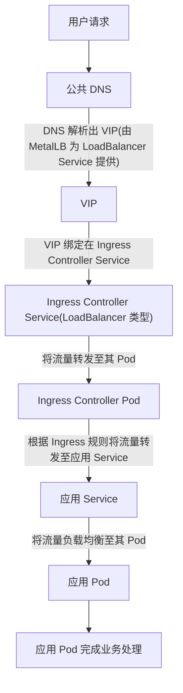
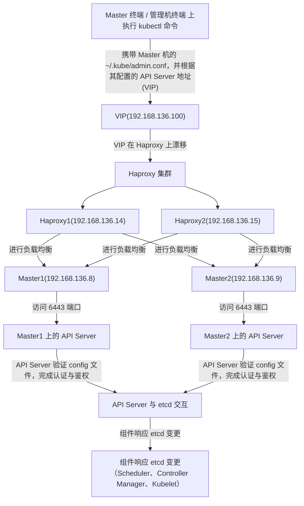
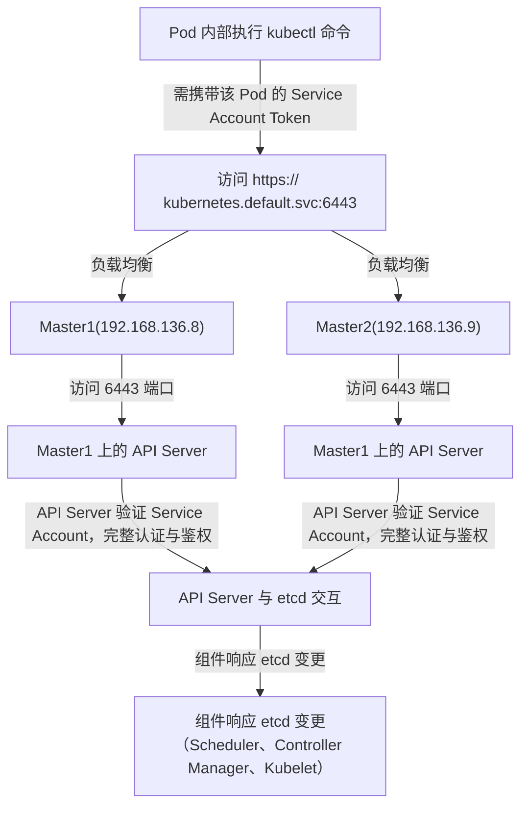

# 一、理论

### 1. 导图：[Map：K8S](../../maps/Map：K8S.xmind)

---


### 2. K8S 概述

K8S 是 **Kubernetes** 的缩写（中间的 "8" 代表 "ubernete" 这 8 个字母），它是目前最流行的**容器编排系统**，用于自动化部署、扩展和管理容器化应用（如 Docker 容器）

---


### 3. K8S 组件

我们说 K8S 实际上就是指的 K8S 集群，其组件分 Master 节点和 Worker 节点：
1. ==Master 节点==
	1. <font color="#00b0f0">containerd（☆☆☆）</font>:
		1. 容器运行时，负责管理**本机容器**的生命周期，例如拉取镜像、启动和停止容器。
	2. <font color="#00b0f0">crictl</font>：
		1. K8S 提供的容器运行时的命令行工具，用于与 containerd 交互，常用于调试容器。例如，`crictl ps` 查看容器状态，`crictl pull` 拉取镜像。
	3. <font color="#00b0f0">kubeadm</font>：
		1. 用于简化 Kubernetes 集群的初始化和管理。例如，`kubeadm init` 初始化集群，`kubeadm join` 添加新节点。
	4. <font color="#00b0f0">kubelet（☆☆☆）</font>：
		1. kubelet 负责创建和运行 Pod，它会监听 etcd 的变更，当 Kubernetes 调度 Pod 至本节点时，`kubelet` 通过 `containerd` 启动容器，并确保其持续运行。
	5. <font color="#00b0f0">kubectl</font>：
		1. 命令行工具，用于与 API Server 交互。例如，`kubectl get pods` 查看集群中的 Pods。
	6. <font color="#00b0f0">calico-kube-controllers</font>：
		1. Calico 控制器，负责管理网络策略和 IP 地址分配。
	7. <font color="#00b0f0">etcd（☆☆☆）</font>：
		1. 分布式键值存储，保存 Kubernetes 集群的所有配置和状态。例如，你创建 Deployment、Pod、Service，它们的配置信息都会存入 etcd，并在多个 Master 节点间保持一致。
	8. <font color="#00b0f0">kube-apiserver（☆☆☆）</font>：
		1. <font color="#7030a0">处理 kubectl 命令</font>：
			1. 接收并处理所有 `kubectl` 命令
		2. <font color="#7030a0">进行认证（☆☆☆）</font>：
			1. 根据执行 `kubectl` 命令时传递的 `Service Account` 或 用户证书，进行用户的身份验证认证
			2. 如果认证通过，则继续执行后续操作（如鉴权、操作 etcd、推送变更等）
			3. 如果认证失败，则返回 401 错误。
		3. <font color="#7030a0">进行鉴权（☆☆☆）</font>：
			1. 根据我们使用 RBAC 为 `Service` 或 用户证书绑定的用户，判断他是否有权限执行这个 kubectl 命令
			2. 如果没有该权限，返回 403 错误
		4. <font color="#7030a0">与 etcd 交互</font>：
			1. API Server 对 etcd 进行增删改查操作，例如读取 Deployment 配置或更新 Service 状态
			2. 在进行写入或修改操作（例如更新 Pod、Service 或 Controller 配置）时，API Server 会先将配置转换成 JSON 格式，然后写入 etcd
		5. <font color="#7030a0">推送变更</font>：
			1. 当 etcd 中的数据发生变更时，API Server 通过 Watch 机制向 Controller Manager、Scheduler 和 Kubelet 推送事件。
			2. 需要注意的是，API Server 不会主动"通知组件"，而是组件主动监听 API Server 的资源变更。
	9. <font color="#00b0f0">kube-controller-manager（☆☆☆）</font>：
		1. 负责运行和管理各个 Controller
		2. Controller 监听 `etcd` 变更，并通过 Scheduler 和 Kubelet 管理 Pod 的生命周期，确保集群中始终保持指定数量的运行 Pod：
			1. 在 Pod 故障时，自动重启 Pod
			2. 当 节点 故障时，触发 Pod 迁移
	10. <font color="#00b0f0">kube-scheduler（☆☆☆）</font>：
		1. 监听 API Server，检测是否有待调度的 Pod。
		2. 如果存在待调度 Pod，Scheduler 根据资源需求（如 CPU/内存）、亲和性（`nodeAffinity`）、污点（`Taint`）等策略选择目标 Worker 节点。
		3. 确定目标节点后，`kube-scheduler` 将 Pod 的 `nodeName` 字段更新，并写入 etcd。当 kubelet 监听到 etcd biang后，调用 `containerd` 创建容器并运行 Pod。
	11. <font color="#00b0f0">kube-proxy</font>：
		1. 负责 Kubernetes 内部的**网络路由**和**服务负载均衡**，实现 Service 的 IP 和端口映射，确保流量正确转发到目标 Pod。例如，你访问`ClusterIP`，流量会被 kube-proxy 代理到实际的 Pod
	12. <font color="#00b0f0">coredns</font>：
		1. Kubernetes 内部的 DNS 服务器，提供**服务发现**。例如，Pod 访问 `my-service.default.svc.cluster.local`，CoreDNS 解析其 IP 地址。
2. ==Worker 节点==
	1. <font color="#00b0f0">containerd</font>
	2. <font color="#00b0f0">crictl</font>
	3. <font color="#00b0f0">kubeadm</font>
	4. <font color="#00b0f0">kubelet</font>
	5. <font color="#00b0f0">kubectl</font>
	6. <font color="#00b0f0">calico-node</font>

---


### 4. K8S 最佳实践

#### 4.1. 高可用实现

1. ==主从之间==
	1. K8S 采用主从架构，是主控制从的架构，Master 节点负责全局调度和决策，而 Worker 节点负责执行具体的任务
	2. K8S 不支持 Worker 上位 Master
2. ==主主之间==
	1. 多个主节点之间通过 `etcd` 实现信息同步，保证每个主节点都能及时获取到集群的最新状态信息。
	2. 主节点之间会通过会通过 **Raft 算法**选举出一个 **Leader**，只有 Leader 的各项组件（如 API Server、Scheduler 等）真正起作用，其他主节点的组件不起作用。这主要是为了避免多个主节点同时操作 etcd，重复调度 Pod，导致冲突，当 Leader 挂掉之后，会重新选举新的 Leader
3. ==负载均衡==
	1. 使用 Keepalived 为 Haproxy 绑定 VIP，并使用 Haproxy 负载均衡到 Master，确保每个 Master 都有执行管理员命令的权利

---


#### 4.2. 流程图

##### 4.2.1. 用户访问应用（通过浏览器）

1. ==用户请求==：
	1. 用户在浏览器中输入请求地址，例如 `blog.wagnjia.xin`。
2. ==公共 DNS 服务器处理==：
	1. 请求首先到达公共 DNS 服务器，DNS 将域名解析为由 MetalLB 分配给 `Ingress Controller Service` 的 VIP 地址
3. ==请求到达 Ingress Controller Serviece==:
	1. 用户请求通过解析得到的 VIP 地址被路由到 `Ingress Controller Service`。
4. ==请求到达 Ingress Controller Pod==：
	1. `Ingress Controller Service` 根据负载均衡策略，将请求分发到某个 `Ingress Controller Pod` 实例
5. ==请求到达 应用 Service==：
	1. `Ingress Controller Pod` 会按照 `Ingress` 资源配置的域名规则，将请求发送到相应的 应用 Service
6. ==请求到达 应用 Pod==：
	1. 应用 Service 接受到请求后，会把请求负载均衡到一个其管理的应用 Pod 实例
7. ==应用 Pod 完成业务处理==：
	1. 然后，将由应用 Pod 完成真正的业务处理


---


##### 4.2.2. 管理员执行命令（Master 终端 / 管理机终端）

1. ==管理员执行命令==
	1. 管理员在 Master 节点的终端执行 `kubectl` 命令，该命令会读取本机 `~/.kube/admin.conf` 中的 `API Server` 字段，以定位本机的 API Server，通常是由 Keepalived 提供的 VIP（`192.168.136.100`）。
	2. `admin.conf` 会自动携带用户证书，并将请求发送至 API Server。（`admin.conf` 默认的用户证书是由 `kubeadm` 在初始化集群时自动生成，拥有最高权限，可操作集群中的所有资源。）
	3. 注意：虽然 `kubeadm` 在 `/etc/kubernetes/` 下生成了 `admin.conf`，但 `kubectl` 实际使用的是 `~/.kube/` 下的 `admin.conf`。前者更像是一个模板，供管理员配置使用。
2. ==命令到达 Haproxy==：
	1. 由于 `admin.conf` 指定的 VIP（`192.168.136.100`）通常绑定在 HAProxy 服务器上，因此命令会先到达 HAProxy。
3. ==命令到达 Master==
	1. HAProxy 负责将请求负载均衡至某个 Master 节点，并转发至 Kubernetes API Server 监听的 `6443` 端口。
4. ==命令到达 API Server==：
	1. 目标 Master 节点上的 API Server 接收请求，并通过 `6443` 端口进行处理。
	2. API Server 验证用户证书的有效性，并检查权限，完成认证与鉴权。
5. ==API Server 与 etcd 交互==
	1. API Server 通过 etcd 客户端库，将请求操作（如资源创建、更新）写入 etcd 分布式数据库集群。
6. ==组件响应 etced 变更==：
	1. 作为集群 Leader 的 Master 节点上，Scheduler、Controller Manager 等组件监听 etcd 的数据变更，并执行相应操作
	2. Master 和 Worker 节点上的 Kubelet 也会监听 etcd 变更，在需要操作容器时，调用 `containerd` 以执行相应的任务


---


##### 4.2.3. 管理员执行命令（Pod 内部）

1. ==管理员执行命令==：
	1. 管理员在 Pod 内部执行 `kubectl` 命令，默认通过 `https://kubernetes.default.svc:443` **负载均衡**到集群中的某个 Master 节点的 API Server（这是一个 K8S 内部 DNS URL，由 K8S DNS 解析）
	2. 必须 **手动** 携带 Pod 挂载的 `Service Account` 的 `Token` 令牌（☆☆☆）。
2. ==命令到达 Master 节点==：
	1. 通过 Kubernetes DNS 解析 `kubernetes.default.svc`，请求被路由至某个 Master 节点，并访问其 `6443` 端口
3. ==命令到达 API Server==：
	1. 目标 Master 节点上的 API Server 接收请求，并通过 `6443` 端口进行处理。
	2. API Server 验证 `Service Account` 的有效性，并检查其权限，完成认证与鉴权
4. ==API Server 与 etcd 交互==：
	1. API Server 通过 etcd 客户端库，将请求操作（如资源创建、更新）写入 etcd 分布式数据库集群。
5. ==组件响应 etcd 变更==
	1. 作为集群 Leader 的 Master 节点上，Scheduler、Controller Manager 等组件监听 etcd 的数据变更，并执行相应操作
	2. Master 和 Worker 节点上的 Kubelet 也会监听 etcd 变更，在需要操作容器时，调用 `containerd` 以执行相应的任务
6. ==注意事项==：
	1. 该操作与管理员的个人身份**无关**，权限完全取决于 Pod 绑定的 `Service Account`。


---


#### 4.3. 节点规划

1. Master 节点的数量应为奇数（如 1、3、5、7 等），这是为了避免在选举过程中出现投票平局的情况，确保集群能够正常选举出 Leader。
2. 在生产环境中，建议至少部署 3 个 Master 节点，这是最常见的高可用部署方式，可以提高集群的稳定性和容错能力。
3. 根据不同的工作负载，可以对 Worker 节点进行合理划分，结合亲和性、反亲和性、污点和容忍性等策略，让调度器（Scheduler）将 Pod 调度到适合的节点。例如，计算密集型应用可以分配到高 CPU 性能的节点，而内存密集型应用可以分配到内存更大的节点，从而实现资源的最优利用。

---


#### 4.4. 安全规划

1. `kubeadm` 在 `/etc/kubernetes/` 目录下自动生成的 `admin.conf` 文件包含了对 Kubernetes 集群的最高权限，因此必须由集群管理员严格保管，不要长期保留在 `Master` 节点中。
2. `Master` 节点上的 `~/.kube/admin.conf` 应该仅允许授权的管理员访问，其他人严格限制访问

> [!NOTE] 注意事项
> 1. `kubeadm` 自动在 `/etc/kubernetes/` 下生成的 `admin.conf`，更像是一个模板，供管理员配置使用。
> 2. 而 `kubectl` 的执行，实际使用的是 `~/.kube/` 下的 `admin.conf`

---


### 5. K8S 核心概念：Pod

#### 5.1. Pod 概述

在 Kubernetes（K8S）体系中，它并非直接对容器进行操作，而是以操作 Pod 为主要形式。Pod 作为 K8S 最小的操作单元，犹如一个功能完备的 “封装舱”，将一个或多个容器封装其中，同时为这些容器提供共享的存储资源、统一的网络环境以及一致的配置信息。可以说，Pod 是 Kubernetes 运行应用程序的基础载体，应用依托 Pod 得以在 K8S 集群中稳定运行和调度。

---


#### 5.2. Pod 的生命周期

| 状态值         | 说明                              |
| ----------- | :------------------------------ |
| **Pending** | Pod 已创建，但 Pod 中的一个或多个容器的镜像还没有创建 |
| **Running** | Pod 内所有容器已创建，且至少一个容器处于运行状态      |
| **Succeed** | Pod 内所有容器均成功执行退出，且不会再重启         |
| **Failed**  | Pod 内所有容器均已退出，但至少一个容器退出失败       |
| **Unknown** | 由于某种原因无法获取 Pod 状态，例如网络通信不畅      |

---


#### 5.3. Pod 资源的写法

```
apiVersion: v1

kind: Pod

metadata:
  name: string
  namespace: string
  labels:
    name: string
  annotations:
    name: string

spec:
  containers:
    - name: string
      image: string
      imagePullPolicy: Always | Never | IfNotPresent  
	   workingDir: string
      command: ["string"]
      args: ["string"]


      volumeMounts:
        - name: string
          mountPath: string
          subPath: string
          readOnly: boolean

      ports:
          containerPort: int
          hostPort: int
          protocol: TCP | UDP
          
	  envFrom:
		  configMapRef | secretRef
		  
      env:
        - name: string
          value: string
          valueFrom:
            configMapRef | secretKeyRef | fieldRef | resourceFieldRef

      resources:
        limits:
          cpu: string
          memory: string
        requests:
          cpu: string
          memory: string

      livenessProbe:
	    httpGet | tcpSocket | exec
	    
	  readinessProbe:
	    httpGet | tcpSocket | exec
        

  restartPolicy: Always | Never | OnFailure

  imagePullSecrets:
    - name: string

  hostNetwork: false

  volumes:
    - name: string
      emptyDir | hostPath | nfs | persistentVolumeClaim | configMap | ......
```
1. ==apiVersiion==：
	1. 指定 API 版本，告诉 Kubernetes **如何解析** 这个 YAML 文件
	2. 可以使用 `kubectl api-versions` 查询支持的 API 版本。
2. ==kind==：
	1. 定义 **资源类型**，即这个 YAML 文件要创建的 Kubernetes 资源，如 `Pod`、`Service`、`Deployment` 等。
3. ==metadata==：
	1. <font color="#00b0f0">name</font>：
		1. 资源的唯一名称，在同一命名空间下不能重复。
	2. <font color="#00b0f0">namespace</font>：
		2. 资源所属的命名空间，未指定时默认使用当前 `kubectl` 上下文的命名空间。
		3. 若未切换到其他 `kubectl` 上下文，则使用默认上下文，其命名空间为 `default`。
	3. <font color="#00b0f0">labels</font>：
		1. 资源的标签，用于分类和筛选资源，可通过 `selector` 进行匹配。
		2. 详细见下文：K8S 核心概念：Labels
	4. <font color="#00b0f0">annotations</font>：
		1. 不要误将其理解为“注解”。虽然名字上像是注解，但 `annotations` 是用来存储**额外元数据**的字段，这些数据不会影响资源的实际运行或行为，但可以被外部工具、系统或用户读取和使用。
4. ==spec==：
	1. <font color="#00b0f0">containers</font>：
		1. 定义该 Pod 内部运行的所有容器
		2. <font color="#7030a0">name</font>：
			1. 容器的名称，同一个 Pod 下必须唯一
		3. <font color="#7030a0">image</font>：
			1. 容器的镜像，通常是 Docker Hub 或私有镜像仓库中的镜像
		4. <font color="#7030a0">imagePullPolicy</font>：
			2. 定义 Pod 拉取镜像的策略
			3. <font color="#00b050">Always（默认）</font>：
				1. 每次创建 Pod 都强制拉取镜像
			4. <font color="#00b050">IfNotPresent</font>：
				2. 如果本地已有镜像，不会重新拉取
			5. <font color="#00b050">Never</font>：
				3. 绝对不拉取进行，只使用本地的已有镜像
		5. <font color="#7030a0">workingDir</font>:
			1. 容器内的工作目录，相当于 cd 进入某个目录再运行 `command`，如果不指定，则使用默认的 `/` 根目录
		6. <font color="#7030a0">command</font>:
			2. 用于覆盖镜像内部默认的启动命令（`Entrypoint`），如果不指定，容器会使用镜像内部的默认命令
			3. 通常，`command` 与 `args` 结合使用，`command` 作为可执行文件，`args` 作为传递给 `command` 的参数：
				1. 例如：`command: ["/bin/sh","-c"],args: ["echo Hello && sleep 3600"]` ，最终效果是：`/bin/sh -c "echo Hello && sleep 3600"`
			4. 如果你想查看容器的默认启动命令，你可以借助 Docker：`docker inspect <image-name / image-id>`，返回的 JSON 结果中，你可以找到 `Cmd` 和 `Entrypoint`
				2. 如果 `Entrypoint` 是 `null` ，则使用 `Cmd` 作为默认命令
				3. 如果 `Entrypoint` 存在，则 `Cmd` 作为其参数
		7. <font color="#7030a0">args</font>：
			1. 用于覆盖镜像内部默认的启动命令的参数（`Cmd`），如果不指定，容器会使用镜像内部的默认参数
		8. <font color="#7030a0">volumeMounts</font>：
			1. 容器内卷的挂载配置，用于将 `volumes` 中定义的存储卷挂载到容器内的指定目录。
			2. <font color="#00b050">name</font>：
				1. 指定要挂载的存储卷的名称，必须与 `volumes` 中定义的名称匹配。
			3. <font color="#00b050">mountPath</font>：
				2. 挂载点，即存储卷挂载到容器内的哪个目录。
			4. <font color="#00b050">subPath</font>：
				3. 只挂载卷内的某个子路径或特定文件，而不是整个卷
			5. <font color="#00b050">readOnly</font>：
				4. 是否以只读的方式挂载。`true` 表示卷只能读取，不能写入；`false` 表示可读写（默认值）。
			6. 注意：如果容器中的挂载点已经有文件，挂载存储卷后，原有文件会被暂时替代
			7. 详细见下文：K8S 核心概念：K8S存储 / 补充：Volume 挂载方法
		9. <font color="#7030a0">ports</font>：
			1. <font color="#00b050">containerPort</font>：
				1. 容器内应用监听的端口
			2. <font color="#00b050">hostPort</font>：
				2. 容器所在宿主机端口与容器监听的端口映射
			3. <font color="#00b050">protocol</font>：
				1. 指定端口的协议类型，通常是 `TCP` 或 `UDP`。
				2. <font color="#e36c09">TCP（默认）</font>：
					1. 一般我们都用这个，是传输控制协议，面向连接，可靠的通信。
				3. <font color="#e36c09">UDP</font> ：
					1. 用户数据报协议，无连接，适用于不需要可靠性保障的应用（例如视频流、游戏等）。
			4. 注意：推荐在 Service 中统一管理，而不是在 Pod 中直接使用
		10. <font color="#7030a0">envFrom</font>:
			1. 从外部源（如 ConfigMap、Secret）加载多个环境变量
			2. <font color="#00b050">configMapRef</font>：
				1. 引用一个 configMap，将其中的所有键值对加载为环境变量
			3. <font color="#00b050">secretRef</font>：
				1. 引用一个 secret，将其中的所有键值对加载为环境变量
			4. 详细见下文：K8S 核心概念：K8S存储 / 补充：Env 挂载方法和相关命令
		11. <font color="#7030a0">env</font>:
			1. 手动 **指定 / 覆盖 / 获取** 环境变量，在容器内的应用程序可以通过 `${env-name}` 进行输出
			2. <font color="#00b050">name</font>：
				1. 指定环境变量的名称
			3. <font color="#00b050">value</font>：
				1. 手动 **指定 / 覆盖** 环境变量的值
				2. 若变量不存在，则设置为指定值；若变量已存在，则覆盖原有值
			4. <font color="#00b050">valueFrom</font>:
				2. 从外部源 **获取** 环境变量的值
				3. <font color="#e36c09">configMapRef</font>:
					1. 从 configMap 中 获取 某个键的值
				4. <font color="#e36c09">secretKeyRef</font>：
					2. 从 secret 中 获取 某个键的值
				5. <font color="#e36c09">fieldRef</font>：
					3. 从当前 Pod 的 `metadata` 中 获取 值
				6. <font color="#e36c09">resourceFieldRef</font>：
					4. 从当前 Pod 的`resources` 下的 `limits` 或 `requests` 中 获取 值
			5. 详细见下文：K8S 核心概念：K8S存储 / 补充：Env 挂载方法和相关命令
		12. <font color="#7030a0">resources</font>:
			1. 容器的资源请求和限制
			2. <font color="#00b050">request</font>：
				1. <font color="#e36c09">cpu</font>：
					1. 容器请求的 CPU 数量，如 "500m" 是 0.5 核
				2. <font color="#e36c09">memory</font>：
					2. 容器请求的 内存 大小，如 "512Mi"、"2Gi"
			3. <font color="#00b050">limits</font>
				1. <font color="#e36c09">cpu</font>:
					1. 限制容器的 CPU 数量
				2. <font color="#e36c09">memory</font>：
					2. 限制容器的 内存 大小
			4. 详细见下文：K8S 核心概念：Controller / Deployment 实战步骤
		13. <font color="#7030a0">livenessProbe</font>：
			1. 存活探针，判断容器是否存活
			2. <font color="#00b050">tcpSocket</font>：
				1. 使用 tcp socket 探针
			3. <font color="#00b050">httpGet</font>：
				1. 使用 http get 探针
			4. <font color="#00b050">exec</font>：
				2. 使用命令行探针
			5. 详细见下文：K8S 核心概念：K8S 探针 / 存活探针实战步骤
		14. <font color="#7030a0">readinessProbe</font>：
			1. 就绪探针，判断容器是否准备好接受流量
			2. <font color="#00b050">tcpSocket</font>：
				1. 使用 tcp socket 探针
			3. <font color="#00b050">httpGet</font>：
				2. 使用 http get 探针
			4. <font color="#00b050">exec</font>：
				1. 使用命令行探针
			5. 详细见下文：K8S 核心概念：K8S 探针 / 就绪探针实战步骤
	2. <font color="#00b0f0">restartPolicy</font>：
		1. Pod 的重启策略
		2. <font color="#7030a0">Always（默认）</font>：
			1. 当容器失效时（无论正常退出还是异常退出），由 kubelet 自动重启该容器
		3. <font color="#7030a0">OnFailure</font>：
			2. 当容器终止运行且推出码不为 0 时（异常退出），由 kubelet 自动重启该容器
		4. <font color="#7030a0">Never</font>：
			3. 不论容器运行状态如何，kubelete 都不会重启该容器
	3. <font color="#00b0f0">imagePullSecrets</font>：
		1. 指定拉取私有镜像的秘钥，通常是指向 dockerconfigjson Secret
		2. 详细见下文：K8S 核心概念：K8S 存储 / Secret 实战步骤 / dockerconfigjson Secret 实战步骤
		3. 注意：假如你指定了阿里云的私钥，但尝试从 Docker Hub 拉取镜像，这不会产生任何影响，因为 `imagePullSecrets` 只会用于认证指定的镜像仓库。
	4. <font color="#00b0f0">hostNetwork</font>：
		1. 决定 Pod 是使用 Kubernetes 默认的网络隔离模式，还是直接复用主机的网络。虽然使用主机网络（`hostNetwork: true`）可以减少网络转发的开销，从而提升访问速度，但通常我们会保持默认设置（`false`），以保证良好的网络隔离性和应用的可移植性。
		2. <font color="#7030a0">true</font>：
			1. 容器将直接使用主机的网络资源，包括主机的 IP 和端口。
			2. 这种方式能提升网络性能，适用于高并发的场景（比如数据库），但通常我们会避免使用，特别是在像 Spring Boot 或 Spring Cloud 这样的应用中。默认情况下我们更倾向于保持网络隔离性和可移植性。
		3. <font color="#7030a0">false（默认）</font>：
			1. 使用 Kubernetes 提供的默认网络隔离，容器有独立的网络环境，无法直接访问主机的网络。
			2. 大多数情况下，我们会选择这个选项，以确保容器和主机网络的隔离。
	5. <font color="#00b0f0">volumes</font>：
		1. 定义 Pod 级别的存储卷
		2. <font color="#7030a0">name</font>：
			1. 存储卷名称
		3. <font color="#7030a0">emptyDir</font>：
			1. 使用 `emptyDir` 存储方式
		4. <font color="#7030a0">hostPath</font>：
			2. 使用 `hostPath` 存储方式
		5. <font color="#7030a0">nfs</font>：
			1. 使用 `nfs` 存储方式
		6. <font color="#7030a0">persistentVolumeClaim</font>：
			2. 使用 `pv + pvc` 存储方式
		7. <font color="#7030a0">configMap</font>：
			1. 使用 `configMap` 存储方式
		8. <font color="#7030a0">其他存储方式</font>：
			2. 除了上述的存储方式，还有其他很多的存储方式
		9. 详细见下文：K8S 核心概念：K8S 存储 / 补充：Volume 挂载方法

---


### 6. K8S 核心概念：Controller

#### 6.1. Controller 引入的原因

在 前面的 Pod 中，我们虽然可以成功启动 Pod，但整个过程依赖手动管理。如果某个 Pod 发生故障，我们需要手动检测并重启，不仅繁琐，还影响效率。

而 Controller 的作用正是自动管理 Pod。它会监听 `etcd` 的变更，并通过 Scheduler 和 Kubelet 来管理 Pod 的生命周期，确保集群中的 Pod 数量符合预期：
1. 当 Pod 发生故障时，根据其 `restartPolicy` 自动重启（是否重启取决于策略设定）。
2. 当节点发生故障时，触发 Pod 迁移，确保应用的高可用性。

---


#### 6.2. Controller 的类型

Controller 主要分为以下几类：
1. ==ReplicationController（过时）==：
	1. `ReplicationController` 可确保指定数量的 Pod **始终保持运行**，即使某些 Pod 发生故障，也会自动补充。同时，它**支持手动调整 Pod 副本数量**，方便进行扩容或缩容
	2. 然而，该过滤器已过时，不建议在新项目中使用。原因在于它仅支持基于 等值匹配（equality-based） 的标签选择器（如 `app=my-nginx`），而无法兼容集合匹配（set-based） 选择器（如 `app in (nginx, web)`）
2. ==ReplicaSet==：
	1. `ReplicaSet` 是 `ReplicationController` 的**升级版**，提供了更强的标签匹配功能（如支持基于集合的 Label Selector），比 RC 更灵活
	2. `ReplicaSet` 很少单独使用，通常是作为 `Deployment` 的一部分，由 `Deployment` 来管理
3. ==Deployment==：
	1. `Deployment` 通过管理 `ReplicaSet`，负责 Pod 的创建、删除和更新。当你创建一个 `Deployment` 时，实际上他会自动创建并管理一个 `ReplicaSet` ，`Deployment` 通过控制 `ReplicaSet` 来间接管理 Pod 的创建、删除和更新等操作。
	2. 此外，`Deployment` 还支持**滚动更新**（平稳升级，避免服务中断）、回滚、暂停/恢复更新等功能，并能与 HPA 和 Service 配合使用，实现弹性扩缩容和流量管理
4. ==HPA==：
	1. `Horizontal Pod Autoscaler（HPA）`用于根据 CPU 使用率、内存使用率或自定义指标自动调整 Deployment 等资源的 Pod 副本数量，以实现资源的**弹性伸缩**。
	2. 举例来说，若让 HPA 监控 CPU 使用率，当 CPU 使用率超出设定的阈值（如 50%）时，HPA 会自动增加 Pod 的数量，以应对更高的负载；而当 CPU 使用率低于设定阈值时，HPA 则会减少 Pod 的数量，从而节省资源。
5. ==Deployment + HPA==：
	1. 当前主流，强烈推荐，其口诀是，先创 Deployment 再创 HPA

---


#### 6.3. RC 实战步骤

==1.编写 RC 资源 yaml 文件==
```
apiVersion: v1
kind: ReplicaController
metadata:
  name: nginx-rc
  namespace: default
  labels:
    controller: nginx-rc
spec:
  replicas: 3                                        # 期望始终有几个 Pod
  selector:                                          # 指定该控制器负责哪些标签的 Pod
    app: nginx
  template:                                          # Pod 模版，用来定义 Pod
    metadata:
      labels:
        app: nginx
    spec:
      containers:
        - name: nginx-container
          image: nginx:1.23
```

> [!NOTE] 注意事项
> 1. `ReplicationController` 允许在 `spec.template` 中定义 `Pod` 资源，除了 `apiVersion`、`kind`、`metadata.namespace`，其他字段均可在 `spec.template` 中指定
> 2. Pod 模版中不能单独指定 `kind`，因为他的类型只能是 Pod
> 3. <font color="#ff0000">Pod 模版中不能单独指定 `namespace`，它会自动继承其所属 `Controller` 的 `namespace`。（☆☆☆）</font>
> 4. Pod 的 `labels` 与 Controller 的 `labels` 互不相关：`Pod` 的 `labels` 仅用于标识 Pod 本身，而 `Controller` 的 `labels` 仅用于标识 Controller 本身，二者不会相互继承。


==2.创建 RC 资源==
```
kubectl apply -f rc.yaml
```


==3.检查 RC 资源状态==
```
kubectl get rc -n <rc-namespace>
```

---


#### 6.4. RS 实战步骤

==1.编辑 RS 资源 yaml 文件==
```
apiVersion: apps/v1
kind: ReplicaSet
metadata:
  name: my-rs
  labels: 
    controller: nginx-rs
spec:
  replicas: 3                                      # 期望始终有几个 Pod                        
  selector:                                        # 指定该控制器负责管理哪些标签的 Pod          
    matchLabels:                                   # 根据 Labels 筛选 Pod               
      app: nginx
  template:                                        # Pod 模版，用来定义 Pod                 
    metadata: 
      labels:
        app: nginx
    spec:
      containers:
      - name: nginx
        image: nginx
```

> [!NOTE] 注意事项：更强的标签匹配功能该怎么写
```
spec:                                           
  selector:                                                        
    matchExpressions:                                                
	  - key: app
	    operator: In                                # operator 操作符
	    values:
	      - my-app
	      - another-app
```


==2.创建 RS 资源==
```
kubectl apply -f rs.yaml
```


==3.检查 RS 资源状态==
```
kubectl get rs -n <controller-namespace>
```

---


#### 6.5. Deployment 实战步骤

==1.编写 Deployment 资源 yaml 文件==
```
apiVersion: apps/v1
kind: Deployment
metadata:
  name: nginx-deployment
  namespace: default
  labels:
    app: nginx
spec:
  replicas: 3                             # 期望始终有几个 Pod（若使用 HPA，该值会动态调整）
  selector:                               # 指定该控制器负责管理哪些标签的 Pod
    matchLabels:                          # 根据 Labels 筛选 Pod
      app: nginx
  strategy:                               # 更新策略
    type: RollingUpdate                   # 采用滚动更新策略
    rollingUpdate:                        # 滚动更新策略配置
      maxUnavailable: 1                   # 更新时最多允许几个 Pod 不可用，如1、25%
      maxSurge: 1                         # 更新时最多额外创建几个新 Pod，如1、25%
  template:                               # Pod 模版，用来定义 Pod
    metadata:
      labels:
        app: nginx
    spec:
      containers:
        - name: nginx-container
          image: nginx:1.25
          resources:                      # 资源限制，容器不能超过该值
            requests:
              cpu: "250m"                 # 资源请求的 CPU 数量，如 "500m"（0.5核）
              memory: "128Mi"             # 资源请求的内存大小，如 "512Mi"、"2Gi"
            limits:
              cpu: "500m"                 # 限制资源的 CPU 数量，如 "500m"（0.5核）
              memory: "256Mi"             # 限制资源的内存大小，如 "512Mi"、"2Gi"
```

> [!NOTE] 注意事项：`RollingUpdate` 更新流程：
> 1. 首先创建新的 Pod（基于新的 `image` 版本）
> 2. 等待新 Pod 运行正常（通过探针检测健康状况）
> 3. 逐步删除旧的 Pod，直到所有的 Pod 都被替换成新版本


==2.创建 Deployment 资源==
```
kubectl apply -f deployment.yaml
```


==3.检查 Deployment 资源状态==
```
kubectl get deployment -n <controller-namespace>
```


---


#### 6.6. HPA 实战步骤

##### 6.6.1. 编写 HPA 资源 yaml 文件

==1.基于 CPU 使用率==
```
apiVersion: autoscaling/v2
kind: HorizontalPodAutoscaler
metadata:
  name: hpa-cpu
  namespace: default
spec:
  scaleTargetRef:
    apiVersion: apps/v1                                   # 目标 API 版本（Deployment 的 API 版本）
    kind: Deployment                                      # 目标资源类型，如 Deployment
    name: my-deployment                                   # 目标资源名称，如 Deployment-name
  minReplicas: 2                                          # 最小 Pod 数量
  maxReplicas: 10                                         # 最大 Pod 数量
  metrics:
  - type: Resource                                        # 指定资源指标
    resource:
      name: cpu                                           # 监控 CPU 资源
      target:
        type: Utilization                                 # 使用利用率模式
        averageUtilization: 80                            # 当平均 CPU 利用率达到 80% 时触发扩容
```

---


==2.基于 内存使用率==
```
apiVersion: autoscaling/v2
kind: HorizontalPodAutoscaler
metadata:
  name: hpa-memory
  namespace: default
spec:
  scaleTargetRef:
    apiVersion: apps/v1                                  # 目标 API 版本
    kind: Deployment                                     # 目标资源类型，如 Deployment
    name: my-deployment                                  # 目标资源名称，如 Deployment-name
  minReplicas: 2                                         # 最小 Pod 数量
  maxReplicas: 10                                        # 最大 Pod 数量
  metrics:
  - type: Resource                                       # 指定资源指标
    resource:
      name: memory                                       # 监控内存资源
      target:
        type: Utilization                                # 使用利用率模式
        averageUtilization: 80                           # 当平均内存使用率达到 80% 时触发扩容
```

> [!NOTE] 注意事项
> 1. 想要使用内存指标，你必须确保集群中已经安装并正常运行 `metrics-server`
```
# 1. 检查 metrices-server 是否已安装
kubectl get deployment metrics-server -n kube-system


# 2. 安装 metrices-server 
kubectl apply -f https://github.com/kubernetes-sigs/metrics-server/releases/download/v0.6.1/components.yaml


# 3. 确认 metrics-server 部署情况
kubectl get deployment metrics-server -n kube-system


# 4. 验证 metrics-server 是否工作正常
kubectl top nodes
kubectl top pods
```

---


==3.基于 自定义指标==
```
apiVersion: autoscaling/v2
kind: HorizontalPodAutoscaler
metadata:
  name: hpa-custom
  namespace: default
spec:
  scaleTargetRef:
    apiVersion: apps/v1                                # 目标 API 版本
    kind: Deployment                                   # 目标资源类型，如 Deployment
    name: my-deployment                                # 目标资源名称，如 Deployment-name
  minReplicas: 2                                       # 最小 Pod 数量
  maxReplicas: 10                                      # 最大 Pod 数量
  metrics:
  - type: Pods                                         # 指定 Pod 级别的自定义指标
    pods:
      metric:
        name: requests_per_second                      # 自定义指标的名称
      target:
        type: AverageValue                             # 目标类型为平均值
        averageValue: "100"                            # 每个 Pod 的指标平均值达到 100 时触发扩容
```

> [!NOTE] 注意事项
> 1. 定义 HPA 相对简单，指标可以根据需求自由定义，但真正的挑战在于如何将这些指标暴露给 Kubernetes，以便它能够基于这些指标进行弹性伸缩，这里先不展开。

---


##### 6.6.2. 创建 HPA 资源
```
kubectl apply -f hpa.yaml
```

---


##### 6.6.3. 检查 HPA 资源状态
```
kubectl get hpa -n <controller-namespace>
```

---


### 7. K8S 核心概念：Labels

#### 7.1. Labels 引入的原因

假设你有一个复杂的系统，包含多个微服务，每个服务有多个 Pod 实例。例如，你的系统有以下服务：`web`、`api`、`database`，每个服务对应多个实例：
- `web-1`、`web-2`、`web-3`
- `api-1`、`api-2`、`api-3`
- `db-1`、`db-2`、`db-3`
在传统的管理方式中，你可能只能通过 **Pod 的名称或 ID** 来定位它们，甚至可能需要进入每个 Pod 查看详细信息，这样既麻烦又低效。
但如果你在创建 Pod 时 **为它们打上标签**（例如 `app=web`、`app=api`、`app=db`），你就能通过 **标签快速筛选** 出相关的资源，无需逐个查找或进入 Pod，极大地提高了效率。

---


#### 7.2. Labels 常见的约定

尽管标签可以自定义，但我们通常将其与 `Namespace` 结合使用，并遵循一些常见的约定，具体如下：
1. ==Namespace==：
	1. `Namespace` 用于隔离不同的环境、团队或应用，每个资源只能属于一个 `Namespace`。常见的约定包括：
	2. <font color="#00b0f0">隔离环境</font>：
		1. `namespace: env_dev`：开发环境
		2. `namespace: env_test`：测试环境
		3. `namespace: env_staging`：预生产环境
		4. `namespace: env_prod`：生产环境
	3. <font color="#00b0f0">开发团队</font>：
		1. `namespace: team_tencent`：腾讯团队
	4. <font color="#00b0f0">应用名称</font>：
		2. `namespace: app_qqrobot`：QQ 机器人应用
2. ==Labels==：
	1. `Labels` 用于标识资源的具体业务、版本、角色等，一个资源可以具有多个标签。常见的约定如下：
	2. <font color="#00b0f0">业务</font>：
		1. `bussiness: nginx`：负载均衡业务
		2. `bussiness: payment`：支付业务
	3. <font color="#00b0f0">版本</font>：
		1. `version: v1.0`：版本 v1.0
	4. <font color="#00b0f0">角色</font>：
		2. `role: batian`：开发人员"霸天"

---


### 8. K8S 核心概念：Namespace

#### 8.1. Namespace 引入的原因

Namespace 为不同环境、团队或应用的资源（例如 Pod、Service 等）提供了一个**逻辑分组**，使得资源管理、权限控制和配额设置更加清晰高效。

<font color="#ff0000">需要注意的是，在 K8S 中，一个资源只能归属于一个命名空间，但可以携带多个标签（Labels）。</font>

---


#### 8.2. Namespace 常见的约定

尽管 `Namespace` 可以自定义，但我们通常将其与 `Labels` 结合使用，并遵循一些常见的约定，具体如下：
1. ==Namespace==：
	1. `Namespace` 用于隔离不同的环境、团队或应用，每个资源只能属于一个 `Namespace`。常见的约定包括：
	2. <font color="#00b0f0">隔离环境</font>：
		1. `namespace: env_dev`：开发环境
		2. `namespace: env_test`：测试环境
		3. `namespace: env_staging`：预生产环境
		4. `namespace: env_prod`：生产环境
	3. <font color="#00b0f0">开发团队</font>：
		1. `namespace: team_tencent`：腾讯团队
	4. <font color="#00b0f0">应用名称</font>：
		2. `namespace: app_qqrobot`：QQ 机器人应用
2. ==Labels==：
	1. `Labels` 用于标识资源的具体业务、版本、角色等，一个资源可以具有多个标签。常见的约定如下：
	2. <font color="#00b0f0">业务</font>：
		1. `bussiness: nginx`：负载均衡业务
		2. `bussiness: payment`：支付业务
	3. <font color="#00b0f0">版本</font>：
		1. `version: v1.0`：版本 v1.0
	4. <font color="#00b0f0">角色</font>：
		2. `role: batian`：开发人员"霸天"

---


#### 8.3. 创建 Namespace 资源

==1.编写 Namespace 资源 yaml 文件==
```
apiVersion: v1
kind: Namespace
metadata:
  name: my-namespace
```


==2.创建 Namespace 资源==
```
kubectl apply -f namespace.yaml
```


==3.检查 Namespace 资源状态==
```
kubectl get namespace <namespace-name>
```

---


### 9. K8S 核心概念：K8S 调度器

#### 9.1. 调度器 引入的原因

上面的 `Namespace` 仅实现了逻辑分区，但不同的 `Pod` 仍然可能运行在同一台主机上。而调度器的作用在于实现物理隔离，即决定 `Pod` 应该运行在哪台主机上，以及主机如何主动将 `Pod` 驱逐。

---


#### 9.2. 调度器 的调度因素

调度器主要受以下三部分因素的影响：
1. ==节点亲和度==：
	1. 调度器会主动将 Pod 分配到满足特定条件的节点上，即根据节点的特性来选择合适的运行环境。
2. ==Pod 亲和度==：
	1. 调度器会将彼此具有亲和关系的 Pod 调度到同一台服务器上，这样可以缩短它们之间的通信延迟，提高整体性能
3. ==污点和容忍性==：
	1. 节点不断被赋予污点，如果 Pod 没有相应的容忍度，就无法适应这种环境，最终会被节点主动驱逐。
	2. <font color="#00b0f0">污点（Taints）  </font>
		1. 定义在节点上，为节点“打上污点”，让它显示出不欢迎普通 Pod 的特性。
	3. <font color="#00b0f0">容忍度（Tolerations）</font>
		1. 定义在 Pod 上，用来说明该 Pod 能接受节点上的特殊污点，从而允许其在带有污点的节点上运行。

----


#### 9.3. K8S 调度工作流程

Kubernetes 调度器（kube-scheduler）就好比集群的“大脑”，它不断观察 API Server 的“呼救信号”，将那些还没有座位（即 PodSpec.NodeName 为空）的 Pod 逐一分配到合适的节点上。整个调度过程大致分为三个阶段：
1. ==预选阶段（Predicates）==
	1. 在这个阶段，调度器先像严格的门卫一样过滤掉那些“不符合要求”的节点。比如：
	2. <font color="#00b0f0">PodFitsResources</font>：
		1. 检查节点是否有足够的资源（CPU、内存、存储等）来满足 Pod 的需求。
	3. <font color="#00b0f0">PodFitsHostPorts</font>：
		1. 检查节点是否存在与 Pod 端口冲突的情况，确保所请求的端口没有被其他 Pod 使用。
	4. <font color="#00b0f0">NoDiskConflict</font>：
		2. 检查节点上的磁盘是否存在冲突，确保没有磁盘资源冲突。
	5. <font color="#00b0f0">CheckNodeDiskPressure</font>：
		1. 检查节点是否因为磁盘压力（磁盘满了等问题）而不能调度 Pod。
	6. <font color="#00b0f0">CheckNodeMemoryPressure</font>：
		2. 检查节点是否因为内存压力而不能调度 Pod。
	7. <font color="#00b0f0">TaintToleration</font>：
		1. <font color="#ff0000">检查节点是否有污点（taint）。如果节点上存在污点，调度器会检查 Pod 是否具有与该污点匹配的容忍度（toleration）。如果 Pod 没有匹配的容忍度，则该 Pod 将无法调度到该节点（☆☆☆）</font>
	8. 如果所有节点都不合适，Pod 就只能站在门口等候（Pending 状态），直到有节点“空出座位”。        
2. ==优选阶段（Priorities）==  
	1. 通过预选后，调度器会为剩下的节点打分，就像给各个餐桌打分：哪个桌子环境好、资源充足、服务棒？打分高的节点将更有机会获得这个 Pod 的“订单”。常见的优选策略有：
    2. <font color="#00b0f0">LeastRequestedPriority</font>：
	    1. 资源使用越低，得分越高，就像优先安排那些桌子空闲的区域。
    3. <font color="#00b0f0">SelectorSpreadPriority</font>：
	    1. 为了高可用，尽量把同一组 Pod 分散在不同节点上。
    4. <font color="#00b0f0">ImageLocalityPriority</font>：
	    2. 如果某个节点上已经下载了需要的镜像，那么“就餐速度”更快，得分自然上升。
    5. <font color="#00b0f0">NodeAffinityPriority</font>：
	    1. <font color="#ff0000">根据节点亲和性打分（☆☆☆）</font>
3. ==Binding 阶段==  
	1. 最后，调度器会选择打分最高的节点，并通过绑定操作（binding）把 Pod 安排到这个节点上，最终记录到 etcd 中。随后，该节点上的 kubelet 会监听到 etcd 的变更，并创建 Pod。

---


#### 9.4. 节点亲和度实战步骤

##### 9.4.1. 节点硬亲和度

节点必须满足这个条件，否则 Pod 就不会被安排在这个节点上
```
apiVersion: v1
kind: Pod
metadata:
  name: with-required-nodeaffinity
spec:
  affinity:                                                            # 配置 亲和性
    nodeAffinity:                                                      # 配置 节点亲和性
      requiredDuringSchedulingIgnoredDuringExecution:                  # 配置 节点硬亲和性
        nodeSelectorTerms:                                             # 定义匹配节点的规则
          - matchExpressions:                                          # 用于匹配节点
              - { key: zone, operator: In, values: ["foo"] }           # 调度到 zone=foo 的节点
  containers:
    - name: myapp
      image: ikubernetes/myapp:v1

```

> [!NOTE] 注意事项：`requiredDuringSchedulingInnoredDuringExecution`
> 1. <font color="#00b0f0">调度时</font>：
> 	- 在调度时，Pod 会要求节点满足特定的条件，否则调度器不会将 Pod 调度到该节点。
> 1. <font color="#00b0f0">调度后</font>：
> 	- 一旦 Pod 被调度到节点，即使节点的条件发生变化，Pod 仍会继续运行，不会受到影响，直到 Pod 被删除或重新调度

---


##### 9.4.2. 节点软亲和度

为符合条件的节点指定权重（1-100），权重越高优先级越高仅仅是“推荐”而已，就像餐厅服务员建议你坐靠窗的位置，但你坐哪儿都行。
```
apiVersion: apps/v1
kind: Deployment
metadata:
  name: myapp-deploy-with-node-affinity
spec:
  replicas: 2
  selector:
    matchLabels:
      app: myapp
  template:
    metadata:
      labels:
        app: myapp
    spec:
      affinity:
        nodeAffinity:
          preferredDuringSchedulingIgnoredDuringExecution:
            - weight: 60
              preference:
                matchExpressions:
                  - { key: zone, operator: In, values: ["foo"] }
            - weight: 30
              preference:
                matchExpressions:
                  - { key: ssd, operator: Exists, values: [] }
      containers:
        - name: myapp
          image: ikubernetes/myapp:v1
```

---


#### 9.5. Pod 亲合度实战步骤
##### 9.5.1. Pod 硬亲合度

要求当前 Pod 必须与特定标签的 Pod “同桌用餐”，Node 上必须事先存在被依赖的 Pod。
```
apiVersion: v1
kind: Pod
metadata:
  name: with-pod-affinity
spec:
  affinity:
    podAffinity:
      requiredDuringSchedulingIgnoredDuringExecution:
        - labelSelector:
            matchExpressions:
              - { key: app, operator: In, values: ["tomcat"] }
          topologyKey: kubernetes.io/hostname
  containers:
    - name: myapp
      image: ikubernetes/myapp:v1
```

---


##### 9.5.2. Pod 软亲合度
建议同一类应用尽量“拉近关系”，比如把缓存（cache）和数据库（db）的 Pod 放在一起，但不是强制要求。
```
apiVersion: apps/v1
kind: Deployment
metadata:
  name: myapp-with-preferred-pod-affinity
spec:
  replicas: 3
  selector:
    matchLabels:
      app: myapp
  template:
    metadata:
      labels:
        app: myapp
    spec:
      affinity:
        podAffinity:
          preferredDuringSchedulingIgnoredDuringExecution:
            - weight: 80
              podAffinityTerm:
                labelSelector:
                  matchExpressions:
                    - { key: app, operator: In, values: ["cache"] }
                topologyKey: zone
            - weight: 20
              podAffinityTerm:
                labelSelector:
                  matchExpressions:
                    - { key: app, operator: In, values: ["db"] }
                topologyKey: zone
      containers:
        - name: myapp
          image: ikubernetes/myapp:v1

```

---


##### 9.5.3. Pod 反硬亲合度

- 用来把相同或相似的应用分开，就像避免一桌全是亲戚，避免“群体过热”。
- **配置方式**：将 `podAffinity` 替换为 `podAntiAffinity`，可以配置强制要求（硬反亲和）或建议性要求（软反亲和）。

```
apiVersion: v1
kind: Pod
metadata:
  name: pod-first
  labels:
    app: myapp
    tier: fronted
spec:
  containers:
    - name: myapp
      image: ikubernetes/myapp:v1
```

---


##### 9.5.4. Pod 反软亲和度
```
apiVersion: v1
kind: Pod
metadata:
  name: pod-second
  labels:
    app: backend
    tier: db
spec:
  containers:
    - name: busybox
      image: busybox:latest
      imagePullPolicy: IfNotPresent
      command: ["/bin/sh", "-c", "sleep 3600"]
  affinity:
    podAntiAffinity:
      requiredDuringSchedulingIgnoredDuringExecution:
        - labelSelector:
            matchExpressions:
              - { key: app, operator: In, values: ["myapp"] }
          topologyKey: zone
```

---


#### 9.6. 污点和容忍性实战步骤

==1.为 Node 节点添加污点==
```
kubectl taint node <node-name> <taint-key>=<taint-value>:<taint-effect>
```


==2.配置 Pod 的容忍性==

```
apiVersion: v1
kind: Pod
metadata:
  name: goproxy
  labels:
    app: goproxy
spec:
  containers:
  - name: goproxy
    image: k8s.gcr.io/goproxy:0.1

  tolerations:
    - key: "taint-key"               # Pod 容忍的 污点 key
	  operator: "Equal"              # 使用等值判断，当 key、value、effect 都相同，即具有被要求的容忍度
	  value: "taint-value"           # Pod 容忍的 污点 value
	  effect: "taint-effect"         # Pod 容忍的 污点 effect
	  tolerationSeconds: 3600        # Pod 被驱逐的时间倒计时，这里是 3600s
```

> [!NOTE] 注意事项
> 1. <font color="#00b0f0">tolerationSeconds</font>：
> 	- 在 `NoExecute` 情况下，Pod 会在指定的时间（`tolerationSeconds`）后被驱逐，即使它已经容忍了该污点。
> 	- 如果没有设置 `tolerationSeconds`，则 Pod 不会被驱逐，直到 Pod 不再容忍
> 1. <font color="#00b0f0">存在性判断</font>：
> 	- 在前面的示例中，我们使用了 `operator: "Equal"` 进行等值判断，表示 Pod 只有在 `key`、`value` 和 `effect` 都匹配时，才具备被要求的容忍度
> 	- 也可以将 `operator` 配置为 `Exists`，这时 Pod 只需要匹配 `key` 和 `effect`，即具有被要求的容忍度
```
tolerations:
  - key: "key1"
    operator: "Exists"
    effect: "NoExecute"
    tolerationSeconds: 3600
```

---


#### 9.7. 补充：Node 节点“自污


---


### 10. K8S 核心概念：K8S 网络

#### 10.1. K8S 网络 引入的原因

K8S 网络的核心作用，就是实现 **容器间的通信**，和 **外部访问容器中的服务**。

---


#### 10.2. K8S 网络 的组成

K8S 网络主要由以下几部分组成：
1. ==hostNetWork==：
	1. 决定 Pod 是使用 Kubernetes 默认的网络隔离模式，还是直接复用主机的网络。虽然使用主机网络（`hostNetwork: true`）可以减少网络转发的开销，从而提升访问速度，但通常我们会保持默认设置（`false`），以保证良好的网络隔离性和应用的可移植性。
	2. <font color="#00b0f0">true</font>：
		1. 容器将直接使用主机的网络资源，包括主机的 IP 和端口。
		2. 这种方式能提升网络性能，适用于高并发的场景（比如数据库），但通常我们会避免使用，特别是在像 Spring Boot 或 Spring Cloud 这样的应用中。默认情况下我们更倾向于保持网络隔离性和可移植性。
	3. <font color="#00b0f0">false（默认）</font>：
		1. 使用 Kubernetes 提供的默认网络隔离，容器有独立的网络环境，无法直接访问主机的网络。
		2. 大多数情况下，我们会选择这个选项，以确保容器和主机网络的隔离。
2. ==ContainerPort、hostPort 和 protocol==：
	1. 通过配置容器应用监听的端口（`containerPort`）以及将其映射到 Pod 所在宿主机端口（`hostPort`），**可以实现外部通过 `http://<host-ip>:<host-port>` 的形式访问容器内的应用**。
	2. 这两类端口既可以在 Pod 配置中直接声明，也可以通过 Service 的 `port` 和 `targetPort` 实现统一的端口管理。但为了提升可维护性和可扩展性，**强烈建议通过 Service 来统一管理容器端口及其映射关系**，而不是直接在 Pod 中显式绑定 `hostPort`。
	3. <font color="#00b0f0">ContainerPort</font>：
		1. 容器内应用监听的端口
	4. <font color="#00b0f0">hostPort</font>：
		1. 容器所在宿主机端口与容器监听的端口映射
	5. <font color="#00b0f0">protocol</font>：
		1. 指定端口的协议类型，通常是 `TCP` 或 `UDP`。
		2. <font color="#7030a0">TCP（默认）</font>：
			1. 一般我们都用这个，是传输控制协议，面向连接，可靠的通信。
		3. <font color="#7030a0">UDP</font>：
			1. 用户数据报协议，无连接，适用于不需要可靠性保障的应用（例如视频流、游戏等）。
3. ==Service==：
	1. 使用 `http://<host-ip>:<host-port>` 访问 Pod 存在一些问题：
		1. 只能访问某个固定的 Pod，其他 Pod 如何处理？
		2. 如果 Pod 迁移，你需要重新查找该 Pod 的 `hostIP`，这非常麻烦。
	2. 而 `Service` 功能强大，它内置了负载均衡机制，能够将请求均匀分配到所有可用的 Pod，从而解决了只能访问单个 Pod 的问题，更高效地利用集群中的所有 Pod 资源。
	3. 此外，`Service` 提供多种类型，能够满足不同的需求。它既有类型支持集群内部服务间的调用，也有类型为外部访问提供稳定的 IP 地址，从而确保外部能够稳定访问 Pod
		1. <font color="#00b0f0">内部访问</font>：
			1. <font color="#7030a0">访问 Service IP + Service Port</font>：`http://<service-ip>:<service-port>`
			2. <font color="#7030a0">访问 Service 内部域名</font>：`http://<service-name.<Service-namesapce>.svc.cluster.local>`
		2. <font color="#00b0f0">外部访问</font>：
			1. 访问 VIP + Service Port：`http://<VIP>:<service-port>`
	4. 需要注意的是，`Service IP` 不是某个具体主机的物理 IP，而是由 Kubernetes 提供的虚拟 IP（☆☆☆）
4. ==Ingress==：
	1. 尽管 `Service Port` 功能强大，但外部访问时必须携带 `Service Port`。然而，我们通常通过 `www.example.com/search`、`www.example.com/main` 等 URL 直接访问，而不是像 `www.example.com/search:7090` 这样输入端口号，这该如何实现呢？
	2. 因此，`Ingress Controller` 可以作为外部流量的统一入口，可以根据 `Ingress` 资源中域名转发配置，将流量路由到对应的 Service，再由 Service 定位到具体的 Pod。这就避免了手动输入端口号的麻烦，因此相当于 Kubernetes 内部的反向代理或 API 网关。
5. ==当前主流==：
	1. 将 `hostNetwork` 设置为 `false`，**保持默认的网络隔离**，同时通过 Service **统一管理容器端口及其映射关系**。
	2. 通过 `Ingress Controller LoadBalancer Service` 接收外部请求，并将请求负载均衡到 `Ingress Controller Pod`。然后，按照 `Ingress` 配置的域名转发规则，将请求转发到相应的 `Pod Service`，接着将请求负载均衡到具体的 `Pod`，由 `Pod` 中的服务进行业务处理。

---


#### 10.3. hostNetWork 实战步骤

```
apiVersion: v1

kind: Pod

metadata:
  name: my-pod
  namespace: default
  
spec:
  hostNetwork: false                              # 是否使用宿主机网络，默认 false，一般也使用 false
  containers:
    - name: my-container
      image: nginx:latest
```

---


#### 10.4. ContainerPort、hostPort 和 protocol 实战步骤

```
apiVersion: v1

kind: Pod

metadata:
  name: my-pod
  namespace: xxxxxx
  
spec:
  containers:
    - name: my-container
      image: nginx:latest
      ports:
        - containerPort: 80                          # 容器内应用监听的端口
          hostPort: 8080                             # 容器所在宿主机端口与容器监听的端口映射
          protocol: TCP                              # 端口的协议类型，为 TCP 或 UDP
```

> [!NOTE] 注意事项
> 1. 这里选择在 Pod 中进行配置仅作为示例，生产环境中强烈不推荐如此配置。
> 2. 推荐在 Service 中进行统一配置，以确保更好的管理和维护。

---


#### 10.5. Service 实战步骤

##### 10.5.1. Service 的分类

`Service` 由以下四种类型组成：
1. ==ClusterIP 类型（默认）==：
	1. 该类型的 Service 仅在集群内部暴露服务，即内部 Pod 可以互相访问调用，而外部客户端无法直接访问
	2. <font color="#00b0f0">内部访问</font>：
		1. <font color="#7030a0">访问 Service IP + Service Port</font>：`http://<service-ip>:<service-port>`
		2. <font color="#7030a0">访问 Service 内部域名</font>：`http://<service-name>.<service-namespace>.svc.cluster.local`
	3. <font color="#00b0f0">注意事项</font>：
		1. 由于 Service IP 是固定的，所以为访问 Pod 提供了稳定的入口
		2. 内部访问时，Service 会采用轮询（Round Robin）的方式，将请求均匀分发到所有功能相同的 Pod。
2. ==NodePort 类型==：
	1. `NodePort` 类型的 Service 不仅可以在集群内部暴露服务，还允许集群外部的客户端访问。然而，由于外部访问的 IP 地址不稳定，通常不推荐使用这种类型。
	2. <font color="#00b0f0">内部访问</font>：
		1. <font color="#7030a0">访问 Service IP + Service Port</font>：`http://10.96.12.34:80`
		2. <font color="#7030a0">访问 Service 内部域名</font>：`http://<service-name>.<service-namespace>.svc.cluster.local`
		3. <font color="#7030a0">注意事项</font>：
			1. 由于 Service 的 IP 是固定的，所以为访问 Pod 提供了稳定的入口
			2. 同样，内部访问时 Service 会自动采用轮询（Round Robin）的方式，将请求均匀分发到所有对应的 Pod。
	3. <font color="#00b0f0">外部访问</font>：
		1. <font color="#7030a0">访问 Node IP + Node Port</font>：`http://192.168.100.210:32600`
		2. 在每台运行 Pod 的宿主机上，Kubernetes 会分配一个介于 `30000~32767` 之间的 NodePort，外部客户端通过 `NodeIP + NodePort` 访问服务时，<font color="#ff0000">请求会经过 `NodeIP:NodePort -> ServiceIP:ServicePort -> Pod:PodPort`</font>
		3. <font color="#7030a0">注意事项</font>：
			1. <font color="#c00000">由于 Pod 所在 Node 的 IP 可能变化，因此直接依赖 Node IP 无法提供完全稳定的访问入口（☆☆☆）</font>
			2. 尽管外部访问看似连接到固定的 Pod，Service 依旧会以轮询（Round Robin）的方式分发请求到所有具备相同功能的 Pod，而非固定转发到某个特定 Node
			3. 如果一台服务器上运行多个 Pod，则可能会分配多个不同的 NodePort，只要不发生 `Service Port` 和 `NodePort` 端口冲突即可。
3. ==LoadBalancer 类型==：
	1. `LoadBalancer` 类型的 Service，其特点在于，一旦创建该类型的 Service，系统（MetalLB 或 云服务）会自动为其分配一个固定的 VIP
	2. 该类型主要用于云环境（如阿里云、AWS、Google Cloud 等），在内网或裸机部署的 Kubernetes 集群中，可以借助 MetalLB 来模拟云环境下的负载均衡器。
	3. <font color="#00b0f0">内部访问</font>：
		1. <font color="#7030a0">访问 Service IP + Service Port</font>：`http://10.96.12.34:80`
		2. <font color="#7030a0">访问 Service 内部域名</font>：`http://<service-name>.<service-namespace>.svc.cluster.local`
	4. <font color="#00b0f0">外部访问</font>：
		1. <font color="#7030a0">访问 VIP + Service Port</font>：`http://192.168.136.210:80`
4. ==ExternalName 类型==
	1. 该类型的 `Service` 相对特殊，主要用于访问 集群外部 的服务，而 不是 让外部访问集群内部的服务。
	2. 当前阶段可暂不深入学习，日后有时间再了解。
5. ==当前主流==：
	1. 对于集群内部通信（即 Pod 之间的访问），选择 `ClusterIP`。
	2. 若需将服务暴露给外部访问，或者在云平台上运行，选择 `LoadBalancer`。
	3. 若集群内部需要访问外部服务，则选择 `ExternalName`。

---


##### 10.5.2. ClusterIP Service 实战步骤

==1.编写 ClusterIP Service 资源 yaml 文件==
```
apiVersion: v1
kind: Service
metadata:
  name: my-clusterip-service
  namespace: default
spec:
  type: ClusterIP                                  # 指定 Service 类型为 ClusterIP
  selector:
    app: my-app                                    # 选择标签为 app=my-app 的 Pod
  ports:
    - port: 80                                     # Service 暴露的端口（Serivce Port）
      targetPort: 8080                             # 容器内应用监听的端口
```


==2.创建 CluserIP Service 资源==
```
kubectl apply -f my-clusterip-service.yaml
```


==3.检查 ClusterIP Service 资源状态==
```
# 检查状态的同时，也可获取 Service IP
kubectl get service <service-name> -n <service-namespace>
```


==4.内部访问 Pod==
```
# 1. 查询 Service IP 和 Service Port
kubectl get service <service-name> -n <namespace>


# 2. 随便找到运行中的 Pod
kubectl get pod -n <namespace>


# 3. 进入到该 Pod 中
kubectl exec -it <Pod-name> -- /bin/bash


# 4. 内部访问 Pod
curl http://<service-name>.<service-namespace>.svc.cluster.local
curl http://<service-ip>:<service-port>
```

---


##### 10.5.3. NodePort Service 实战步骤

==1.编写 NodePort Service 资源 yaml 文件==
```
apiVersion: v1
kind: Service
metadata:
  name: my-nodeport-service
spec:
  type: NodePort                                             # 通过宿主机的 NodePort 访问
  selector:
    app: my-app
  ports:
    - port: 80                                               # Service 暴露的端口
      targetPort: 8080                                       # 容器内应用监听的端口
      nodePort: 30080                                        # Pod 所在 Node 上暴露的端口(NodePort)
```


==2.创建 NodePort Service 资源==
```
kubectl apply -f your-service.yaml
```


==3.检查 NodePort Service 资源状态==
```
# 检查状态的同时，也可获取 Service IP
kubectl get service <service-name> -n <service-namespace>
```


==4.内部访问 Pod==
```
# 1. 查询 Service IP 和 Service Port
kubectl get service <service-name> -n <namespace>


# 2. 随便找到运行中的 Pod
kubectl get pod -n <namespace>


# 3. 进入到该 Pod 中
kubectl exec -it <Pod-name> -- /bin/bash


# 4. 内部访问 Pod
curl http://<service-name>.<service-namespace>.svc.cluster.local
curl http://<service-ip>:<service-port>
```


==5.外部访问 Pod==
```
curl http://<node-ip>:<node-port>
```

---


##### 10.5.4. LoadBalancer Service（MetalLB）实战步骤

###### 10.5.4.1. 安装 MetalLB

==1.开启 ARP 模式==
仅需在当前 Master 节点启用 ARP 模式即可
```
# 1. 编辑 kube-proxy 配置文件
kubectl edit configmap -n kube-system kube-proxy


# 2. 修改 ipvs.strictARP 为 true
strictARP: false  -> strictARP: true


# 3. 重启 Kube-proxy pod
kubectl rollout restart daemonset -n kube-system kube-proxy
```


==2.安装 MetalLB==
```
# 1. 查询 K8S 版本
kubectl version


# 2. 安装适配 K8S 版本的 MetalLB（这里适配 1.28.2 版本的 K8S）
kubectl apply -f https://raw.githubusercontent.com/metallb/metallb/v0.14.9/config/manifests/metallb-native.yaml


# 3. 补充：删除 MetalLB
kubectl delete -f https://raw.githubusercontent.com/metallb/metallb/v0.14.9/config/manifests/metallb-native.yaml
```

> [!NOTE] 注意事项：资源清单中的主要内容
> 1. 资源清单中的内容主要包括：
> 	- <font color="#00b0f0">创建命名空间</font>：
> 		- 创建 `metallb-system` 命名空间，隔离 MetalLB 资源。
> 	- <font color="#00b0f0">定义 CRD（自定义资源）</font>
> 		- `IPAddressPool`：IP 地址池。
> 		- `L2Advertisement`：Layer2 广播配置。
> 		- `BGPAdvertisement`：BGP 广播配置（BGP 模式下）。
> 	- <font color="#00b0f0">创建 RBAC 权限</font>
> 		- 使用 `ServiceAccount`、`ClusterRole` 和 `ClusterRoleBinding`，保证 MetalLB 能访问集群资源。
> 	- <font color="#00b0f0">部署核心组件</font>
> 		- `Controller`（Deployment）：负责将 MetalLB 配置资源（如 IP 池）同步到 Kubernetes。
> 		- `Speaker`（DaemonSet）：负责监听 Service 变化并向外部广播 IP 地址。
> 	- <font color="#00b0f0">创建 Service</font>
> 		- 用于暴露 webhook 服务。
> 1. 资源清单的示例：[MetalLB 资源清单示例](https://raw.githubusercontent.com/metallb/metallb/v0.14.3/config/manifests/metallb-native.yaml)


==3.查看 MetalLB 状态==
```
kubectl get all -n metallb-system
```

---


###### 10.5.4.2. 配置 IP 地址池

==1.编写 IPAddressPool 资源 yaml 文件==
```
apiVersion: metallb.io/v1beta1
kind: IPAddressPool
metadata:
  name: public-ips 
  namespace: metallb-system                      # 命名空间，要为 metallb-system
spec:
  addresses:
  - 192.168.136.200-192.168.136.250              # 分配的 IP 范围
  autoAssign: true                               # 自动分配 IP
```

> [!NOTE] 注意事项：IP 范围
> 1. 这里配置的 IP 范围用于自动为 LoadBalancer 类型 Service 分配 VIP。也就是说，创建该类型的 Service 后，MetalLB 会从此范围内自动挑选一个 IP 地址作为其 VIP


==2.创建 IPAddressPool 资源==
```
kubectl apply -f ip-pool.yaml
```


==3.检查 IPAddressPool 资源状态==
```
kubectl get ipaddresspool -n metallb-system
```

---


###### 10.5.4.3. 配置 L2 广播

==1.编写 L2Advertisement 资源 yaml 文件==
```
apiVersion: metallb.io/v1beta1
kind: L2Advertisement
metadata:
  name: l2-advert
  namespace: metallb-system         # 命名空间，要为 metallb-system
spec:
  ipAddressPools:                   # 使用的 IP 地址池
  - public-ips                      # IP 池的名称
```

> [!NOTE] 注意事项
> 1. 简单来说，只有在配置了 L2 广播的情况下，Service 才会自动分配地址，否则不会分配。


==2.创建 L2Advertisement 资源==
```
kubectl apply -f l2-advert.yaml
```


==3.检查 L2Advertisement 资源状态==
```
kubectl get l2advertisement -n metallb-system
```

---


###### 10.5.4.4. 创建 LoadBalancer Service 资源

==1.编写 LoadBalancer Service 资源 yaml 文件==
```
apiVersion: v1
kind: Service
metadata:
  name: my-web
spec:
  selector:
    app: my-web-app
  ports:
    - name: http
      protocol: TCP
      port: 80
      targetPort: 8080
  type: LoadBalancer                  # 使用负载均衡器类型
```


==2.创建 LoadBalancer Service 资源==
```
kubectl apply -f my-loadbalancer-service.yaml
```


==3.检查 LoadBalancer Service 资源状态==
```
kubectl get svc my-web -o wide
```


==4.内部访问 Pod==
```
# 1. 查询 Service IP 和 Service Port
kubectl get service <service-name> -n <namespace>


# 2. 随便找到运行中的 Pod
kubectl get pod -n <namespace>


# 3. 进入到该 Pod 中
kubectl exec -it <Pod-name> -- /bin/bash


# 4. 内部访问 Pod
curl http://<service-name>.<service-namespace>.svc.cluster.local
curl http://<service-ip>:<service-port>
```


==5.外部访问 Pod==
```
curl http://<VIP>:<service-port>
```

---


##### 10.5.5. 补充：查看 Service IP
```
kubectl get service <service-name> -n namespace
```

1. ==Cluster-IP==：
	1. 可以理解为 `Service IP`，它不是某个具体主机的物理 IP，而是由 Kubernetes 提供的虚拟 IP。
2. ==EXTERNAL-IP==：
	1. 可以理解为 VIP，由 MetalLB 或云服务商为 `LoadBalancer` 类型的 Service 自动分配。
3. ==PORT(S)==：
	1. 可以理解为 `Service Port`，是 `Service` 暴露出的端口
4. ==SELECTOR==：
	1. Service 将请求负载均衡到匹配的 Pod。

---


#### 10.6. Ingress 实战步骤

##### 10.6.1. Ingress 的类型

`Ingress` 是用于**定义域名路由规则**的资源，但它本身不具备流量转发能力。要让流量真正转发到对应的服务，**还需要部署** `Ingress Controller Pod` 来执行实际的流量转发。常见的 Ingress Controller 有：
1. ==NGINX Ingress Controller==
2. ==Traefik==
3. ==HAProxy==
4. ==Istio Gateway==

> [!NOTE] 注意事项
> 1. 这些 Controller 本质上都是运行在集群中的 Pod，它们会自动监听集群内的 `Ingress` 资源，并根据配置规则执行流量转发
> 2. 要先部署 `Ingress Controller` 再创建 `Ingress` 资源（☆☆☆）

---


##### 10.6.2. NGINX Ingress Controller 实战步骤

###### 10.6.2.1. 安装metalab

见上文：K8S 核心概念：K8S 网络 / Service 实战步骤 / LoadBalancer Service（MetalLB）实战步骤

---


###### 10.6.2.2. 安装 Nginx Ingress Controller 

==1.安装 Nginx Ingress Controller==
```
# 1. 查询 K8S 版本
kubectl version


# 2. 安装适配 K8s 版本的 Nginx Ingress Controller（这里适配 1.28.2 版本的 K8S）
kubectl apply -f https://raw.githubusercontent.com/kubernetes/ingress-nginx/controller-v1.8.4/deploy/static/provider/cloud/deploy.yaml


# 3. 补充：删除 Nginx Ingress Controller
kubectl delete -f https://raw.githubusercontent.com/kubernetes/ingress-nginx/controller-v1.8.4/deploy/static/provider/cloud/deploy.yaml
```

> [!NOTE] 注意事项
> 1. 部署时需根据 K8S 版本选择与之匹配的 NGINX Ingress Controller 资源清单，确保兼容性（☆☆☆）
> 2. 资源清单中的内容主要包括：
> 	- <font color="#00b0f0">创建命名空间</font>：
> 		- 在集群中创建 `ingress-nginx` 命名空间，隔离 NGINX Ingress 资源
> 	- <font color="#00b0f0">创建 RBAC 权限</font>：
> 		- 使用 `ServiceAccount`、`ClusterRole` 和 `ClusterRoleBinding`，确保 NGINX Ingress 能访问集群资源
> 	- <font color="#00b0f0">部署核心组件</font>：
> 		- `Controller`（Deployment）：负责监听 Ingress 资源，将外部请求根据域名规则转发至对应的应用 Service。
> 	- <font color="#00b0f0">创建 Service</font>：
> 		- 用于管理 NGINX Ingress Pod 并对外暴露流量入口。
> 1. 资源清单示例：[Nginx Ingress Controller 资源清单示例](https://raw.githubusercontent.com/kubernetes/ingress-nginx/main/deploy/static/provider/baremetal/deploy.yaml)
> 2. 版本资源对照列表：[版本资源对照列表](https://gitcode.com/gh_mirrors/in/ingress-nginx?utm_source=csdn_github_accelerator)


==2.检查 Nginx Ingress Controller 状态==
```
kubectl get all -n ingress-nginx
```

---


###### 10.6.2.3. Ingress 域名路由配置

==1.编写 Ingress 资源 yaml 文件==
```
apiVersion: networking.k8s.io/v1
kind: Ingress
metadata:
  name: demo-ingress                          # Ingress 的名称
spec:
  ingressClassName: nginx                     # 使用的 Ingress Controller 这里是 Nginx Ingress
  
  rules:                                      # 定义具体的流量路由规则
    - host: demo.example.com                  # 域名
      http:
        paths:
          - path: /                           # HTTP 路由 1
            pathType: Prefix
            backend:
              service:
                name: demo-app-http-1         # 分发的 Service
                namespace: namespace-1        # 显式指定命名空间
                port:
                  number: 80                  # Service 的端口
          - path: /path2                      # HTTP 路由 2
            pathType: Prefix
            backend:
              service:
                name: demo-app-http-2
                namespace: namespace-2        # 显式指定命名空间
                port:
                  number: 80
          - path: /path3                      # HTTP 路由 3
            pathType: Prefix
            backend:
              service:
                name: demo-app-http-3
                namespace: namespace-1        # 显式指定命名空间
                port:
                  number: 80
```

> [!NOTE] 注意事项
> 1. 关于 HTTPS 的使用，还有自动续签证书、重写、限流、认证等高级用法，以及相关插件等内容，可以在后续进一步学习。
> 2. 这些被分发的应用服务 Service 不需要与 Nginx Ingress Controller 位于同一命名空间。然而，如果在多个命名空间下存在相同名称的服务（例如，多个命名空间中都有 `demo-app-http-3`），我们可以通过显式指定服务的命名空间来避免冲突。


==2.创建 Ingress 资源==
```
kubectl apply -f demo-ingress.yaml
```


==3.检查 Ingress 资源状态==
```
kubectl describe ingress demo-ingress
```

---


### 11. K8S 核心概念：K8S 存储

#### 11.1. K8S 存储 的组成

K8S 存储由以下几部分组成：
1. ==EmptyDir==：
	1. `EmptyDir` 是当 Pod 创建时，Kubernetes 会自动在 Pod 所在宿主机上为其分配一个临时目录（ `/var/lib/kubelet/pods/<pod-id>/volumes/kubernetes.io~empty-dir/` ）该 Pod 内的所有容器都可以读写这个目录。
	2. 然而，<font color="#ff0000">一旦 Pod 挂掉或迁移，数据将不可被访问</font>，直到 Kubelet 定期清理 `/var/lib/kubelet` 下的无用数据时才会被删除。
2. ==HostPath==：
	1. `HostPath` 允许 Pod 内的容器访问 Pod 所在宿主机的特定目录，如果多个 Pod 在同一个 Node 上，可以共享该数据，即便 Pod 挂掉或迁移，数据仍然在宿主机上
	2. 然而，由于数据存储在宿主机上，当 Pod 迁移到其他节点时，就无法访问原节点上的数据，无法访问原宿主机上的 HostPath 存储卷，只能访问当前节点的 HostPath 路径下的数据，每个节点上的 HostPath 存储卷数据可能不同，这可能导致数据不一致。
	3. 需要特别注意的是，K8S 不会自动创建目录，我们必须手动在宿主机上预先创建目录。如果目录不存在，可能会导致问题。
3. ==NFS==：
	1. `NFS` 可以让 Pod 从远程 NFS 服务器中读写数据，可以跨多个 Pod 和 Node 共享数据
	2. 需要特别注意的是，通常情况下，NFS 不需要由 Kubernetes 管理或配置，它是一个独立的外部服务，负责数据存储和共享。
	3. 同样的，K8S 不会自动创建目录，我们必须手动在宿主机上预先创建目录。如果目录不存在，可能会导致问题。
4. ==PV/PVC==：
	1. 传统存储方式（如 HostPath、EmptyDir、NFS）需要在 Pod 配置中直接指定数据存储路径。而 PV 和 PVC 是 Kubernetes 对存储资源的统一抽象和管理机制。PV 负责定义存储位置和大小，PVC 则负责申请这些存储资源，Pod 只需挂载 PVC 即可。
	2. 即使底层存储发生变化（例如从 NFS 更换为云存储），其他配置无需修改。管理员只需更新 PV 配置即可，无需修改 Pod 或 PVC 配置
	3. 同样的，K8S 不会自动创建目录，我们必须手动在宿主机上预先创建目录。如果目录不存在，可能会导致问题。
5. ==ConfigMap==：
	1. `ConfigMap` **用于存储非敏感的配置信息**，如应用配置、环境变量和配置文件等。它可以包含配置文件、属性对，甚至 JSON 对象。设计初衷是方便多个 Pod 共享和管理配置。
	2. 如果应用的配置文件较小（例如小于 1MB），推荐使用 `ConfigMap`，而不是通过 NFS 挂载
6. ==Secret==：
	1. 与 `ConfigMap` 不同，`Secret` **通过 RBAC 控制访问**，**用于存储敏感信息**，如密码、Token 和私钥等，具有更高的安全性。

---


#### 11.2. EmptyDir（Volume 挂载）实战步骤

`EmptyDir` 需要在 Pod 中通过 Volume 挂载才能使用。
```
apiVersion: v1
kind: Pod
metadata:
  name: test-pd
spec:
  volumes:                                     # 定义 Pod 级别的存储卷
    - name: cache-volume                       # 存储卷名称
      emptyDir: {}                             # 使用 emptyDir 存储方式

  containers:
    - image: docker.io/nazarpc/webserver
      name: test-container
      volumeMounts:                            # 容器内卷的挂载配置
        - name: cache-volume                   # 指定要挂载的存储卷的名称
          mountPath: /cache                    # 挂载点，即存储卷挂载到容器内的哪个目录
          readOnly: false                      # 是否以只读的方式挂载
```

---


#### 11.3. HostPath（Volume 挂载）实战步骤

`HostPath` 需要在 Pod 中通过 Volume 挂载才能使用。
```
apiVersion: v1
kind: Pod
metadata:
  name: test-pd
spec:
  volumes:
    - name: test-volume
      hostPath:                              # 使用 hostPath 存储方式
        path: /data                          # 需要挂载的宿主机的目录
        
  containers:
    - image: docker.io/nazarpc/webserver
      name: test-container
      volumeMounts:
        - name: test-volume
          mountPath: /test-pd
          readOnly: false
```

---


#### 11.4. NFS 实战步骤

##### 11.4.1. NFS 环境搭建

NFS 环境搭建见：[Categories/数据管理/NFS](https://blog.wangjia.xin/2025/03/22/%E7%AC%94%E8%AE%B0%EF%BC%9ANFS/)

---


##### 11.4.2. 挂载 NFS 共享目录

`NFS` 需要在 Pod 中通过 Volume 挂载才能使用。
```
apiVersion: v1
kind: Pod
metadata:
  name: redis
spec:
  volumes:
    - name: redis-persistent-storage
      nfs:                                    # 使用 NFS 存储方式
        path: /k8s-nfs/redis/data             # NFS 服务器上的共享目录路径
        server: 192.168.126.112               # NFS 服务器的 IP 地址（推荐使用域名）

  containers:
    - image: redis
      name: redis
      volumeMounts:                           # 挂载存储卷到容器内
        - mountPath: /data                    # 将存储卷的目录挂载到容器的 /data 目录
          name: redis-persistent-storage      # 对应上面定义的存储卷名称，确保正确挂载
```

---


#### 11.5. PV + PVC（Volume 挂载） 实战步骤

##### 11.5.1. 基于 阿里云 NAS

###### 11.5.1.1. 所有节点安装 NFS 客户端

安装 NFS 客户端见：[Categories/数据管理/NFS](https://blog.wangjia.xin/2025/03/22/%E7%AC%94%E8%AE%B0%EF%BC%9ANFS/)

---


###### 11.5.1.2. 基于 StorageClass 资源（可选）

==1.StorageClass 的作用==
`StorageClass` 可以根据 PVC 动态创建 PV，无需手动预先定义 PV 资源


==2.安装阿里云 NAS CSI 插件==

https://help.aliyun.com/zh/nas/user-guide/mount-nas-by-using-alibaba-cloud-csi-storage-components-recommend#8936ec00590ea


```
# 1. 下载部署文件
wget https://github.com/kubernetes-sigs/alibaba-cloud-csi-driver/archive/refs/tags/v1.2.1.tar.gz

tar -zxvf v1.2.1.tar.gz


下载 zip上传

uzip alibaba-cloud-csi-driver-release-v1.1.0.zip

cd alibaba-cloud-csi-driver-release-v1.1.0/deploy


kubectl create -f ./rbac.yaml

kubectl create -f ./deploy/nas/nas-plugin.yaml
```

> [!NOTE] 注意事项：
> 1. 选版本：[github/alibaba-cloud-csi-driver](https://github.com/kubernetes-sigs/alibaba-cloud-csi-driver)，code ->branches / tags 然后加个xxx.git就行了用tages 就行了
标签用于表示代码的一个固定快照，通常用于发布版本。
该过程碎石可能变化，详细你还是要看 README 文档啊，看 NAS  CSI 的

步骤都在文档中了，用哪个版本的就看那个版本的文档，看 nas csi 的
找他妈release 的，mlgb


==2.编写 StorageClass 资源 yaml 文件==

```
apiVersion: storage.k8s.io/v1
kind: StorageClass
metadata:
  name: nas-storage                              # StorageClass 的名称
provisioner: nasplugin.csi.alibabacloud.com      # 使用阿里云 NAS CSI 插件
reclaimPolicy: Retain
volumeBindingMode: Immediate
allowVolumeExpansion: true
parameters:
  server: "xxx.cn-hangzhou.nas.aliyuncs.com"     # NAS 服务地址
  path: "/k8s-data"                              # NAS 挂载路径
  vers: "4.0"                                    # NFS 协议版本
  archiveOnDelete: "false"                       # 删除 PVC 时不自动归档
mountOptions:                                    # NFS 挂载参数
  - nolock
  - vers=4.0
```


==3.创建 StorageClass 资源==
```
kubectl apply -f sc-nas.yaml
```


==4.检查 StorageClass 资源状态==
```
kubectl get storageclass
```

---


###### 11.5.1.3. 创建 PV 资源

==1.编写 PV 资源 yaml 文件==
如果使用了 StorageClass，则无需手动创建 PV 资源；否则，需要手动创建 PV 资源。
```
apiVersion: v1
kind: PersistentVolume
metadata:
  name: nas-pv
spec:
  capacity:
    storage: 20Gi
  accessModes:
    - ReadWriteMany
  persistentVolumeReclaimPolicy: Retain
  storageClassName: nas-storage                       # 指定 StorageClass
  csi:                                                # 存储后端配置，这里使用 CSI 插件对接阿里云 NAS
    driver: nasplugin.csi.alibabacloud.com            # 指定使用阿里云 NAS CSI 驱动
    volumeHandle: nas-pv                              # 唯一标识符，用于 K8S 与 NAS 之间建立联系
    volumeAttributes:                                 # NAS 存储相关属性配置
      server: "xxx.cn-hangzhou.nas.aliyuncs.com"      # NAS 挂载点地址
      path: "/k8s_share"                              # NAS 文件系统内的子路径
      vers: "4.0"                                     # NFS 协议版本
      options:                                        # NFS 挂载参数
	    - nolock
	    - noresvport
```

> [!NOTE] 注意事项
> 1. <font color="#00b0f0">唯一标识符</font>：
> 	- `volumeHandle` 是一个唯一标识符，用来在存储系统（如阿里云NAS）和 Kubernetes 集群之间建立联系。
> 1. <font color="#00b0f0">NAS 子路径</font>：
> 	- 需要我们提前创建好
> 1. <font color="#00b0f0">NFS 协议版本</font>：
> 	- 阿里云 NAS 推荐使用 NFS 4.0 或 4.1
> 	- <font color="#7030a0">4.0</font>：单通道传输，适合中小规模数据访问。
> 	- <font color="#7030a0">4.1</font>：支持多通道传输，适合高并发和大规模分布式存储场景
> 1. <font color="#00b0f0">NFS 挂载参数</font>：
> 	- 无论你使用的是 NAS 还是 Ceph，只要你的服务基于 NFS 协议提供存储服务，就可以配置 NFS 挂载参数。


==2.创建 PV 资源==
```
kubectl apply -f nas-pv.yaml
```


==3.检查 PV 资源状态==
```
kubectl get pv
```

---


###### 11.5.1.4. 创建 PVC 资源

==1.编写 PVC 资源 yaml 文件==
```
apiVersion: v1
kind: PersistentVolumeClaim
metadata:
  name: nas-pvc
spec:
  accessModes:
    - ReadWriteMany
  storageClassName: nas-storage                   # 指定 StorageClass
  resources:
    requests:
      storage: 20Gi
```


==2.创建 PVC 资源==
```
kubectl apply -f nas-pvc.yaml
```


==3.检查 PVC 资源状态==
```
kubectl get pvc
```

---


###### 11.5.1.5. Pod 挂载 PVC

==1.Pod 挂载 PVC==
```
apiVersion: v1
kind: Pod
metadata:
  name: test-nfs
  namespace: dev
spec:
  volumes:                                 # 定义 Pod 使用的卷
  - name: nfs-volume                       # 卷的名称
    persistentVolumeClaim:                 # 卷的数据来源，这里是来自 PVC
      claimName: nfs-pvc                   # PVC 的名称
      
  containers:
  - name: app
    image: nginx
    volumeMounts:                          # 容器内卷的挂载配置                     
    - name: nfs-volume                     # 指定挂载的卷名称
      mountPath: /usr/share/nginx/html     # 挂载点，即容器内的目标路径
```

> [!NOTE] 注意事项
> 1. <font color="#00b0f0">namespace 必须指定</font>：
> 	- Pod 在挂载 PVC 时，必须与 PVC 在同一个命名空间，否则挂载会失败
> 1. <font color="#00b0f0">无需指定 readOnly</font>：
> 	- 不需要在 Pod 中再指定 `readOnly`，因为 `accessModes` 已经定义了存储的访问模式。


==2.检查 Pod 资源状态==
```
kubectl describe pod my-pod
```

---


##### 11.5.2. 补充：PV 资源的写法
```
apiVersion: v1
kind: PersistentVolume
metadata:
  name: nfs-pv
spec:
  capacity:
    storage: 10Gi                            # 定义 PV 的存储容量，这里为 10Gi
    volumeMode: Filesystem                   # 存储模式，这里使用文件系统模式
  storageClassName: nas-storage              # 指定 StorageClass
  accessModes:                               
    - ReadWriteMany                          # 访问模式，这里是多个节点可同时读写
  persistentVolumeReclaimPolicy: Retain      # 回收策略，这里是PVC 释放后，PV 保留不删除
  nfs:                                       # 存储后端配置，不同存储类型配置方式不同，这里使用 NFS 存储
    path: /data                              # NFS 服务上的导出目录路径
    server: 192.168.1.100                    # NFS 服务器地址
```

> [!NOTE] 注意事项
> 1. <font color="#00b0f0">手动创建存储路径</font>：
> 	- 由于 K8S 不会自动创建存储路径，因此我们需要手动创建存储路径。
> 1. <font color="#00b0f0">无需指定 namespace</font>：
> 	- PV 是集群范围的资源，不属于任何命名空间。因此在创建 PV 时，不需要指定 `metadata.namespace` 字段
> 1. <font color="#00b0f0">storageClassName、accessModes 必须指定</font>
> 	- <font color="#7030a0">PV + PVC 模式下</font>：
> 		- 只有当两者的 `storageClassName` 和 `accessModes` 与 PV 一致时，绑定才会成功，否则 PVC 将始终处于 `Pending` 状态，无法绑定到 PV
> 	- <font color="#7030a0">StorageClass + PVC 模式下</font>：
> 		- 只有当 PVC 的 `storageClassName` 指定对应的 `StorageClass` 时，绑定才会成功，否则 PVC 将始终处于 `Pending` 状态，无法绑定到 PV
> 1. <font color="#00b0f0">存储模式的配置（`volumeMode`）</font>：
> 	- <font color="#7030a0">Filesystem</font>：将该 PV 挂载为文件系统，类似于普通硬盘，一般都是使用此方式
> 	- <font color="#7030a0">Block</font>：将该 PV 作为原始磁盘块进行挂载，**很少使用，如果不是内核开发者，否则永远不要碰它**
> 1. <font color="#00b0f0">访问模式的配置（`accessModes`）</font>：
> 	- <font color="#7030a0">ReadWriteOnce</font>：允许单个节点对 PV 进行读写
> 	- <font color="#7030a0">ReadOnlyMany</font>：允许多个节点以只读模式访问 PV
> 	- <font color="#7030a0">ReadWriteMany</font>：允许多个节点对 PV 进行读写
> 1. <font color="#00b0f0">回收策略的配置（`persistentVolumeReclaimPolicy`）</font>：
> 	- <font color="#7030a0">Retain</font>：释放 PVC 时，PV 保留，不会删除。
> 	- <font color="#7030a0">Delete</font>：释放 PVC 时，PV 会被删除
> 	- <font color="#7030a0">Recycle</font>：释放 PVC 时，PV 的数据会被清空并重新回收到存储池

---


##### 11.5.3. 补充：PVC 资源的写法
```
apiVersion: v1
kind: PersistentVolumeClaim
metadata:
  name: nfs-pvc                                   # PVC 名称
  namespace: dev                                  # PVC 所属命名空间
spec:
  accessModes:
    - ReadWriteMany                               # 定义 PVC 的访问模式，这里是允许多节点对 PVC 进行读写
  storageClassName: nas-storage                   # 指定 StorageClass
  resources:
    requests:
      storage: 5Gi                                # 向 PV 请求 5Gi 的存储空间
```

> [!NOTE] 注意事项
> 1. <font color="#00b0f0">namespace 必须指定</font>：
> 	- Pod 在挂载 PVC 时，必须与 PVC 在同一个命名空间，否则挂载会失败，或挂载其他 PVC
> 1. <font color="#00b0f0">storageClassName、accessModes 必须指定</font>
> 	- <font color="#7030a0">PV + PVC 模式下</font>：
> 		- 只有当 PVC 的 `storageClassName` 和 `accessModes` 与 PV 一致时，绑定才会成功，否则 PVC 将始终处于 `Pending` 状态，无法绑定到 PV
> 	- <font color="#7030a0">StorageClass + PVC 模式下</font>：
> 		- 只有当 PVC 的 `storageClassName` 和 `StorageClass`的名称一致时，绑定才会成功，否则 PVC 将始终处于 `Pending` 状态，无法绑定到 PV

---


##### 11.5.4. 补充：StorageClass 资源的写法
```
apiVersion: storage.k8s.io/v1
kind: StorageClass
metadata:
  name: fast-storage
provisioner: kubernetes.io/aws-ebs          # 存储插件，指定由那个存储系统来提供 PV
reclaimPolicy: Retain                       # 回收策略，这里是PVC 释放后，PV 保留不删除
volumeBindingMode: Immediate                # 绑定模式，这里是立即分配存储
allowVolumeExpansion: true                  # 是否允许扩展卷的大小，true 表示允许
parameters:                                 # 存储参数，不同存储插件参数不同
  type: gp2                                 # AWS EBS 存储类型，gp2 为通用型 SSD
  fsType: ext4                              # 文件系统类型，ext4 是常用的 Linux 文件系统
```

> [!NOTE] 注意事项
> 1. <font color="#00b0f0">手动创建存储路径</font>：
> 	- 由于 K8S 不会自动创建存储路径，因此我们需要手动创建存储路径。
> 1. <font color="#00b0f0">无需指定 namespace</font>：
> 	- StorageClass 是集群范围的资源，不属于任何命名空间。因此在创建 StorageClass 时，不需要指定 `metadata.namespace` 字段
> 1. <font color="#00b0f0">无需指定 accessModes</font>：
> 	- 使用 StorageClass 无需指定 accessModes，让 PVC 完全按照 StorageClass 的名称进行匹配
> 1. <font color="#00b0f0">允许扩展卷大小</font>：
> 	- <font color="#7030a0">true</font>：
> 		- 允许修改 PVC 来增加已绑定的卷大小，可以动态扩展卷的容量
> 	- f<font color="#7030a0">alse</font>：
> 		- 不允许修改 PVC 来增加已绑定的卷大小
> 1. <font color="#00b0f0">绑定模式的配置（`volumeBindingMode`）</font>
> 	- <font color="#7030a0">Immediate</font>：
> 		- PVC 创建后，立刻为其创建和分配 PV 
> 	- <font color="#7030a0">WaitForFirstConsumer</font>：
> 		- PVC 常见后，不立刻为其创建和分配 PV，而是在 Pod 挂载 PVC 后再为其创建和分配
> 1. <font color="#00b0f0">回收策略的配置（`reclaimPolicy`）</font>：
> 	- <font color="#7030a0">Retain</font>：释放 PVC 时，PV 保留，不会删除。
> 	- <font color="#7030a0">Delete</font>：释放 PVC 时，PV 会被删除
> 	- <font color="#7030a0">Recycle</font>：释放 PVC 时，PV 的数据会被清空并重新回收到存储池

---


#### 11.6. ConfigMap 实战步骤

##### 11.6.1. 以 Env 挂载

###### 11.6.1.1. 编写配置信息文件（properties 文件）
```
# variate.properties

enemies=aliens
lives=3
enemies.cheat=true
enemies.cheat.level=noGoodRotten
secret.code.passphrase=UUDDLRLRBABAS
secret.code.allowed=true
secret.code.lives=30
```

----


###### 11.6.1.2. 创建 ConfigMap 资源

==1.创建 ConfigMap 资源==
```
kubectl create configmap variate-config --from-file=variate.properties
```


==2.检查 ConfigMap 资源状态==
```
kubectl get configmap variate-config -o yaml
```

---


###### 11.6.1.3. Pod 挂载 ConfigMap（以 Env 挂载）

==1.加载所有键值对成环境变量（推荐）==
```
apiVersion: v1

kind: Pod

metadata:
  name: my-pod
  namespace: xxxxxx
  
spec:
  containers:
    - name: my-container
      image: nginx:latest
	  envFrom:                       # 从外部源（这里是 ConfigMap）加载多个环境bianlaing
		- configMapRef:              # 引用一个 ConfigMap，将其中的所欲键值对加载为环境变量
			name: bianliang-config
	  env:                           # 手动 指定 / 覆盖  环境变量
	    - name: user                 # 指定环境变量的名称
	      value: "nginx_admin"       # 手动 指定 / 覆盖 环境变量的值
```

---


###### 11.6.1.4. 使用 ConfigMap（以 Env 输出）
```
echo "Secret code allowed: $SECRET_CODE_allowed"
echo "Lives remaining: $SECRET_CODE_LIVES"
```

---


##### 11.6.2. 以 Volume 挂载

###### 11.6.2.1. 编写配置信息文件（格式不限）
```
# nginx.conf

user  nobody;
worker_processes  1;
error_log  logs/error.log error;
pid        logs/nginx.pid;

server {
    listen 80;                                          # 监听的端口
    server_name 192.168.136.8;                          # 代理服务器 IP（你的 Nginx 服务器 IP）
    
    location / {
        proxy_pass http://myserver;                     # 被代理的服务器
    }
}
```

---


###### 11.6.2.2. 创建 ConfigMap 资源

==1.创建 ConfigMap 资源==
```
kubectl create configmap nginx-config --from-file=nginx.conf
```


==2.检查 ConfigMap 资源状态==
```
kubectl get configmap nginx-config -o yaml
```

---


###### 11.6.2.3. Pod 挂载 ConfigMap（以 Volume 挂载）
```
apiVersion: v1

kind: Pod

metadata:
  name: my-pod
  namespace: xxxxxx
  
spec:
  containers:
	- name: nginx
	  image: nginx:latest
	  volumeMounts:                                      # 容器内卷的挂载配置
		- name: config-volume                            # 指定要挂载的存储卷的名称
		  mountPath: /etc/nginx/nginx.conf               # 挂载点，即存储卷挂载容器内的哪个目录
		  subPath: nginx.conf                            # 只挂载卷内的某个子路径或特定文件
		
  volumes:                                               # 定义 Pod 级别的存储卷
	- name: config-volume                                # 存储卷的名称                        
	  configMap:                                         # 使用 ConfigMap 存储方式
		name: nginx-config                               # ConfigMap 的名称为
```

> [!NOTE] 注意事项
> 1.  `subPath: nginx.conf`：
> 	- 表示只挂载 ConfigMap 中名为 `nginx.conf` 的文件，而不是整个 ConfigMap。这意味着容器中 `/etc/nginx/nginx.conf` 文件会被替换为 ConfigMap 中 `nginx.conf` 文件的内容。

---


##### 11.6.3. 补充：ConfigMap 更新
```
# 1. 编辑完配置文件后，重新创建 ConfigMap，并应用此更新
kubectl create configmap bianliang-config --from-file=bianliang.properties --dry-run=client -o yaml | kubectl apply -f -


# 2. 为相关的 Deployment 触发滚动更新，应用最新的 ConfigMap
kubectl rollout restart deployment <deployment-name>
```

---


#### 11.7. Secret 实战步骤

##### 11.7.1. Secret 的组成

Secret 主要由以下三部分组成：
1. ==Service Account Secret==：
	1. 当在 Pod 内部需要执行 `kubectl` 命令的时候，需要携带本 Pod 所绑定的 `Service Account` 的 `Token` ，用于 `API Server` 对其执行认证和鉴权
2. ==Opaque Secret==：
	1. 适用于存储**密码、密钥、API Key 等敏感信息**。可由用户自定义创建和管理。
	2. `Opaque Secret` 中的数据必须以 `base64` 编码的形式存储，虽然不能完全防止恶意用户访问，但它能够确保数据在配置文件中是以编码的方式存储的，从而增加了一定的安全性。
	3. 需要注意的是，Base64 编码只是使其适合在文本中传输，不提供任何加密功能，任何人都可以轻松解码回原始数据。
3. ==dockerconfigjson==：
	1. 当 Pod 需要从**私有仓库（例如阿里云或 Docker Hub 私有仓库）拉取镜像**时，用于存储 Docker 认证信息。

---


##### 11.7.2. Service Account Secret 实战步骤

###### 11.7.2.1. 创建 Service Account 资源

==1.编写 Service Account 资源 yaml 文件==
```
apiVersion: v1
kind: ServiceAccount
metadata:
  name: my-service-account            # Service Account 名称
  namespace: default                  # Service Account 的 namespace
```

> [!NOTE] 注意事项
> 1. <font color="#00b0f0">必须指定 namespace</font>：
> 	- 因为使用 Pod 指定 Service Account，会去找 Pod 所在的 namespace 中的 Service Account


==2.创建 Service Account 资源==
```
kubectl apply -f service-account.yaml
```


==3.查看 Service Account 资源状态==
```
kubectl get serviceaccount
```

---


###### 11.7.2.2. 使用 RBAC 为 Service Account 绑定权限
```
apiVersion: rbac.authorization.k8s.io/v1
kind: Role
metadata:
  name: pod-reader
  namespace: default
rules:
  - apiGroups: [""]
    resources: ["pods"]
    verbs: ["get", "watch", "list"]
---
apiVersion: rbac.authorization.k8s.io/v1
kind: RoleBinding
metadata:
  name: pod-reader-binding
  namespace: default
subjects:
  - kind: ServiceAccount
    name: my-sa
    namespace: default
roleRef:
  kind: Role
  name: pod-reader
  apiGroup: rbac.authorization.k8s.io
```

> [!NOTE] 注意事项：关于 Service Account 授权的理解
> 1. Service Account 需要与 Pod 绑定，一个 Pod 只能绑定一个 Service Account，但一个 Service Account 可以绑定多个 Pod
> 2. 绑定 Service Account 到 Pod 后，在该 Pod 内执行 `kubectl` 命令时，权限取决于 Role 的设置。
> 	- 如果使用的是 RoleBinding，那么只能操作或访问该 Role 和 RoleBinding 所在 namespace 下的资源；
> 	- 如果使用的是 ClusterRoleBinding，则可以操作或访问 ClusterRole 所指定的所有 namespace 下的资源。

---


###### 11.7.2.3. Pod 指定 Service Account
```
apiVersion: v1
kind: Pod
metadata:
  name: mypod
spec:
  serviceAccountName: my-service-account                  # 指定要使用的 Service Account
  containers:
    - name: mycontainer
      image: nginx
```

---


###### 11.7.2.4. 在 Pod 中访问 API Server
```
# 1. 进入 Pod
kubectl exec -it <pod-name>


# 2. 获取 Token
kubectl exec -it <pod-name> -- ls /run/secrets/kubernetes.io/serviceaccount


# 3. 在 Pod 内部访问 API Server
TOKEN=$(cat /run/secrets/kubernetes.io/serviceaccount/token)
curl -k -H "Authorization: Bearer $TOKEN" https://kubernetes.default.svc/api/v1/nodes
```

---


###### 11.7.2.5. 补充：Service Account 相关命令
```
# 1. 获取某 Pod 的 Service Account 的 Token
kubectl exec -it <pod-name> -n <namespace> -- ls /run/secrets/kubernetes.io/serviceaccount
```

> [!NOTE] 注意事项
> 1. `/run/secrets/kubernetes.io/serviceaccount` 可能包含：
> 	- <font color="#00b0f0">ca.crt</font>：
> 		- K8s API 服务器的 CA 证书（用于验证 API Server 的身份）
> 	- <font color="#00b0f0">namespace</font>：
> 		- Pod 所在的 Namespace
> 	- <font color="#00b0f0">token</font>：
> 		- Pod 内部访问 Kubernetes API 的认证 Token

---

###### 11.7.2.6. 补充：默认 Service Account

K8S 会为每个 namespace 自动创建一个默认的 Service Account。如果该 namespace 下的 Pod 未指定 Service Account，默认将使用该 Service Account。

Service Account 会被挂载到 Pod 的 `/var/run/secrets/kubernetes.io/serviceaccount/token` 路径中。

默认情况下，默认的 Service Account 没有绑定任何角色，这意味着它几乎没有任何权限。

---


##### 11.7.3. Opaque Secret 实战步骤

###### 11.7.3.1. 为铭感数据进行 base64 编码
```
echo -n "admin" | base64
```

> [!NOTE] 注意事项
> 1. 也可以使用其他工具进 base64 编码，编码的方式不限

---

###### 11.7.3.2. 创建 Secret 资源

==1.编写 Secret 资源 yaml 文件==
```
apiVersion: v1
kind: Secret
metadata:
  name: my-secret
  namespace: default
type: Opaque
data:
  username: YWRtaW4=                               # base64 编码后的 "admin"
  password: c2VjcmV0MTIz                           # base64 编码后的 "secret123"
```


==2.创建 Secret 资源==
```
kubectl apply -f opaque-secret.yaml
```


==3.查看 Secret 资源状态==
```
kubectl get secret  -o yaml
```

---


###### 11.7.3.3. Pod 挂载 Opaque Secret（以 Env 挂载）
```
apiVersion: v1
kind: Pod
metadata:
  name: pod-with-secret-env
spec:
  containers:
    - name: my-container
      image: nginx
      env:
        - name: USERNAME
          valueFrom:
            secretKeyRef:
              name: my-secret
              key: username
        - name: PASSWORD
          valueFrom:
            secretKeyRef:
              name: my-secret
              key: password
```

> [!NOTE] 注意事项
> 1. 由于 `Secret` 中的数据是 Base64 编码的，Kubernetes 会在容器启动时自动解码。例如：`DATABASE_USER` 环境变量的值会被解码为 `"admin`

---


###### 11.7.3.4. 在 Pod 中使用 Opaque Secret（以 Env 输出）
```
echo $USERNAME
echo $PASSWORD
```

---


##### 11.7.4. dockerconfigjson Secret 实战步骤

###### 11.7.4.1. 准备 Docker 仓库认证信息
```
export DOCKER_REGISTRY_SERVER="your-docker-registry-server"
export DOCKER_USERNAME="your-docker-username"
export DOCKER_PASSWORD="your-docker-password"
export DOCKER_EMAIL="your-docker-email"
```

---


###### 11.7.4.2. 创建 Secret 资源

==1.创建 Secret 资源==
```
kubectl create secret docker-registry myregistrykey \
  --docker-server=$DOCKER_REGISTRY_SERVER \
  --docker-username=$DOCKER_USERNAME \
  --docker-password=$DOCKER_PASSWORD \
  --docker-email=$DOCKER_EMAIL
```


==2.查看 Secret 资源状态==
```
kubectl get secret -o yaml
```

---


###### 11.7.4.3. Pod 中指定 dockerconfigjson Secret
```
apiVersion: v1
kind: Pod
metadata:
  name: foo
spec:
  containers:                                      # 使用 dockerconfigjson Secret 拉取进行
    - name: foo
      image: <your-docker-registry-server>/<your-image>:<tag>
  imagePullSecrets:                                # 指定 dockerconfigjson Secret
    - name: myregistrykey                          
```

---


#### 11.8. 补充：Volume 挂载方法
```
spec:
  volumes:                                        # 定义 Pod 级别的存储卷
    - name: config-volume                         # 存储卷名称
      xxxxxxxxx                                   # 指定卷的存储方式，即数据来源

  containers:
    - name: nginx
      image: nginx:latest
      volumeMounts:                               # 容器内卷的挂载配置
        - name: config-volume                     # 指定要挂载的存储卷的名称
          mountPath: /etc/nginx/nginx.conf        # 挂载点，即存储卷挂载到容器内的哪个目录
          subPath: nginx.conf                     # 只挂载卷内的某个子路径或特定文件，而不是整个卷
          readOnly: false                         # 指定是否以只读方式挂载（false 表示可读写）
```
> [!NOTE] 注意事项
> 1.  <font color="#00b0f0">subPath: nginx.conf</font>：
> 	- 用于只挂载卷中的某个特定子路径（例如 ConfigMap 中的单个文件），而不是整个卷的内容。这样可以实现对特定配置文件的精确覆盖。
> 	- 这意味着容器中的 `/etc/nginx/nginx.conf` 文件将被 ConfigMap 中的 `nginx.conf` 文件内容**替代**。
> 1. <font color="#00b0f0">常见卷的存储方式</font>：
> 	- emptyDir
> 	- hostPath
> 	- nfs
> 	- persistentVolumeClaim
> 1. <font color="#00b0f0">注意事项</font>：
> 	- 如果容器中的挂载点已经有文件，挂载存储卷后，原有文件会被暂时替代

---


#### 11.9. 补充：Env 挂载方法和相关命令

==1.挂载方法==
```
spec:
  containers:
    - name: my-container
      image: nginx:latest
      envFrom:                          # 从外部源（如 ConfigMap、Secret）加载多个环境变量
        - configMapRef:                 # 引用一个 ConfigMap，将其中的所有键值对加载为环境变量
            name: my-variate-config1    # ConfigMap 的名称
		- secretRef:                    # 引用一个 Secret，将其中的所有键值对加载为环境变量
		    name: my-opaque-secret1     # Secret 的名称
      env:                              # 手动 指定 / 覆盖 / 获取环境变量
        - name: USER                    # 指定环境变量的名称
          value: "nginx_admin"          # 手动 指定 / 覆盖 环境变量的值

	    - name: MY_ENV 
	      valueFrom:                    # 从外部源获取环境变量的值
	        configMapKeyRef:            # 从 ConfigMap 中获取某键个值
	          name: my-variate-config2  # ConfigMap 的名称
	          key: my-key               # CconfigMap 键的名称
			secretKeyRef:               # 从 Secret 中获取某个键的值（一般是 Opaque Secret）
			  name: my-opaque-secret2   # Secret 的名称
			  key: my-key               # Secret 键的名称
		    fieldRef:                   # 从当前 Pod 的 metadata 中获取值
		      fieldPath: metadata.name  # 获取 metadata.name
		    resourceFieldRef:           # 从当前 Pod 的 resources 下的 limits 或 requests 中获取值
		      resource: limits.cpu      # 获取 limits.cpu
```

> [!NOTE] 注意事项：指定 / 覆盖
> 1. 若环境变量不存在，则设置为指定值；
> 2. 若环境变量已存在，则覆盖原有值


> [!NOTE] 注意事项：`env`
> 1. `env` 用于手动设置环境变量
> 2. 如果 ConfigMap 中存在与 `env` 中相同名称的环境变量，则 `env` 中的值将覆盖 ConfigMap 中的值。
> 3. 如果 ConfigMap 中没有与 `env` 中同名的环境变量，则 `env` 中的值将成为最终值。


==2.相关命令==
这些命令的前提是，先进入 Pod：`kubectl exec -it <pod-name> -- /bin/bash`
```
# 1. 查看当前 Pod 的环境变量
env


# 2. 输出环境变量
${xxxxx}
```

---


#### 11.10. 补充：Volume 和 Env 挂载的区别

1. ==Volume 挂载==：适用于将整个**文件**或多个文件一次性挂载到容器中，它的文件类型不限
2. ==Env 挂载==：适用于将文件中的部分或全部**键值对**加载为环境变量，之后可以通过 `${xxxx}` 的方式引用这些值，一般是使用 `properties` 类型的文件

---


### 12. K8S 核心概念：K8S 探针

#### 12.1. K8S 探针 的组成

在 K8s 中，探针有以下两位明星：
1. ==liveness probe（存活探针）==
	1. `Liveness Probe` 用于检测容器是否还活着，如果容器的存活探针失败，Kubernetes 会认为该容器处于故障状态并尝试重启它（是否重启还要根据容器的重启策略，如果你设置不重启，那没办法重启）。
2. ==readiness probe（就绪探针）==
	2. `Readiness Probe` 用于检测容器是否已经准备好接收流量，只有当就绪探针成功时，Kubernetes Service 才会将流量路由到该容器。

---


#### 12.2. 存活探针实战步骤

##### 12.2.1. HTTP GET 探针

适用于容器内部有提供 HTTP 服务的应用程序，尤其是 Web 服务，容器响应的 HTTP 状态码可以用于判断健康（如 `200 OK` 表示健康，`500` 或 `404` 等表示不健康）。
```
apiVersion: v1
kind: Pod
metadata:
  name: goproxy
  labels:
    app: goproxy
spec:
  containers:
  - name: goproxy
    image: k8s.gcr.io/goproxy:0.1

	livenessProbe:                                # 配置存活探针
	  httpGet:                                    # 使用 http get 探针
	    path: /healthz
	    port: 8080
	  initialDelaySeconds: 3                      # 容器启动后，第一次探测钱等待多少秒，这里是 3s
	  periodSeconds: 10                           # 探测的频率，这里是 10s
	  timeoutSeconds: 1                           # 探测超时时间，超时代表本次探测失败，这里是 1s
	  successThreshold：1                         # 需要**连续**几次探测成功，才认为存活，这里是 1次
	  failureThreshold：3                         # 需要**连续**几次探测失败，才认为不存活，这里是 3次
```

> [!NOTE] 注意事项
> 1. `/healthz` 需要我们自己提供，如：
```
@RestController
public class HealthController {

    @GetMapping("/healthz")
    public ResponseEntity<String> healthCheck() {
        // 返回 200 OK，表示健康（不健康让 spring boot 自己返回去吧）
        return ResponseEntity.ok("Healthy");
    }
}
```

---


##### 12.2.2. TCP Socket 探针

适用于数据库、消息队列等服务，它们可能没有 HTTP 接口，所以我们只需要检查其端口的可用性，能否建立连接
```
apiVersion: v1
kind: Pod
metadata:
  name: goproxy
  labels:
    app: goproxy
spec:
  containers:
  - name: goproxy
    image: k8s.gcr.io/goproxy:0.1

	livenessProbe:                                # 配置存活探针
	  tcpSocket:                                  # 使用 tcp socket 探针
	    port: 3306                                # 连接的端口，推荐与容器内的应用监听的一致           
	  initialDelaySeconds: 3                      # 容器启动后，第一次探测钱等待多少秒，这里是 3s
	  periodSeconds: 10                           # 探测的频率，这里是 10s
	  timeoutSeconds: 1                           # 探测超时时间，超时代表本次探测失败，这里是 1s
	  successThreshold：1                         # 需要**连续**几次探测成功，才认为存活，这里是 1次
	  failureThreshold：3                         # 需要**连续**几次探测失败，才认为不存活，这里是 3次
```

---


##### 12.2.3. 命令探针

适用于需要执行特定命令来判断容器健康状态的场景。应用程序没有 HTTP 服务或 TCP 服务，但可以通过执行某些命令检查应用状态。
```
apiVersion: v1
kind: Pod
metadata:
  name: goproxy
  labels:
    app: goproxy
spec:
  containers:
  - name: goproxy
    image: k8s.gcr.io/goproxy:0.1

	livenessProbe:                                # 配置存活探针
	  exec:                                       # 使用命令探针
	    command:
	      - "sh"
	      - "-c"
	      - "curl -f http://localhost:8080/healthz || exit 1"       
	  initialDelaySeconds: 3                      # 容器启动后，第一次探测钱等待多少秒，这里是 3s
	  periodSeconds: 10                           # 探测的频率，这里是 10s
	  timeoutSeconds: 1                           # 探测超时时间，超时代表本次探测失败，这里是 1s
	  successThreshold：1                         # 需要**连续**几次探测成功，才认为存活，这里是 1次
	  failureThreshold：3                         # 需要**连续**几次探测失败，才认为不存活，这里是 3次
```

> [!NOTE] 注意事项
> 1. 上面三种探针可以结合使用，并不是说只能使用一种探针

---


#### 12.3. 就绪探针实战步骤

##### 12.3.1. HTTP GET 探针
```
apiVersion: v1
kind: Pod
metadata:
  name: goproxy
  labels:
    app: goproxy
spec:
  containers:
  - name: goproxy
    image: k8s.gcr.io/goproxy:0.1

	readinessProbe:
	  httpGet:
	    path: /readiness
	    port: 8080
	  initialDelaySeconds: 3
	  periodSeconds: 10
	  timeoutSeconds: 1
	  successThreshold：1
	  failureThreshold：3
```

---


##### 12.3.2. TCP Socket 探针
```
apiVersion: v1
kind: Pod
metadata:
  name: goproxy
  labels:
    app: goproxy
spec:
  containers:
  - name: goproxy
    image: k8s.gcr.io/goproxy:0.1

	readinessProbe:
	  tcpSocket:
	    port: 8080
	  initialDelaySeconds: 3
	  periodSeconds: 10
	  timeoutSeconds: 1
	  successThreshold：1
	  failureThreshold：3
```

---


##### 12.3.3. 命令探针
```
apiVersion: v1
kind: Pod
metadata:
  name: goproxy
  labels:
    app: goproxy
spec:
  containers:
  - name: goproxy
    image: k8s.gcr.io/goproxy:0.1

	readinessProbe:
	  exec:
	    command:
	      - "sh"
	      - "-c"
	      - "curl -f http://localhost:8080/ready || exit 1
	  initialDelaySeconds: 3
	  periodSeconds: 10
	  timeoutSeconds: 1
	  successThreshold：1
	  failureThreshold：3
```

---


#### 12.4. 补充：探针的结果

探针的结果就像是你给容器的成绩单，有三种可能：
1. ==Success（成功）==：
	1. 容器通过了健康检查，继续干活！
2. ==Failure（失败）==：
	2. 容器没通过检查，需要处理一下问题。
3. ==Unknown（未知）==：
	1. 检查无法执行，K8s 没有采取任何行动。

---


### 13. K8S 核心概念： K8S Helm

#### 13.1. Helm 引入的原因


---


### 14. K8S 核心概念：RBAC 权限管理

#### 14.1. RBAC 权限管理引入的原因

在使用 `kubectl` 命令时，API Server 并不会随意执行任何请求。它首先会**认证身份**，接着对权限进行**鉴权**，最后才根据 `kubectl` 命令执行相应操作。

那么，API Server 是如何进行身份认证和权限鉴权的呢？这与我们执行 `kubectl` 命令时携带的认证信息密切相关：
1. <font color="#00b0f0">在 Master 节点终端执行 `kubectl` 命令</font>：
	1. 我们在 Master 节点的终端执行 `kubectl` 时，`kubeconfig` 文件会**自动携带认证信息**，此认证信息通常是**用户证书**。
	2. API Server 会先对该证书进行**身份认证**，验证该用户是否存在。
	3. 认证通过后，API Server 会根据我们使用 RBAC（基于角色的访问控制）为该用户绑定的权限，判断其是否有执行该命令的权限。
2. <font color="#00b0f0">在 Pod 内部执行 `kubectl` 命令</font>：
	4. 在 Pod 内执行 `kubectl` 命令时，我们需要**手动携带当前 Pod 的 Service Account Token**。
	5. API Server 会先认证该 Token，确认对应的 Service Account 身份。
	6. 认证通过后，API Server 再依据 RBAC 为该 Service Account 绑定的权限，判断其是否有权限执行该命令。
	7. 注意：每个 Pod 只会挂载一个 Service Account，其 Token 会被自动挂载到 `/var/run/secrets/kubernetes.io/serviceaccount/token` 中。

而 RBAC 权限管理就是负责为**用户**、**用户组**或者**Service Account**授予执行 `kubectl` 命令的**权限**。

---


#### 14.2. 为 用户 / 用户组 授权

##### 14.2.1. 创建用户证书

在 K8S 中创建用户证书时，不能像创建 HTTPS 自签名证书那样随意生成用户证书，因为 K8S 会验证用户证书的有效性。

K8S 如何检测用户证书是否有效呢？它需要我们将 K8S 当作一个权威的 CA 机构，并为其创建一个 CA 证书，用它的 CA 证书为我们的用户证书签名请求（CSR）进行签署，然后将签署后的用户证书提供给需要的用户。

如果我们使用 kubeadm 部署 K8S 集群，他会默认为我们生成 CA 证书，CA 证书和其秘钥一般存放在 Master 节点的 `/etc/kubernetes/pki/` 目录下，文件名通常为 `ca.crt` 和 `ca.key`

```
# 1. 安装 OpenSSL 服务
sudo apt install openssl        # Ubuntu


# 2. 生成 用户私钥
openssl genpkey -algorithm RSA -out alice.key -pkeyopt rsa_keygen_bits:2048 -aes256


# 3. 创建CSR配置文件 csr_alice.conf，并进行配置
[ req ]
default_bits = 2048              # 密钥长度设置为 2048 位
prompt = no                      # 禁用交互式提示
default_md = sha256              # 使用 SHA-256 作为默认哈希算法
distinguished_name = dn          # 指定 DN（Distinguished Name）部分
req_extensions = v3_ext          # 启用扩展字段

[ dn ]
CN = alice                       # 用户名（Common Name）
O = dev-team                     # 用户组（Organization），用于 RBAC 角色绑定

[ v3_ext ]
basicConstraints = CA:FALSE      # 标记为非 CA 证书
keyUsage = digitalSignature, keyEncipherment  # 密钥用途：数字签名和密钥加密
extendedKeyUsage = clientAuth    # 扩展密钥用途：客户端认证（必须包含）


# 4. 生成含扩展的用户证书签名请求（CSR）
openssl req -new -key alice.key -out alice.csr -config csr.conf


# 5. 使用 CA 证书为 CSR 进行签署
openssl x509 -req -in alice.csr -CA /etc/kubernetes/pki/ca.crt -CAkey /etc/kubernetes/pki/ca.key -CAcreateserial -out alice.crt -days 365 -extensions v3_ext -sha256
```

> [!NOTE] 注意事项
> 1. 不能用 `openssl req -new -key user.key -out user.csr` 直接生成用户证书签名请求（CSR），因为默认缺少Kubernetes所需的扩展字段（如`clientAuth`），可能导致证书认证失败。

---


##### 14.2.2. 将用户证书配置到 kubeconfig 中
```
# 1. 将 admin.conf 复制并作为用户的 config 模板，重命名为 config，不加任何后缀。
cp etc/kubernetes/admin.conf etc/kubernetes/userconfig/alice/config


# 2. 修改 config 的关键字段

users:                                      # 进行用户配置
  - name: alice@kubernetes                  # 用户名称（本地标识，本文件中引用，推荐：<用户>@<集群>）
    user:
      client-certificate-data: LS0tLS1CRUdJTiB...   # 用户证书 Base64 编码（alice.crt）
      client-key-data: LS0tLS1CRUdJ...              # 用户私钥 Base64 编码（alice.key）
      
clusters:                                   # 进行集群配置
  - name: env-cluster                       # 开发集群名称（本地标识，本文件中引用，其他地方无效）
    cluster:
      certificate-authority-data: LS0tLS1CRUd...    # CA 证书 Base64 编码（ca.crt）
      server: https://env_vip.example.com:6443      # API Server 地址（DNS 解析到 VIP，6443 端口）
      
  - name: prod-cluster                     # 生产集群名称（本地标识，本文件中引用，其他地方无效）
    cluster:
      certificate-authority-data: LS0tLS1...
      server: https://prod_vip.example.com:6443


contexts:                                  # 进行上下文配置，定义用户当前使用的集群、用户和命名空间
  - name: dev-team@production              # 上下文名称（本地标识，本文件中引用，推荐：<团队>@<集群>）
    context:
      cluster: production-cluster          # 指向开发集群名称
      user: alice@kubernetes               # 指向用户名称
      namespace: mynamespace               # kubectl 命令默认操作的命名空间
      
  - name: prod@prod-cluster
    context:
      cluster: prod-cluster                # 指向生产集群名称
      user: alice@kubernetes               # 指向用户名称
      namespace: mynamespace
      

current-context: dev-team@production       # 指定默认生效的上下文，kubectl 将使用该上下文连接集群

```

> [!NOTE] 注意事项：
> 1. <font color="#00b0f0">用户名称</font>：
> 	- 一个 `config` 文件中可以配置多个用户名称，但由于我们是将配置下发给员工，只需要提供一个用户名称即可
> 1. <font color="#00b0f0">对 crt、key 进行 Base64 编码</font>
> 	- Kubernetes 配置文件（如 `kubeconfig`）要求将证书和密钥的内容以字符串形式嵌入配置文件中
> 	- 由于证书和密钥是二进制文件，所以需要将其转为 Base64 字符串（`base64 -w 0 user.crt `），以便写入配置。
> 1. <font color="#00b0f0">集群配置</font>：
> 	- 如果我们配置了多个 Kubernetes 集群，可以使用同一批用户证书在多个集群中进行操作，无需重新生成用户证书。
> 	- 主要是通过配置不同集群的 `server` 地址，分别指向对应的 API Server，实现跨集群操作。
> 	- 但如果规模较小，实际上没必要搭建多个集群，直接使用命名空间（namespace）+调度器（Scheduler）进行逻辑和物理隔离即可，简单又高效。
> 1. <font color="#00b0f0">上下文配置</font>：
> 	- 切换到某个上下文配置时，`kubectl` 会自动使用该上下文中指定的：集群（API Server）、用户（user）、命名空间
> 	- 举个栗子，就像 Master 主机上的 `admin.conf`，默认操作当前主机的 API Server，默认使用 admin 用户，默认操作 default 命名空间，如果你想使用其他用户或操作其他命名空间，就需要通过参数挂载
> 	- 当然，这只是举个例子，`admin.conf` 仅包含 `admin` 用户，你无法切换其他用户，因为根本就没有其他用户
```
# 使用其他用户 的参数挂载
--user=alice@kubernetes


# 操作其他命名空间 的参数挂载
-n mynamespace
```

---


##### 14.2.3. 将 config 文件下发到用户管理机
```
# 1. 使用直接复制或者 ssh 等操作，将 config 下发到用户管理机


# 2. 将 config 配置文件复制到默认路径 ~/.kube/config，以便 kubectl 自动加载使用


# 3. 在管理机上为 config 设置文件权限
chmod 600 ~/.kube/config
```

> [!NOTE] 注意事项
> 1. 通过这样的配置，管理机无需安装 `K8S`，即可直接使用 `kubectl` 命令，并且自动携带 `~/.kube/config` 文件进行集群访问

---


##### 14.2.4. 使用 Role + RoleBinding 为 用户 / 用户组 授权

==1.编写 Role 资源 yaml 文件==
```
apiVersion: rbac.authorization.k8s.io/v1
kind: Role
metadata:
  name: pod-reader
  namespace: frontend                     # 指定作用的命名空间
rules:                                    # 权限规则
  - apiGroups: [""]                       # API 组（"" 表示核心资源，如 Pod、Service）
    resources: ["pods"]                   # 资源名称
    verbs: ["get", "list"]                # 操作权限
```


==2.创建 Role 资源==
```
kubectl apply -f role.yaml               # 使用 apply 创建 Role
```


==3.检查 Role 资源状态==
```
kubectl get role
```


==4.编写 RoleBinding 资源 yaml 文件==
```
apiVersion: rbac.authorization.k8s.io/v1
kind: RoleBinding
metadata:
  name: alice-pod-reader
  namespace: frontend                      # 指定作用的命名空间
subjects:                                  # 授权的用户、组或 ServiceAccount
  - kind: User                             # 类型：用户
    name: alice                            # 授权给 alice 用户（与 用户证书 中的 CN 一致）
    apiGroup: rbac.authorization.k8s.io    # 指定 RBAC API 组
roleRef:                                   # 引用已有的 Role
  kind: Role                               # 引用角色的类型
  name: pod-reader                         # 引用的 Role 名称（需已存在）
  apiGroup: rbac.authorization.k8s.io      # 指定 RBAC API 组
```

> [!NOTE] 注意事项
> 1. 我们可以直接为用户组授权，这样用户组中的所有成员都会自动获得该用户组的权限：
```
subjects:                                  # 授权的用户、组或 ServiceAccount
  - kind: Grop                             # 类型：用户组
    name: dev-team                         # 授权给 dev-team 用户组（与 用户证书 中的 O 一致）
    apiGroup: rbac.authorization.k8s.io    # 指定 RBAC API 组
```


==5.创建 RoleBinding 资源状态==
```
kubectl apply -f rolebinding.yaml          # 使用 apply 创建 RoleBinding
```


==6.检查 RoleBinding 资源状态==
```
kubectl get rolebinding
```

---


##### 14.2.5. 使用 ClusterRole + ClusterRoleBinding 为用户 / 用户组授权

==1.编写 ClusterRole 资源 yaml 文件==
```
apiVersion: rbac.authorization.k8s.io/v1
kind: ClusterRole
metadata:
  name: pod-reader                          # 指定角色名称
rules:                                      # 权限规则
  - apiGroups: [""]                         # API 组（"" 表示核心资源，如 Pod、Service）
    resources: ["pods"]                     # 资源名称
    verbs: ["get", "list"]                  # 操作权限
```


==2.创建 ClusterRole 资源==
```
kubectl apply -f clusterrole.yaml          # 使用 apply 创建 ClusterRole
```


==3.检查 ClusterRole 资源状态==
```
kubectl get clusterrole
```


==4.编写 ClusterRoleBinding 资源 yaml 文件==
```
apiVersion: rbac.authorization.k8s.io/v1
kind: ClusterRoleBinding
metadata:
  name: alice-pod-reader-binding            # 绑定名称
subjects:                                   # 授权的用户、组或 ServiceAccount
  - kind: User                              # 类型：用户
    name: alice                             # 授权给 alice 用户（与 用户证书 中的 CN 一致）
    apiGroup: rbac.authorization.k8s.io     # 指定 RBAC API 组
roleRef:                                    # 引用已有的 ClusterRole
  kind: ClusterRole                         # 引用角色的类型
  name: pod-reader                          # 引用的 ClusterRole 名称（需已存在）
  apiGroup: rbac.authorization.k8s.io       # 指定 RBAC API 组
```

> [!NOTE] 注意事项
> 1. 我们可以直接为用户组授权，这样用户组中的所有成员都会自动获得该用户组的权限：
```
subjects:                                  # 授权的用户、组或 ServiceAccount
  - kind: Grop                             # 类型：用户组
    name: dev-team                         # 授权给 dev-team 用户组（与 用户证书 中的 O 一致）
    apiGroup: rbac.authorization.k8s.io    # 指定 RBAC API 组
```


==5.创建 ClusterRoleBinding 资源==
```
kubectl apply -f clusterrolebinding.yaml    # 使用 apply 创建 ClusterRoleBinding
```


==6.检查 ClusterRoleBinding 资源状态==
```
kubectl get clusterrolebinding
```

---


#### 14.3. 为 Service Account 授权

##### 14.3.1. 创建 Service Account

==1.编写 Service Account 资源 yaml 文件==
```
apiVersion: v1
kind: ServiceAccount
metadata:
  name: my-service-account            # Service Account 名称
  namespace: default                  # Service Account 的 namespace
```

> [!NOTE] 注意事项
> 1. <font color="#00b0f0">必须指定 namespace</font>：
> 	- 因为使用 Pod 指定 Service Account，会去找 Pod 所在的 namespace 中的 Service Account


==2.创建 Service Account 资源==
```
kubectl apply -f service-account.yaml
```


==3.查看 Service Account 资源状态==
```
kubectl get serviceaccount
```

---


##### 14.3.2. 使用 Role + RoleBinding 为 Service Accoount 授权

==1.编写 Role 资源 yaml 文件==
```
apiVersion: rbac.authorization.k8s.io/v1
kind: Role
metadata:
  name: pod-reader
  namespace: frontend                     # 指定作用的命名空间
rules:                                    # 权限规则
  - apiGroups: [""]                       # API 组（"" 表示核心资源，如 Pod、Service）
    resources: ["pods"]                   # 资源名称
    verbs: ["get", "list"]                # 操作权限
```


==2.创建 Role 资源==
```
kubectl apply -f role.yaml               # 使用 apply 创建 Role
```


==3.检查 Role 资源状态==
```
kubectl get role
```


==4.编写 RoleBinding 资源 yaml 文件==
```
apiVersion: rbac.authorization.k8s.io/v1
kind: RoleBinding
metadata:
  name: my-service-account-pod-reader
  namespace: frontend                      # 指定作用的命名空间
subjects:                                  # 授权的用户、组或 ServiceAccount
  - kind: ServiceAccount                   # 类型：ServiceAccount
    name: my-service-account               # 授权给 my-service-account ServiceAccount
    namespace: frontend                    # 确保指定正确的命名空间
roleRef:                                   # 引用已有的 Role
  kind: Role                               # 引用角色的类型
  name: pod-reader                         # 引用的 Role 名称（需已存在）
  apiGroup: rbac.authorization.k8s.io      # 指定 RBAC API 组
```
> [!NOTE] 注意事项
> 1. 不要将 Service Account 的namespace 和

==5.创建 RoleBinding 资源状态==
```
kubectl apply -f rolebinding.yaml          # 使用 apply 创建 RoleBinding
```


==6.检查 RoleBinding 资源状态==
```
kubectl get rolebinding
```

---


###### 14.3.2.1. 使用 ClusterRole + ClusterRoleBinding 为 Service Account 授权

==1.编写 ClusterRole 资源 yaml 文件==
```
apiVersion: rbac.authorization.k8s.io/v1
kind: ClusterRole
metadata:
  name: pod-reader                            # 指定角色名称
rules:                                        # 权限规则
  - apiGroups: [""]                           # API 组（"" 表示核心资源，如 Pod、Service）
    resources: ["pods"]                       # 资源名称
    verbs: ["get", "list"]                    # 操作权限
```


==2.创建 ClusterRole 资源==
```
kubectl apply -f clusterrole.yaml             # 使用 apply 创建 ClusterRole
```


==3.检查 ClusterRole 资源状态==
```
kubectl get clusterrole
```


==4.编写 ClusterRoleBinding 资源 yaml 文件==
```
apiVersion: rbac.authorization.k8s.io/v1
kind: ClusterRoleBinding
metadata:
  name: pod-reader-binding-to-sa                # 绑定名称
subjects:                                       # 授权的用户、组或 ServiceAccount
  - kind: ServiceAccount                        # 类型：ServiceAccount
    name: my-service-account                    # 授权给 my-service-account
    namespace: default                          # 指定 ServiceAccount 所在的命名空间
    apiGroup: rbac.authorization.k8s.io         # 指定 RBAC API 组
roleRef:                                        # 引用已有的 ClusterRole
  kind: ClusterRole                             # 引用角色的类型
  name: pod-reader                              # 引用的 ClusterRole 名称（需已存在）
  apiGroup: rbac.authorization.k8s.io           # 指定 RBAC API 组
```


==5.创建 ClusterRoleBinding 资源==
```
kubectl apply -f clusterrolebinding.yaml    # 使用 apply 创建 ClusterRoleBinding
```


==6.检查 ClusterRoleBinding 资源状态==
```
kubectl get clusterrolebinding
```

---


#### 14.4. 补充：Role 资源的写法

##### 14.4.1. Role 资源的写法
```
apiVersion: rbac.authorization.k8s.io/v1
kind: Role
metadata:
  name: pod-reader
  namespace: frontend                     # 指定作用的命名空间
rules:                                    # 权限规则
  - apiGroups: [""]                       # API 组（"" 表示核心资源，如 Pod、Service）
    resources: ["pods"]                   # 资源名称
    verbs: ["get", "list"]                # 操作权限
```

> [!NOTE] 注意事项
> 1. `namespace` 必须指定，并且要与 `RoleBinding` 的命名空间一致。这样，当我们使用 `RoleBinding` 将 `Role` 绑定到用户、用户组或 ServiceAccount 后，该用户在执行 `kubectl` 命令时，就能操作该命名空间下的资源。

---


##### 14.4.2. API 组（apiGroups）和资源名称（resources）

==1.所有资源组（apiGroups: " * "）==


==2.核心资源组（apiGroup: ""）==

|资源名称|描述|
|---|---|
|`pods`|Pod 资源|
|`services`|Service 资源|
|`endpoints`|Service 的 Endpoint 信息|
|`namespaces`|命名空间|
|`configmaps`|ConfigMap 配置项|
|`secrets`|Secret 密钥|
|`persistentvolumeclaims`|PVC（持久卷声明）|
|`persistentvolumes`|PV（持久卷）|
|`events`|事件信息|
|`nodes`|节点信息|
|`replicationcontrollers`|副本控制器（RC）|
|`serviceaccounts`|ServiceAccount 服务账号|
|`bindings`|调度绑定信息|
|`limitranges`|限制范围|
|`resourcequotas`|资源配额|


==3.工作负载组（apiGroup: "apps"）==

|资源名称|描述|
|---|---|
|`deployments`|Deployment 部署|
|`daemonsets`|DaemonSet 守护进程集|
|`statefulsets`|StatefulSet 有状态副本集|
|`replicasets`|ReplicaSet 副本集|
|`controllerrevisions`|控制器修订版本信息|


==4.批处理资源组（apiGroup: "batch"）==

|资源名称|描述|
|---|---|
|`jobs`|Job 任务|
|`cronjobs`|CronJob 定时任务|


==5.RBAC 权限资源组（apiGroup: "rbac.authorization.k8s.io"）==

|资源名称|描述|
|---|---|
|`roles`|Role 角色|
|`rolebindings`|RoleBinding 角色绑定|
|`clusterroles`|ClusterRole 集群角色|
|`clusterrolebindings`|ClusterRoleBinding 集群绑定|


==6.自定义资源（CRD）组（apiGroup: "apiextensions.k8s.io"）==

|资源名称|描述|
|---|---|
|`customresourcedefinitions`|自定义资源定义（CRD）|


==7.其他常见资源组==

|API 组|资源名称|描述|
|---|---|---|
|`autoscaling`|`horizontalpodautoscalers`|HPA 自动扩缩容|
|`networking.k8s.io`|`networkpolicies`|网络策略|
|`storage.k8s.io`|`storageclasses`|存储类|
|`metrics.k8s.io`|`pods`, `nodes`|指标（Pod、Node）|

---


##### 14.4.3. 操作权限（verbs）

`verbs` 指定用户对资源的操作权限，包括：
- `*` -> 所有权限
- `get` → 获取资源信息。
- `list` → 列出资源列表。
- `watch` → 监听资源变化。
- `create` → 创建资源。
- `update` → 修改资源。
- `patch` → 部分修改资源。
- `delete` → 删除资源。
- `deletecollection` → 批量删除资源。
- `impersonate` → 模拟其他用户执行操作。
- `use` → 使用指定资源。
- `bind` → 将角色绑定到用户或组。

---


#### 14.5. 补充：RoleBinding 资源的写法

```
apiVersion: rbac.authorization.k8s.io/v1
kind: RoleBinding
metadata:
  name: alice-pod-reader
  namespace: frontend                      # 指定作用的命名空间
subjects:                                  # 授权的用户、组或 ServiceAccount
  - kind: User                             # 类型：用户
    name: alice                            # 授权给 alice 用户（与 kubeconfig 中的 CN 一致）
    apiGroup: rbac.authorization.k8s.io    # 指定 RBAC API 组
roleRef:                                   # 引用已有的 Role
  kind: Role                               # 引用角色的类型
  name: pod-reader                         # 引用的 Role 名称（需已存在）
  apiGroup: rbac.authorization.k8s.io      # 指定 RBAC API 组
```

> [!NOTE] 注意事项：
> 1. <font color="#00b0f0">apiGroup</font>：
> 	- Kubernetes 中可能存在多种授权模型（如 ABAC、RBAC 等），这里的 `apiGroup: rbac.authorization.k8s.io` 是为了明确告诉 Kubernetes：我要绑定 RBAC 模型下的角色。
> 1. <font color="#00b0f0">subjects.kind</font>：
> 	- <font color="#7030a0">User</font>：授权给用户
> 	- <font color="#7030a0">Group</font>：授权给用户组
> 	- <font color="#7030a0">ServiceAccount</font>：授权给 Service Account
> 1. <font color="#00b0f0">roleRef.apiGroup</font>：
> 	- <font color="#7030a0">Role</font>：单个命名空间下的权限配置
> 	- <font color="#7030a0">ClusterRole</font>：全集群范围下的权限配置

---


#### 14.6. 补充：ClusterRole 资源的写法
```
apiVersion: rbac.authorization.k8s.io/v1
kind: ClusterRole
metadata:
  name: cluster-pod-reader
rules:
  - apiGroups: [""]
    resources: ["pods"]
    verbs: ["get", "list"]
  - apiGroups: ["apps"]
    resources: ["deployments", "statefulsets"]
    verbs: ["get", "list", "watch"]
```

> [!NOTE] 注意事项
> 1. 无需指定 `namespace`，因为 `ClusterRole` 是集群级别的角色，作用于全集群和所有命名空间。

----


#### 14.7. 补充：ClusterRoleBinding 资源的写法
```
apiVersion: rbac.authorization.k8s.io/v1
kind: ClusterRoleBinding
metadata:
  name: alice-cluster-admin
subjects:                                 # 授权的用户、组或 ServiceAccount
  - kind: User                            # 类型：用户
    name: alice                           # 授权给 alice 用户（与 kubeconfig 中的 CN 一致）
    apiGroup: rbac.authorization.k8s.io   # 指定 RBAC API 组
roleRef:                                  # 引用已有的 ClusterRole
  kind: ClusterRole                       # 引用角色的类型
  name: cluster-admin                     # 引用的 ClusterRole 名称（必须已经存在）
  apiGroup: rbac.authorization.k8s.io     # 指定 RBAC API 组
```

---


# 二、实操

### 1. 环境准备

#### 1.1. 节点规划

| IP             | 主机名         | 硬件要求                 |
| -------------- | ----------- | -------------------- |
| 192.168.136.8  | k8s-master1 | 内存：2GB、CPU：2、硬盘：30GB |
| 192.168.136.9  | k8s-master2 | 内存：2GB、CPU：2、硬盘：30GB |
| 192.168.136.10 | k8s-worker1 | 内存：2GB、CPU：2、硬盘：30GB |
| 192.168.136.11 | k8s-worker2 | 内存：2GB、CPU：2、硬盘：30GB |
| 192.168.136.53 | bind-dns    |                      |
| 192.168.136.12 | keepalived1 |                      |
| 192.168.136.13 | keepalived2 |                      |
| 192.168.136.14 | haproxy1    |                      |
| 192.168.136.15 | haproxy2    |                      |

---


#### 1.2. 软件版本

| 名称             | 版本     |
| -------------- | ------ |
| **Ubuntu**     | 24.04  |
| **Containerd** | 1.7.22 |
| **Kubeadm**    | 1.28.2 |
| **Kubelet**    | 1.28.2 |
| **kubectl**    | 1.28.2 |
| **Kubernetes** | 1.28.2 |
| **Calico**     | 3.28.2 |

> [!NOTE] 注意事项
> 1. Kubeadm 和 Kubernetes 的版本最好一致

---


#### 1.3. K8S 节点环境准备

==1.修改主机名==
```
hostnamectl set-hostname k8s-master1        # 根据上表配置主机名
```


==4.编辑本地名称解析文件==
```
# 1. 编辑文件
sudo vim /etc/hosts


# 2. 添加内容  之类的？
127.0.0.1 localhost xxxxx
192.168.136.100 k8s-vip
```


==5.关闭防火墙==
```
sudo ufw disable
```


==6.关闭 Swap 分区==
```
sudo swapoff -a && sudo sed -i '/swap/s/^/#/' /etc/fstab
```


==7.配置内核转发==
```
sudo cat <<EOF | sudo tee /etc/modules-load.d/k8s.conf 
overlay
br_netfilter
EOF

sudo modprobe overlay && sudo modprobe br_netfilter

# 查看是否加载
lsmod | grep br_netfilter

# 示例输出
user@k8s-master1:~$ lsmod | grep br_netfilter
br_netfilter           32768  0
bridge                421888  1 br_netfilter
```


==8.配置网桥过滤==
```
cat <<EOF | sudo tee /etc/sysctl.d/k8s.conf
net.bridge.bridge-nf-call-ip6tables = 1
net.bridge.bridge-nf-call-iptables = 1
net.ipv4.ip_forward = 1
net.ipv6.conf.all.forwarding=1
vm.swappiness = 0
EOF

sudo sysctl --system
```
> [!NOTE] 注意事项
> 1. 无需过于关注此命令的细节，关键是要知道它确保 Kubernetes 集群中的容器网络得到正确管理，从而实现容器之间的安全、顺畅通信。


==9.安装 ipset 及 ipvsadm==
```
# 1. 安装 ipset 及 ipvsadm
sudo apt-get install -y ipset ipvsadm


sudo tee /etc/modules-load.d/ipvs.conf <<EOF
ip_vs
ip_vs_lc
ip_vs_wlc
ip_vs_rr
ip_vs_wrr
ip_vs_lblc
ip_vs_lblcr
ip_vs_dh
ip_vs_sh
ip_vs_fo
ip_vs_nq
ip_vs_sed
ip_vs_ftp
nf_conntrack
ip_tables
ip_set
xt_set
ipt_set
ipt_rpfilter
ipt_REJECT
ipip
EOF

sudo systemctl restart systemd-modules-load.service && sudo systemctl enable  systemd-modules-load.service
```


==8.安装容器运行时（Containerd）==
从 Kubernetes 1.28 开始，`dockershim` 已经被移除，因此 `kubeadm` 无法使用 Docker 作为容器运行时。如果你希望继续使用 Docker，你需要明确地安装并启用正确的容器运行时，或者切换到使用 `containerd`。
```
# 1. 设置 Containerd 版本号环境变量
CONTAINERD_VERSION=1.7.22


# 2. 下载 Containerd 安装包（下载地址是经过代理的 GitHub 加速链接。）
sudo wget https://hub.openeeds.com/https://github.com/containerd/containerd/releases/download/v$CONTAINERD_VERSION/cri-containerd-cni-$CONTAINERD_VERSION-linux-amd64.tar.gz


# 3. 解压并安装 Containerd
sudo tar -zxvf cri-containerd-cni-$CONTAINERD_VERSION-linux-amd64.tar.gz -C /


# 4. 创建配置文件目录
sudo mkdir -p /etc/containerd


# 5. 生成默认配置文件
sudo containerd config default | sudo tee /etc/containerd/config.toml > /dev/null


# 6. 修改默认配置参数
# 6.1. 启用 Systemd 管理 Cgroup
sed -i '/SystemdCgroup/s/=\(.*\)/= true/g' /etc/containerd/config.toml 

# 6.2. 将 Pause:3.8 替换成 Pause:3.9
sed -i '/sandbox_image/s/=\(.*\)/= "registry.aliyuncs.com\/google_containers\/pause:3.9"/g' /etc/containerd/config.toml 


# 6.3. 手动修改镜像加速地址（DockerHub 源）
sudo vim /etc/containerd/config.toml 

[plugins."io.containerd.grpc.v1.cri".registry.mirrors]
  [plugins."io.containerd.grpc.v1.cri".registry.mirrors."docker.io"]
    endpoint = ["https://docker.m.daocloud.io"]


# 6.4. 配置 Containerd 代理
..........                            # 遵纪守法，这里不展示


# 6.5. 重启并开机启动 containerd
sudo systemctl restart containerd && sudo systemctl enable containerd
```


> [!NOTE] 注意事项
> 1. 如果镜像的源 不是 `docker.io`，那么你在 `containerd` 里配置的 `docker.io` 加速镜像是 **无效** 的。


==9.配置 crictl 客户端==
`crictl` 是 Kubernetes 官方提供的命令行工具，用于直接操作容器运行时
```
# 1. 编辑配置文件
echo -e "runtime-endpoint: unix:///run/containerd/containerd.sock\nimage-endpoint: unix:///run/containerd/containerd.sock\ntimeout: 10\ndebug: false" | sudo tee /etc/crictl.yaml


# 2. 重启 containerd 服务
sudo systemctl daemon-reload && systemctl restart containerd && sudo systemctl enable containerd


# 3. 测试 containerd 是否正常工作
sudo crictl images
```


==9.安装 kubeadm 等组件==
```
# 1. 导入 Kubernetes GPG 公钥（用于软件包签名验证）
curl -s https://mirrors.aliyun.com/kubernetes/apt/doc/apt-key.gpg \
  | sudo apt-key add -


# 2. 添加 Kubernetes 阿里云镜像源
echo "deb https://mirrors.aliyun.com/kubernetes/apt/  kubernetes-xenial main" \
  | sudo tee /etc/apt/sources.list.d/kubernetes.list


# 3. 更新源并安装指定版本组件
sudo apt-get update && sudo apt-get install -y \
  kubeadm=1.28.2-00 \
  kubelet=1.28.2-00 \
  kubectl=1.28.2-00


# 4. 锁定版本，防止系统自动升级
sudo apt-mark hold kubelet kubeadm kubectl
```


==10.配置kubelet==
```
# 1. 配置 kubelet 的 cgroup 驱动为 `systemd`
cat > /etc/default/kubelet <<EOF
KUBELET_EXTRA_ARGS="--cgroup-driver=systemd"
EOF


# 2. 重启并开机启动 containerd
sudo systemctl restart containerd && sudo systemctl enable containerd
```

---

#### 1.4. Keepalived 节点环境准备

Keepalived 节点无需任何准备，进行完 Ubuntu 初始化即可，但是 Keepalived 绑定 VIP 的服务器（Haproxy），必须进行下面的操作：
```
sudo apt install -y conntrack libseccomp2
```

---


#### 1.5. Haproxy 节点环境准备

Haproxy 节点无需任何准备，进行完 Ubuntu 初始化即可

---


### 2. 部署 Keepalived 集群

==1.安装 Keepalived==
```
sudo apt-get install -y keepalived
```


==2.编辑配置文件==
```
# 1. 编辑 Keepalived 配置文件
sudo vim /etc/keepalived/keepalived.conf


# 2. 添加以下内容
vrrp_script chk_haproxy1 {
    script "/bin/bash -c 'echo > /dev/tcp/192.168.136.14/16443'"
    interval 2
    weight -2
}

vrrp_script chk_haproxy2 {
    script "/bin/bash -c 'echo > /dev/tcp/192.168.136.15/16443'"
    interval 2
    weight -2
}

vrrp_instance VI_1 {
    state MASTER                               # 主就写 Master，从就写 BACKUP
    interface ens33
    virtual_router_id 51
    priority 100                               # 主就写 100，从就稍微低点 90
    advert_int 1

    authentication {
        auth_type PASS
        auth_pass wq666666
    }

    virtual_ipaddress {
        192.168.136.100/24
    }

    track_script {
        chk_haproxy1
        chk_haproxy2
    }
}


# 3. 重启和开机自启动 Keepalived
sudo systemctl start keepalived && sudo systemctl enable keepalived
```


==3.检查 Keepalived 状态==
```
sudo systemctl status keepalived
```

---


### 3. 部署 Haproxy 集群

==1.安装 Haproxy==
```
sudo apt-get install -y haproxy
```


==2.配置配置文件==
```
# 1. 编辑 Haproxy 配置文件
sudo vim /etc/haproxy/haproxy.cfg


# 2. 写入以下内容（）
#---------------------------------------------------------------------
# Global settings
#---------------------------------------------------------------------
global
    # 日志配置（需配置 rsyslog 接收 local2）
    log         127.0.0.1 local2
    chroot      /var/lib/haproxy
    pidfile     /var/run/haproxy.pid
    maxconn     4000
    user        haproxy
    group       haproxy
    daemon

    # 开启本地统计 socket（供监控工具使用）
    stats socket /var/lib/haproxy/stats

#---------------------------------------------------------------------
# 默认配置
#---------------------------------------------------------------------
defaults
    mode                    http
    log                     global
    option                  httplog
    option                  dontlognull
    option                  http-server-close
    option                  redispatch
    retries                 3
    timeout http-request    10s
    timeout queue           1m
    timeout connect         10s
    timeout client          1m
    timeout server          1m
    timeout http-keep-alive 10s
    timeout check           10s
    maxconn                 3000

#---------------------------------------------------------------------
# Kubernetes apiserver 前端配置，监听端口为 16443
#---------------------------------------------------------------------
frontend kubernetes-apiserver
    mode            tcp
    bind            *:16443
    option          tcplog
    default_backend kubernetes-apiserver

#---------------------------------------------------------------------
# Kubernetes apiserver 后端配置，使用轮询策略
#---------------------------------------------------------------------
backend kubernetes-apiserver
    mode    tcp
    balance roundrobin
    server  master01.k8s.io 192.168.136.8:6443 check inter 2s fall 3 rise 2
    server  master02.k8s.io 192.168.136.9:6443 check inter 2s fall 3 rise 2

#---------------------------------------------------------------------
# HAProxy 状态页面
#---------------------------------------------------------------------
listen stats
    bind            *:1080
    stats uri       /admin?stats
    stats realm     HAProxy\\ Statistics
    stats auth      admin:awesomePassword
    stats refresh   5s
# 这里需要补一个换行符，按一下 Enter 键 即可


# 3. 检查配置文件是否有语法错误
haproxy -c -f /etc/haproxy/haproxy.cfg


# 4. 重启和开机自启动 Haproxy
sudo systemctl start haproxy && sudo systemctl enable haproxy
```


==3.检查 Haproxy 状态==
```
# 1. 检查 Haproxy 状态
sudo systemctl status haproxy


# 2. 检查 Haproxy 监听的端口
netstat -lntup | grep haproxy


# 3. 访问 Haproxy 状态页面
http://192.168.136.14:1080/admin?stats
```

---


### 4. 检查 VIP 是否正确绑定
```
ip addr show
```

---


### 5. 部署第一个 Master 节点

==1.初始化控制平面==
```
# 1. 创建存放 K8S 配置的目录
sudo mkdir /usr/local/kubernetes/manifests -p


# 2. 切换到刚刚创建的目录
cd /usr/local/kubernetes/manifests/


# 3. 查看 kubeadm 初始化时默认会用到哪些镜像
kubeadm config images list --image-repository=registry.aliyuncs.com/google_containers


# 4. 获取当前 kubelet 的版本号
KUBE_VERSION=$(kubelet --version | awk '{print $2}')


# 5. 使用 crictl 工具批量拉取所有所需镜像
kubeadm config images list \
  --image-repository=registry.aliyuncs.com/google_containers \
  --kubernetes-version=$KUBE_VERSION | xargs -n 1 crictl pull


# 6. 查看已拉取的镜像，确认是否成功
sudo crictl images


# 7. 获取初始化默认配置中的 apiVersion，用于写入配置文件
API_VERSION=$(kubeadm config print init-defaults | grep apiVersion: | awk 'NR==1')


# 8. 再次获取 kubelet 的版本号，用于指定 Kubernetes 版本
KUBE_VERSION=$(kubelet --version | awk '{print $2}')


# 9. 创建 kubeadm 初始化所需的配置文件（kubeadm-config.yaml）
cat > kubeadm-config.yaml <<EOF
$API_VERSION
kind: ClusterConfiguration
kubernetesVersion: $KUBE_VERSION
controlPlaneEndpoint: "192.168.136.100:6443"
imageRepository: registry.aliyuncs.com/google_containers
apiServer:
  certSANs:
  - "k8s-vip"
  - "192.168.136.100"
  - "127.0.0.1"
  - "::1"
networking:
  dnsDomain: cluster.local
  serviceSubnet: 10.96.0.0/12
  podSubnet: 10.244.0.0/16
---
apiVersion: kubeproxy.config.k8s.io/v1alpha1
kind: KubeProxyConfiguration
mode: ipvs
EOF


# 10. 使用指定的配置文件进行 Kubernetes 集群初始化
kubeadm init --config kubeadm-config.yaml

# 查问题：
```

> [!NOTE] 注意事项：
> 1. 如果初始化集群失败，我们可以：
```
# 1. 查问题
sudo journalctl -u kubelet -f

sudo systemctl status kubelet


# 2. 清除相关文件和进程
kubeadm reset && rm -rf /etc/kubernetes/ && rm -rf /var/lib/cni && rm -rf /var/lib/kubelet && rm -rf /var/lib/etcd && rm -rf $HOME/.kube/config && ipvsadm -C && sudo systemctl stop kubelet


# 3. 重新初始化
```


==2.保存官方提示信息==
```
Your Kubernetes control-plane has initialized successfully!

To start using your cluster, you need to run the following as a regular user:

  mkdir -p $HOME/.kube
  sudo cp -i /etc/kubernetes/admin.conf $HOME/.kube/config
  sudo chown $(id -u):$(id -g) $HOME/.kube/config

Alternatively, if you are the root user, you can run:

  export KUBECONFIG=/etc/kubernetes/admin.conf

You should now deploy a pod network to the cluster.
Run "kubectl apply -f [podnetwork].yaml" with one of the options listed at:
  https://kubernetes.io/docs/concepts/cluster-administration/addons/

You can now join any number of control-plane nodes by copying certificate authorities
and service account keys on each node and then running the following as root:

  kubeadm join 192.168.136.100:6443 --token pgauot.eh1ad4drixh1z72b \
        --discovery-token-ca-cert-hash sha256:3d27a9471694ab6159533f0d3ca0bc2ddffed8447358950f6732b0f10e770d70 \
        --control-plane 

Then you can join any number of worker nodes by running the following on each as root:

kubeadm join 192.168.136.100:6443 --token pgauot.eh1ad4drixh1z72b \
        --discovery-token-ca-cert-hash sha256:3d27a9471694ab6159533f0d3ca0bc2ddffed8447358950f6732b0f10e770d70 
```


==3.配置 kubectl 的访问凭据==
```
# 1. 创建 .kube 目录（用于存放 kubectl 的配置文件）
sudo mkdir -p $HOME/.kube


# 2. 复制 kubeadm 初始化生成的管理员配置文件到当前用户目录
sudo cp -i /etc/kubernetes/admin.conf  $HOME/.kube/config


# 3. 更改该配置文件的所有者为当前用户（否则你访问时可能会权限不足）
sudo chown $(id -u):$(id -g) $HOME/.kube/config
```


==4.calico 网络插件部署==
```
# 1. 设置 Calico 版本为 v3.28.2
CALICO_VERSION=v3.28.2


# 2. 从 OpenNeeds 镜像仓库下载指定版本的 Calico 配置文件
sudo wget https://hub.openeeds.com/https://raw.githubusercontent.com/projectcalico/calico/$CALICO_VERSION/manifests/calico.yaml


# 3. 替换 yaml 文件中的镜像源，将所有的 docker.io 替换为 hub.openeeds.com
sudo sed -i 's/docker.io/hub.openeeds.com/g' calico.yaml


# 4. 从 OpenNeeds 镜像仓库拉取所有涉及的 Calico 镜像
sudo cat calico.yaml | grep hub.openeeds.com | sed 's/          image://g' | xargs -n 1 crictl pull


# 5. 使用 kubectl 应用 Calico 配置文件，部署 Calico 网络插件
kubectl apply -f calico.yaml


# 6. 查看 Calico 是否成功部署
kubectl get pod -n kube-system
```

---


### 6. 部署其他 Master 节点

==1.复制 Kubernetes 集群配置和证书到其他节点==
以下命令需要在第一个 Master 节点（192.168.136.9）上执行
```
ssh root@192.168.136.9 mkdir -p /etc/kubernetes/pki/etcd

scp /etc/kubernetes/admin.conf root@192.168.136.9:/etc/kubernetes

scp /etc/kubernetes/pki/{ca.*,sa.*,front-proxy-ca.*} root@192.168.136.9:/etc/kubernetes/pki

scp /etc/kubernetes/pki/etcd/ca.* root@192.168.136.9:/etc/kubernetes/pki/etcd
```


==2.加入到集群==
在保存信息中，加上 `--control-plane` 参数，表明这是一个 master
```
  kubeadm join 192.168.136.100:6443 --token pgauot.eh1ad4drixh1z72b \
        --discovery-token-ca-cert-hash sha256:3d27a9471694ab6159533f0d3ca0bc2ddffed8447358950f6732b0f10e770d70 \
        --control-plane 
```


==3.配置 kubectl 的访问凭据==
```
# 1. 创建 .kube 目录（用于存放 kubectl 的配置文件）
sudo mkdir -p $HOME/.kube


# 2. 复制 kubeadm 初始化生成的管理员配置文件到当前用户目录
sudo cp -i /etc/kubernetes/admin.conf  $HOME/.kube/config


# 3. 更改该配置文件的所有者为当前用户（否则你访问时可能会权限不足）
sudo chown $(id -u):$(id -g) $HOME/.kube/config
```

---


### 7. 部署 Node 节点

在保存信息中，不加 `--control-plane` 参数，表明这是一个 node
```
kubeadm join 192.168.136.100:6443 --token pgauot.eh1ad4drixh1z72b \
        --discovery-token-ca-cert-hash sha256:3d27a9471694ab6159533f0d3ca0bc2ddffed8447358950f6732b0f10e770d70 
```

---


# 三、工具

### 1. cAdvisor

---


# 三、补充

### 1. Kubectl 命令

==1.创建资源==
```
# 1. 创建单个 Pod（内部只有一个容器）
kubectl run <pod-name> --image=<image>


# 2. 根据 yaml 创建资源
 kubectl apply -f resource.yaml
```


==2.删除资源==
```
# 1. 根据资源名称删除资源
kubectl delete <resource-type> <resource-name> -n <namespace>


# 2. 根据标签删除资源（只要有该标签的资源，都会被删除）
kubectl delete<resource-type -l <label-key>=<label-value> -n <namespace>


# 3. 根据 yaml 删除资源
kubectl delete -f /path/to/myFile.yaml


# 4. 删除某命名空间下的所有 pod
kubectl delete pods --all -n <namespace>
```

> [!NOTE] 注意事项：
> 1. Controller 可以附加参数 `--cascade=orphan`，表示仅删除 Controller 不删除关联的 Pod
> 2. 可以附加参数 `--force --grace-period=0` ，表示强行删除


==3.更新资源==
```
# 1. 简单更新（使用默认的编辑器编辑一个资源，重启后恢复原状态）
kubectl edit <resource-type> <resource-name> -n <namespace>


# 2. 复杂更新（修改 yaml 文件后重新 apply）
kubectl apply -f resource.yaml


# 3. 调整 Controller 管理的 Pod 数量
kubectl scale <controller-type> <controller-name> -n <namespace> --replicas=<number>


# 4. 修改 Deployment 镜像（触发滚动更新）
kubectl set image deployment <deployment-name> <container-name>=<new-image> -n <namespace>


# 5. 查看 Deployment 当前滚动更新状态
kubectl rollout status deployment <deployment-name> -n <namespace>


# 6. 暂停 Deployment 滚动更新
kubectl rollout pause deployment <deployment-name> -n <namespace>


# 7. 恢复 Deployment 滚动更新
kubectl rollout resume deployment <deployment-name> -n <amespace


# 8. 查看 Deployment 历史版本
kubectl rollout history deployment <deployment-name> -n <namespace>


# 9. 回滚 Deployment 到上一个版本
kubectl rollout undo deployment <deployment-name> -n <namespace>


# 10. 回滚 Deployment 到指定版本
kubectl rollout undo deployment <deployment-name> --to-revision=<revision-number> -n <namespace>


# 11. 强制重启 Deployment，触发滚动更新
kubectl rollout restart deployment <deployment-name> -n <namespace>
```

> [!NOTE] 注意事项
> 1. 对 `ReplicationController (RC)` 和 `ReplicaSet (RS)` 进行复杂更新时，新的 Pod 不会自动替换旧的 Pod，我们需要手动删除旧 Pod
> 2. 但是对于 `Deployment` ，他会触发滚动更新，这些都不需要我们操心


==4.查询资源==
```
# 1. 获取资源概览信息（只显示核心字段，适用于快速查看资源状态）
kubectl get <resource-type> <resource-name> -o wide -n <namespace>


# 2. 查看资源详细信息（显示完整的资源信息，适用于排查问题或查看详细配置）
kubectl describe <resource-type> <resource-name> -o wide -n <namespace>


# 3. 查看某 namespace 下的所有资源
kubectl get all -n <namespace>


# 4. 查看节点资源使用情况
kubectl top node


# 5. 查看 Pod 资源使用情况
kubectl top pod -n <namespace>
```


==5.执行命令到容器==
```
# 1. 模版
kubectl exec <pod-name> -n <namespace> -- <实际命令>


# 2. 进入 Pod
kubectl exec -it <pod-name> -- /bin/bash


# 3. 查看 Pod 内部的文件
kubectl exec <pod-name> -- cat /etc/hosts
```


==6.节点相关命令==
```
# 1. 查看 Node 列表（包含 Master 节点和 Worker 节点）
kubectl get nodes


# 2. 为 Node 节点添加 Label
kubectl label nodes <node-name> <label-key>=<label-value>


# 3. 为 Node 节点删除 Label
kubectl label nodes <node-name> <label-key>-


# 4. 查看节点资源使用情况
kubectl top node


# 5. 查看 Node 节点详细信息（验证标签是否添加成功）
kubectl describe node <node-name>


# 6. 将 Node 标记为不可调度（不会影响已运行的 Pod）
kubectl cordon <node-name>


# 7. 将 Node 恢复为可调度
kubectl uncordon <node-name>


# 8. 驱逐 Node 上的所有 Pod，并标记为不可调度
kubectl drain <node-name> --ignore-daemonsets --delete-emptydir-data


# 9. 为 Node 添加污点
kubectl taint nodes <node-name> <taint-key>=<taint-value>:<taint-effect>


# 10. 为 Node 移除污点
kubectl taint nodes <node-name> <taint-key>-


# 11. 为 Node 移除所有污点
kubectl patch nodes <node-name> -p '{"spec":{"taints":[]}}'


# 12. 查看 Node 上的污点
kubectl get nodes <node-name> -o go-template="{{.spec.taints}}"
```
> [!NOTE] 注意事项：`taint-effect`
> 1. `taint-effect` 表示排斥等级，主要有三种：
> 	- <font color="#00b0f0">NoSchedule</font>：
> 		- 调度器不会将不具备相应容忍度的 Pod 调度到该节点，但已经在该节点运行的 Pod 不受影响。
> 	- <font color="#00b0f0">PreferNoSchedule</font>：
> 		- 节点“建议”调度器不要将不具备相应容忍度的 Pod 调度到该节点，然而如果其他节点无法容纳，仍然可以将 Pod 调度到该节点
> 	- <font color="#00b0f0">NoExecute</font>：
> 		- 调度器不会将不具备相应容忍度的 Pod 调度到该节点，并且还会将已在该节点运行但不满足容忍度的 Pod 驱逐出去。
> 		- 同时，还可以配置 `tolerationSeconds`，即使 Pod 已声明容忍该污点，也会在指定时间后被驱逐。


==7.探针相关命令==
```
# 1. 查看探针状态
kubectl describe pod <pod-name> -n <namespace>


# 2. 手动执行探针命令
# 2.1. 进入 Pod 内部
kubectl exec -it <pod-name> -- /bin/sh

# 2.2. exec 探针
/bin/sh -c "your_probe_command"

# 2.3. HTTP 探针
curl -v http://localhost:8080/health

# 2.4. TCP 探针
nc: connect to localhost port 8080 (tcp) failed: Connection refused
```


==8.注意事项==
1. 如果未指定 namespace，会使用当前上下文指定的 namespace
2. 对于 `resource-type resource-name` 这种的，如果没指定 `resource-name` 会作用于全部 `resource-type` 的资源

---


### 2. 操作符 operator

`operator` 字段是用来判断的操作符，常见有以下几种：
1. ==Equal==：
    - 判断键值对是否相等。
    - 适用于您需要完全匹配键和值的情况。
    - 示例：`key: "key1", operator: "Equal", value: "value1"`
2. ==In==：
    - 判断值是否在指定的集合中。
    - 适用于多个可能值的容忍度判断。
    - 示例：`key: "key1", operator: "In", values: ["value1", "value2"]`
3. ==NotIn==：
    - 判断值是否不在指定的集合中。
    - 适用于您需要排除某些值的情况。
    - 示例：`key: "key1", operator: "NotIn", values: ["value1", "value2"]`
4. ==Exists==：
    - 只检查键是否存在，而不关心它的值。
    - 适用于您只关心键的存在性，而不关心具体的值。
    - 示例：`key: "key1", operator: "Exists"` （不需要指定 `value`）
```
tolerations:
  - key: "key1"
    operator: "In"
    values: ["value1", "value2"]
    effect: "NoExecute"
```

---


### 3. K8S 中的常用单位

1. ==存储容器==：
	1. Ki、Mi、Gi、Ti
2. ==cpu==：
	1. 1000m 是 1 核（逻辑 CPU 的核数，不是物理核数）
3. ==memory（内存）==
	1. Ki、Mi、Gi、Ti

---


### 4. 资源清单

之前我们通常会在一个 YAML 文件中定义一个资源，之后通过 `kubectl apply` 命令进行应用。

其实，在一个 YAML 文件中可以定义多个资源，通过 `---` 来分隔各个资源。我们通常将这样的文件称为“资源清单”。
```
apiVersion: v1
kind: Namespace
metadata:
  name: ingress-nginx
---
apiVersion: v1
kind: ServiceAccount
metadata:
  name: ingress-nginx
  namespace: ingress-nginx
---
apiVersion: v1
kind: Service
metadata:
  name: ingress-nginx-controller
  namespace: ingress-nginx
spec:
  type: LoadBalancer
  ports:
    - port: 80
      targetPort: 80
---
apiVersion: apps/v1
kind: Deployment
metadata:
  name: ingress-nginx-controller
  namespace: ingress-nginx
```

---


### 5. base64 编码
```
# 1. 对字符串进行 base64 编码
echo -n "admin" | base64


# 2. 对文件内容进行 base64 编码，并输出编码后的结果
base64 -w 0 user.crt              # -w 0 选项表示不对输出进行换行，输出结果会是一个长的连续字符串
base64 -w 0 user.key
```

---


### 6. NFS 挂载参数

==1.文件锁相关==

|参数|作用|使用场景|
|---|---|---|
|`nolock`|禁用 NFS 文件锁，防止锁竞争问题|多节点读写时使用|
|`lock`|启用 NFS 文件锁（默认）|单节点挂载时推荐使用|
|`nocto`|不强制更新 `ctime` 和 `mtime` 缓存|提高性能，适合只读数据|
|`actimeo=N`|设置属性缓存时间，单位秒|提高性能，适合少改频读数据|


==2.性能优化相关==

|参数|作用|使用场景|
|---|---|---|
|`rsize=xxx`|读取块大小，默认 `1048576` 字节|增大块大小提升吞吐量|
|`wsize=xxx`|写入块大小，默认 `1048576` 字节|增大块大小提升写入性能|
|`async`|异步写入数据（默认）|性能更高，但存在数据丢失风险|
|`sync`|同步写入数据，数据立即写入磁盘|数据一致性要求高时使用|
|`noatime`|不更新文件访问时间|提高性能，适合频繁读取的大量小文件|
|`nodiratime`|不更新目录访问时间|类似 `noatime`，作用于目录|


==3.端口协议相关==

|参数|作用|使用场景|
|---|---|---|
|`noresvport`|使用非保留端口通信（1024 以上端口）|防止端口冲突，常用在容器环境|
|`resvport`|使用保留端口通信（默认）|默认端口（1024 以下），适合传统环境|
|`proto=tcp`|使用 TCP 协议（默认）|稳定性好，常用|
|`proto=udp`|使用 UDP 协议|低延迟，适合低丢包网络|
|`vers=4.0`|使用 NFS v4.0 协议|默认使用 4.0，性能更优|
|`vers=3`|使用 NFS v3 协议|兼容性更好，但性能稍差|


==4.安全性相关==

|参数|作用|使用场景|
|---|---|---|
|`sec=sys`|使用本地 UID/GID 进行身份验证|默认方式|
|`sec=krb5`|使用 Kerberos 认证|安全性更高|
|`ro`|挂载为只读|防止意外修改|
|`rw`|挂载为读写（默认）|可读可写，默认模式|
|`anonuid=xxx`|将匿名用户映射为指定 UID|提高安全性|
|`anongid=xxx`|将匿名用户映射为指定 GID|提高安全性|

---


### 7. 对 角色（Role）的理解

角色是一系列权限的集合

---


