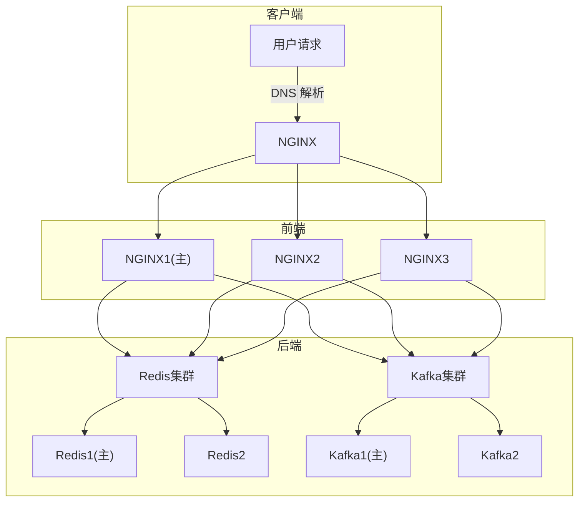
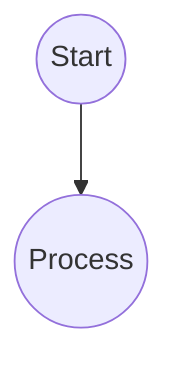
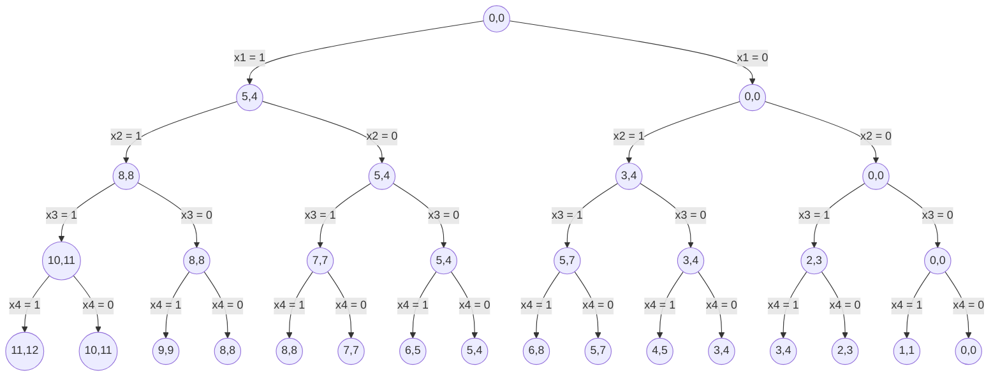

```
graph TD
    subgraph 客户端
	    A[用户请求] -->|"DNS 解析"| B["NGINX"]
    end

    subgraph 前端
	    B --> C["NGINX1(主)"]
	    B --> D["NGINX2"]
	    B --> E["NGINX3"]
    end

    subgraph 后端
	    C --> F["Redis集群"]
	    D --> F["Redis集群"]
	    E --> F["Redis集群"]
	    F --> G["Redis1(主)"]
	    F --> H["Redis2"]
	
	    C --> I["Kafka集群"]
	    D --> I["Kafka集群"]
	    E --> I["Kafka集群"]
	    
	    I --> J["Kafka1(主)"]
	    I --> K["Kafka2"]
    end
```



```
graph TD
    A[(0,0)] -->|选物品1| B[(2,3)]
    A -->|不选物品1| C[(0,0)]
    B -->|选物品2| D[(5,7)]
    B -->|不选物品2| E[(2,3)]
    C -->|选物品2| F[(3,4)]
    C -->|不选物品2| G[(0,0)]
    D -->|选物品3| H[(9,14)]
    D -->|不选物品3| I[(5,7)]
    E -->|选物品3| J[(6,10)]
    E -->|不选物品3| K[(2,3)]
    F -->|选物品3| L[(7,11)]
    F -->|不选物品3| M[(3,4)]
    G -->|选物品3| N[(4,7)]
    G -->|不选物品3| O[(0,0)]

```


```
graph TD
    A((Start)) --> B((Process))

```







