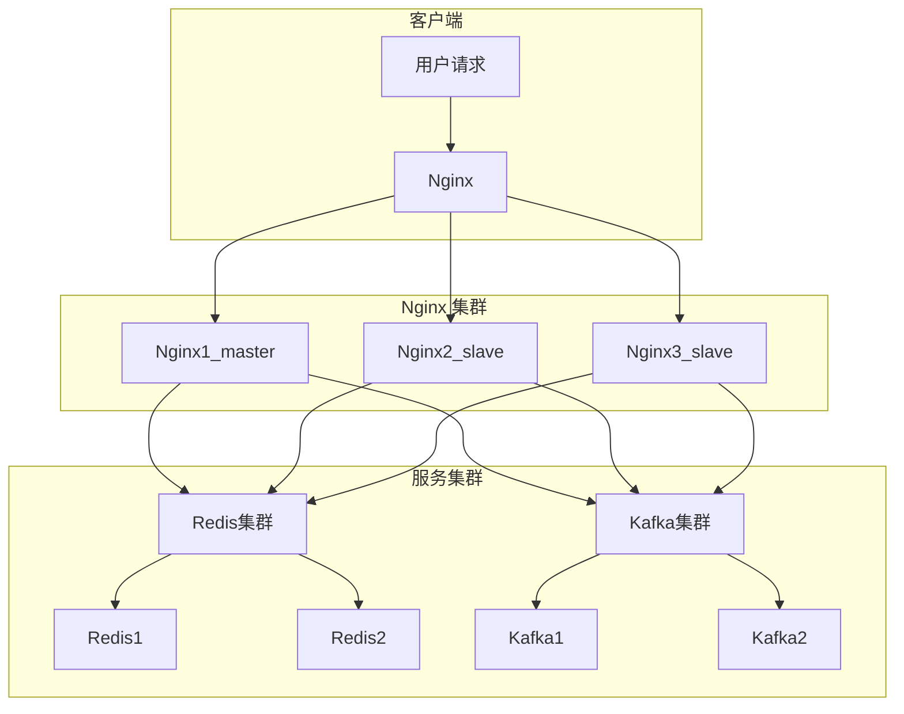

# 一、理论

### 1. 导图：[Map：Nginx](Map：Nginx.xmind)

---


### 2. Nginx 概述

Nginx 是一款开源的、高性能的 HTTP 服务器，我们常使用 Nginx 作为负载均衡服务器或反向代理服务器。

---


### 3. Nginx 最佳实战

1. ==主从==：
	1. Nginx **无主从概念**，每个 Nginx 都是独立的单体实例，我们需要分别配置其配置文件
	2. <font color="#00b0f0">Nginx 核心组件</font>：
			1. <font color="#7030a0">Master 进程</font>：
				1. 负责管理 Worker 进程，执行配置文件加载、信号管理（如启动、停止、重载等）
			2. <font color="#7030a0">Worker 进程</font>：
				1. 负责实际处理 HTTP 请求，如接收连接、解析请求、读取文件、反向代理、返回响应等
				2. Worker 进程可以有多个，以提高并发处理能力
2. ==高可用==：
	1. Nginx 本身**不具备自动故障转移能力**，高可用通常依赖以下方案：
	2. 部署多实例 Nginx
	3. 使用 Keepalived 负责检测 Nginx 节点健康状况，若检测到 Nginx 不健康，则将 VIP 漂移到其他健康 Nginx 节点，保证请求不中断。
3. ==最佳实战==：
	1. 关于 Nginx 的最佳实战是：<font color="#ff0000">别再用传统 Nginx 集群了！直接使用 K8s NGINX Ingress Controller 替代！</font>此处仅以单个 Nginx 为示例进行演示。
	2. 传统的 Nginx 集群的痛点：
		1. <font color="#00b0f0">配置复杂</font>：
			1. 每个 Nginx 节点都需要手动配置，修改配置后还需重启或重新加载，运维成本高
		2. <font color="#00b0f0">健康检查问题</font>：
			1. 在健康检查中，Nginx 若检测到某个节点故障，将停止向该节点发送请求。
			2. 但是Nginx 社区版没有主动健康检查，只有被动健康检查，被动健康检查无法预防故障，只能在请求失败后检测出问题，延迟较大。
		3. <font color="#00b0f0">扩展性不足</font>：
			1. 传统集群难以实现动态扩容，增加节点时不仅需要手动配置，还需要重新调整负载均衡
		4. <font color="#00b0f0">证书管理麻烦</font>
			1. 证书申请与部署需要手动操作，更新证书时还必须重新加载 Nginx
	3. 在容器化场景下，使用 K8s 的 Nginx Ingress Controller 完全可以代替传统的 NGINX 集群，并且它更适合容器化架构，其优点是：
		1. <font color="#00b0f0">简化配置</font>：
			1. 通过声明式 `Ingress` 资源定义访问规则，只需更新 YAML 文件即可修改规则，**无需重启或重新加载 Nginx**
		2. <font color="#00b0f0">高可用性</font>：
			1. 利用 K8s 的 Liveness/Readiness 探针主动检测 Nginx 的健康状况，不健康的实例会自动被移除出流量池，确保请求始终分发到健康节点
		3. <font color="#00b0f0">出色的扩展性</font>：
			1. 通过 K8s 可灵活调整 Nginx Ingress Controller 的 Pod 数量，结合水平自动扩展（HPA），轻松实现扩容；
			2. 同时，K8s支持多种插件和自定义扩展（如重写、限流、认证等），比传统 NGINX 更具灵活性
		4. <font color="#00b0f0">证书自动管理</font>：
			1. 配合 cert-manager，实现 HTTPS 证书的自动申请、管理与续期，彻底简化证书更新流程，无需人工干预

---


### 4. Nginx 相关命令

使用这些命令的前提是要先进入 Nginx 的安装目录：`cd /usr/local/nginx/sbin`
```
# 查看 nginx 版本号
./nginx -v

# 查看 nginx 状态
ps -ef|grep nginx

# 启动 nginx
./nginx

# 停止 nginx
./nginx -s stop

# 重新加载 nginx
./nginx -s reload
```

---


### 5. Nginx 配置文件研究

Nginx 配置文件的位置：`/usr/local/nginx/conf/nginx.conf`
```
# --------------------------------- 全局块 -------------------------------------
user  nobody;                                          # 设置 Worker 进程运行的用户

worker_processes  1;                                   # 设置 Worker 进程的数量，建议与 CPU 核心数一致

error_log  logs/error.log error;                       # 记录错误日志，级别是 error

pid        logs/nginx.pid;                             # 存储 master 进程的 ID 的文件


# -------------------------------- events 块 ------------------------------------
events {
    worker_connections  1024;                          # 每个 worker 进程最大并发连接数（根据系统优化）
}


# --------------------------------- http 块 --------------------------------------
# 被反向代理的服务器，同时设置了负载均衡
upstream myserver {                                     
    server 192.168.29.134:8080 weight=4;
    server 192.168.29.134:8081 weight=2;
}


# 将 HTTP 请求（端口 80）重定向到 HTTPS（端口 443）
server {
    listen 80;                                          # 监听端口 80（IPv4）
    listen [::]:80;                                     # 监听端口 80（IPv6）
    server_name 192.168.17.129;                         # 代理服务器 IP（Nginx 服务器 IP）
    return 301 https://$host$request_uri;               # HTTP -> HTTPS
}


# 监听 HTTPS（端口 443）
server {
    listen 443 ssl;                                     # 启用 SSL 支持，监听端口 443（IPv4）
    listen [::]:443 ssl;                                # 启用 SSL 支持，监听端口 443（IPv6）
    server_name 192.168.17.129;                         # 代理服务器 IP（Nginx 服务器 IP）
 
    ssl_certificate /etc/nginx/ssl/example.com.crt;     # 指定 HTTPS 证书文件
    ssl_certificate_key /etc/nginx/ssl/example.com.key; # 指定 HTTPS 证书私钥文件

    ssl_protocols TLSv1.2 TLSv1.3;                      # 启用 TLS 协议
    
    ssl_ciphers 'TLS_AES_128_GCM_SHA256:TLS_AES_256_GCM_SHA384:ECDHE-ECDSA-AES128-GCM-SHA256:ECDHE-RSA-AES128-GCM-SHA256';                                 # 推荐的加密套件
    
    ssl_prefer_server_ciphers on;                       # 强制使用服务器的加密套件

    ssl_session_cache shared:SSL:10m;                   # SSL 会话缓存大小，这里是 10 MB
    ssl_session_timeout 1d;                             # 会话超时时间，推荐 10m ~ 1d
    ssl_stapling on;                                    # 启用 OCSP stapling
    ssl_stapling_verify on;                             # 启用 OCSP stapling 验证

    location / {
        proxy_pass http://myserver; 
    }
}

```
1. `user`：
	1. 设置 `Worker` 进程运行的用户，常见选择为：
	2. <font color="#00b0f0">nobody</font>：
		1. 低权限用户，通常用于运行不需要访问敏感系统资源的服务
	3. <font color="#00b0f0">nginx（自定义用户）</font>：
		1. 通常情况下，我们会创建一个 nginx 用户，授予其一定权限，在 Master 进程上使用 root ，在 worker 进程上使用 nginx
2. `worker_processes`：
	1. 指定了 Nginx 的 Worker 进程数量，建议设置为主机 CPU 的核心数，常见值有：
	2. <font color="#00b0f0">auto</font>：
		1. 让 Nginx 自动检测 CPU 核心数（Nginx 1.11.3+ 支持）
	3. <font color="#00b0f0">int（自定义数量）</font>：
		1. 与主机 CPU 核心数一致
3. `error_log`：
	1. 记录错误的日志，可选日志级别有：
	2. <font color="#00b0f0">error</font>
	3. <font color="#00b0f0">notice</font>
	4. <font color="#00b0f0">info</font>
4. `server_name`：
	1. 指定当前 Nginx 主机的**域名或 IP**
	2. 在这个配置中，你也可以有多个值，多个值之间用空格隔开

> [!NOTE] 注意事项
> 1. 在实际开发中，避免将 IP 硬编码在配置文件中，建议通过 BIND DNS 使用域名解析的方式进行管理。
> 2. 在监听 HTTPS 端口时，尽管配置中使用的是 `ssl` 参数来启用加密，但实际上开启的是 TLS 支持。这是由于历史原因遗留下来的命名习惯

---

### 6. Nginx 负载均衡策略

==1.轮询（默认）==
每个请求按时间顺序逐一分配到不同的后端服务器，如果某台服务器挂掉，能自动剔除。


2.==weight==
weight 代表权重，默认权重为 1，权重越高被分配的客户端越多
```
upstream myserver {
    server 192.168.29.134:8080 weight=4;
    server 192.168.29.134:8081 weight=2;
}
```


==3.ip_hash==
每个请求按访问 ip 的 hash 结果分配，这样每个访客固定访问一个后端服务器
```
upstream myserver {
	ip_hash;
    server 192.168.29.134:8080;
    server 192.168.29.134:8081;
}
```


==4.fair==
按后端服务器的响应时间来分配请求，响应时间短的优先分配
```
upstream myserver {
    server 192.168.29.134:8080;
    server 192.168.29.134:8081;
    fair;
}
```

---


# 二、实操

### 1. 安装并启用 Nginx
以下是基于 `Ubuntu` 系统安装并启用 `Nginx` 步骤：
```
# 1. 安装 Nginx
sudo apt install nginx


# 2. 启动 Nginx 服务
sudo systemctl start nginx


# 3. 设置 Nginx 开机自启动
sudo systemctl enable nginx


# 4. 查看 Nginx 状态
sudo systemctl status nginx


# 5. 开放 Nginx 端口（默认80，可按需求开发其他端口，如443等）
sudo ufw allow 'Nginx HTTP'


# 6. 重新加载防火墙规则以使其生效
sudo ufw reload


# 7. 访问 Nginx
http://Nginx 服务器 IP
```

---


### 2. 配置 Nginx

根据上文 Nginx 配置文件研究，配置 Nginx

---


### 3. 重加载 Nginx
```
sudo systemctl reload nginx
```

---


##### 7.2.3. 进行 Ipv6 反向代理与负载均衡


---


### 8. Nginx 集群架构

#### 8.1. 集群架构图


---


# 三、补充

### 1. 正向代理


---


### 2. 反向代理


---


### 3. 负载均衡


---


### 4. 查看 CPU 核心数
```
# 1. Windows（需要使用 PowerShell）
Get-WmiObject -Class Win32_Processor | Select-Object NumberOfCores


# 2. Linux
nproc
```


