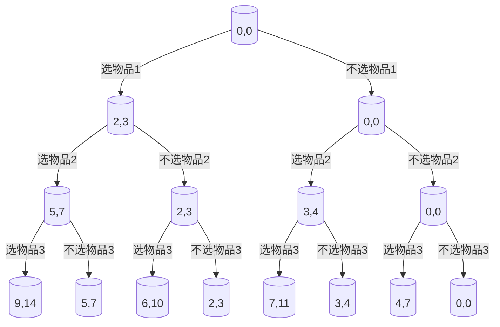
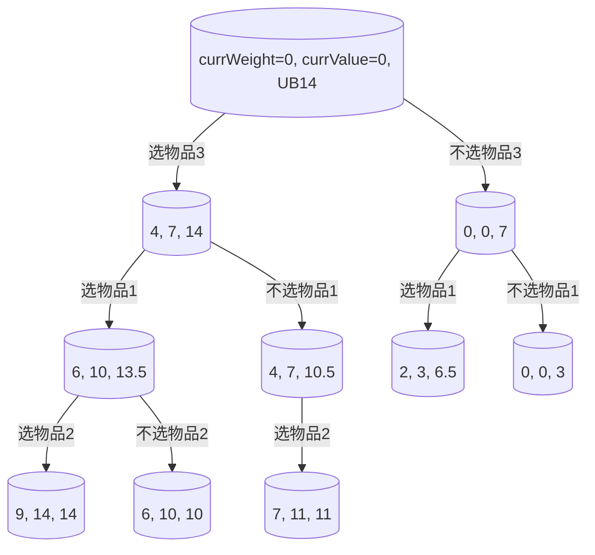
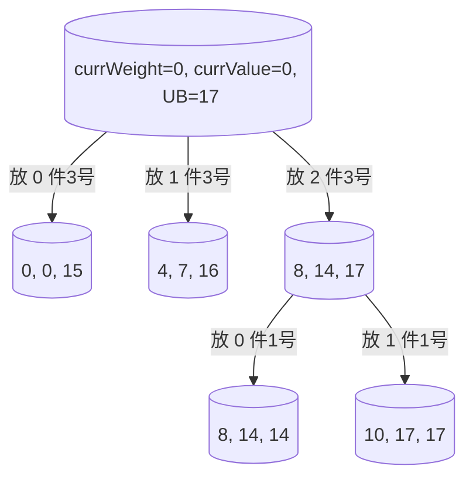

### 1. 背包问题

#### 1.1. 分数背包

##### 1.1.1. 题目描述
给定一个背包，其最大承重为 10，且有 3 件物品可供选择。每件物品的重量和价值如下：
- 物品 1：重量 2，价值 3
- 物品 2：重量 3，价值 4
- 物品 3：重量 4，价值 7
**物品可以进行分割，但不能无限取**，请求解能够放入背包的最大价值。

---


##### 1.1.2. 贪心法（代码）

==1.解题思路==
1. 首先计算每个物品的单位重量价值（即 `v/w`），并根据该比值将物品**按从高到低的顺序排序**。这是因为单位价值越高的物品，在有限的背包容量中越“划算”，优先选择可以最大化总价值。
2. 接着，从单位价值最高的物品开始，**依次尽可能多地放入背包**。若当前物品还能全部装下，就全部取走；<font color="#ff0000">若背包容量不足，则只取其中的一部分（也就是“分数”）</font>，<font color="#ff0000">直到背包装满为止</font>（与 0/1 背包的区别就这一点，0/1 背包不能取其中的一部分，背包可能装不满）。


==2.代码示例==
```
#include <stdio.h>

int main() {
    int n = 3;                                       // 物品的数量
    int capacity = 10;                               // 背包的容量
    int weight[4] = {0, 2, 3, 4};                    // 物品的重量，下标从1开始
    int value[4]  = {0, 3, 4, 7};                    // 物品的价值，下标从1开始
    double ratio[4] = {0};                           // 用于存放物品的 价值/重量 比

    int i, j;

    for (i = 1; i <= n; i++) {                       // 计算每个物品的 价值/重量 比
        ratio[i] = (double)value[i] / weight[i];
    }


    for (i = 1; i <= n - 1; i++) {                   // 冒泡排序：按价值重量比 ratio 降序排列，同时交换 weight 和 value
        for (j = 1; j <= n - i; j++) {
            if (ratio[j] < ratio[j + 1]) {
                // 交换 ratio
                double tmpRatio = ratio[j];
                ratio[j] = ratio[j + 1];
                ratio[j + 1] = tmpRatio;

                // 交换 weight
                int tmpW = weight[j];
                weight[j] = weight[j + 1];
                weight[j + 1] = tmpW;

                // 交换 value
                int tmpV = value[j];
                value[j] = value[j + 1];
                value[j + 1] = tmpV;
            }
        }
    }

    double maxValue = 0.0;
    for (i = 1; i <= n && capacity > 0; i++) {    // 在物品未遍历完且背包仍有剩余容量的情况下，循环遍历已排序的物品列表
        if (weight[i] <= capacity) {              // 如果当前物品重量小于或等于背包神域容量，则完全放入该物品
            capacity -= weight[i];
            maxValue += value[i];
        } else {                                  // 如果当前物品重量大于背包剩余容量，则按比例放入该物品
            maxValue += ratio[i] * capacity;
            capacity = 0;
        }
    }

    printf("能够放入背包的最大价值 = %.2f\n", maxValue);
    return 0;
}
```

---


#### 1.2. 0/1 背包

##### 1.2.1. 题目描述

给定一个背包，其最大承重为 10，且有 3 件物品可供选择。每件物品的重量和价值如下：
- 物品 1：重量 2，价值 3
- 物品 2：重量 3，价值 4
- 物品 3：重量 4，价值 7
**每个物品只能取一次，且不能分割**，请求能够放入背包的最大价值。

---


##### 1.2.2. 贪心法

==1.解题思路==
1. 首先计算每个物品的单位重量价值（即 `v/w`），并根据该比值将物品**按从高到低的顺序排序**。这是因为单位价值越高的物品，在有限的背包容量中越“划算”，优先选择可以最大化总价值。
2. 接着，从单位价值最高的物品开始，**依次尽可能多地放入背包**。若当前物品还能全部装下，就全部取走；<font color="#ff0000">若背包容量不足，则找重量更小的物品</font>，<font color="#ff0000">背包可能装不满</font>（与分数背包的区别就这一点，分数背包可以取其中的一部分，背包要装满）

---


##### 1.2.3. 动态规划法（代码）

==1.解题思路==
根据当前背包容量判断是否可以放入第 `i` 个物品，分两种情况讨论：
1. <font color="#00b0f0">不能放</font>：
	1. 如果当前容量小于物品 `i` 的重量，说明放不下，直接继承「相同容量下、前一个物品」的最优解。
2. <font color="#00b0f0">可以放</font>：
	1. 如果当前容量足够放下物品 `i`，则需要判断是否“值得”放，对比下面两种选择，取最大值作为当前状态的最优解
	2. <font color="#7030a0">不放当前物品</font>：
		1. 直接继承「相同容量下、前一个物品」的最优解；
	3. <font color="#7030a0">放当前物品</font>：
		1. 考虑当前物品的价值 + 「剩余容量下、<font color="#ff0000">前一个物品</font>」的最优解
		2. 和完全背包的区别就仅仅在于（☆☆☆）：
			1. **0/1 背包中每种物品只能取一次**，一旦选择就不能再取，因此状态转移时需要参考「**剩余容量下，前一个物品**」的最优解；
			2. 而在**完全背包问题中，物品可以无限次取用**，所以只需考虑「**当前物品在剩余容量下**」的最优解即可。


==2.举例说明==
在分析问题时，我们通常会构造出一个如下的动态规划表。

以坐标 (1, 1) 为例，表示当前考虑第 1 个物品，背包容量为 1。由于物品的重量为 2，超过了当前背包容量，因此无法放入，只能继承「相同容量下、前一个物品」的最优解，即 (0, 1) 处的值。

例如 (2, 6)，表示当前考虑第 2 个物品，背包容量为 6，物品重量为 3。此时我们有两种选择：
- **不放该物品**：直接继承「相同容量下、前一个物品」的最优解，即 (1, 6)；
- **放入该物品**：当前物品价值为 4，放入后剩余容量为 3，此时我们还可以使用「剩余容量下、<font color="#ff0000">前一个物品</font>」的最优解，即 (1, 3)。因此，总价值为 4 + (1, 3)。
最终在这两种选择中取最大值，作为状态 (2, 6) 的最优解。

| 物品\容量      | 0   | 1   | 2   | 3   | 4   | 5   | 6   | 7   | 8   | 9   | 10  |
| ---------- | --- | --- | --- | --- | --- | --- | --- | --- | --- | --- | --- |
| **0**      | 0   | 0   | 0   | 0   | 0   | 0   | 0   | 0   | 0   | 0   | 0   |
| **1（2,3）** | 0   | 0   | 3   | 3   | 3   | 3   | 3   | 3   | 3   | 3   | 3   |
| **2（3,4）** | 0   | 0   | 3   | 4   | 4   | 7   | 7   | 7   | 7   | 7   | 7   |
| **3（4,7）** | 0   | 0   | 3   | 4   | 7   | 7   | 10  | 11  | 11  | 11  | 11  |


==3.代码示例==
```
#include <stdio.h>

int max(int a, int b) {                // 工具函数，取两个数中的最大值
    return a > b ? a : b;
}

int main() {
    int n = 3;                        // 物品个数
    int capacity = 10;                // 背包容量
    int weight[4] = {0, 2, 3, 4};     // 物品重量，下标从1开始
    int value[4]  = {0, 3, 4, 7};     // 物品价值，下标从1开始

    int a[4][11] = {0};               // 动态规划数组 a[i][j] 表示在考虑前 i 个物品时，背包容量为 j 时的最大价值。（相当于我们列的表格的每一行，11 是因为虽然最大容量是 10，但容量是从 0 开始的，所以需要 11 个容量点）

    for (int i = 1; i <= n; ++i) {               // 遍历每一个物品
        for (int j = 0; j <= capacity; ++j) {    // 遍历每一种容量
            if (j < weight[i]) {                 // 必然不选当前物品的情况
                a[i][j] = a[i - 1][j];
            } else {                             // 可能选当前物品的情况
                a[i][j] = max(a[i - 1][j], a[i-1][j - weight[i]] + value[i]); // a[i-1]是核心
            }
        }
    }

    printf("max = %d\n", a[n][capacity]);
    return 0;
}
```

---


##### 1.2.4. 回溯法（代码）

==1.解题思路==
回溯法的核心思想是使用 **“深度优先搜索（DFS）+ 剪枝函数”** 构建决策树：
1. <font color="#00b0f0">深度优先搜索</font>：
	1. 一路“选选选”到底，选不动了就尝试更新一次最大价值（`maxv`）和最优选择记录（`x[]`）。然后回溯到上一个分叉，改走“不选”的那条路，继续深入，再回溯……直到走遍了从根节点出发的每一条路径。
2. <font color="#00b0f0">剪枝函数</font>：
	1. 为了避免无效或冗余的路径搜索，引入剪枝函数进行预判和提前终止

下图展示的是仅采用深度优先搜索（DFS）但未进行剪枝处理所生成的表达图：


在原图的基础上，稍微增加一点注解，方便理解：


==2.代码示例==
```
#include <stdio.h>

// 1. 定义变量
int n = 3;                                       // 物品数量
int capacity = 10;                               // 背包容量
int weight[4] = {0, 2, 3, 4};                    // 物品重量（下标从1开始）
int value[4]  = {0, 3, 4, 7};                    // 物品价值（洗标从1开始）

int maxValue = 0;                                // 用来存放最大价值（不断赋值更新，直到找到最大价值）
int currSelect[4] = {0};                         // 当前选择路径
int bestSelect[4] = {0};                         // 最优选择路径（不断赋值更新，直到找到最优选择路径）


// 2. 深度优先搜索函数
void backtrack(int i, int currWeight, int currValue) { // 核心函数，做深度优先遍历，逐个尝试选还是不选物品
    if (i > n) {                                       // 如果已经考虑完所有物品了
        if (currValue > maxValue) {                    // 看看当前选择的物品总价值 currValue 是否大于之前记录的最大价值 maxValue，如果大，则更新 maxValue 和 bestSelect
            maxValue = currValue;
            for (int k = 1; k <= n; k++) {
                bestSelect[k] = currSelect[k];
            }
        }
        return;
    }

    if (currWeight + weight[i] <= capacity) {          // 如果没有考虑所有物品，现在考虑第 i 个物品选不选，如果 已选重量 + 本物品重量 不超过背包最大容量，则选择当前物品，并递归调用 backtrack 方法，考虑下一个物品
    
        currSelect[i] = 1;
        backtrack(i + 1, currWeight + weight[i], currValue + value[i]);
    }

    currSelect[i] = 0;                                 // 回溯法的关键一步：即便尝试过“选当前物品”，并进行了一系列递归，当递归完成后，也必须回到这一层继续探索“不选当前物品”的可能
    backtrack(i + 1, currWeight, currValue);
}


// 3. 主方法
int main() {
    backtrack(1, 0, 0);                                // 从第一个物品开始考虑
    printf("能够放入背包的最大价值 = %d\n", maxValue);
    printf("选择的物品有：");
    for (int i = 1; i <= n; i++) {
        if (bestSelect[i]) {
            printf("物品%d(重%d,值%d) ", i, weight[i], value[i]);
        }
    }
    printf("\n");
    return 0;
}


// 在贪心法中，由于我们是取完就行了，而且取的必然是最优解，所以直接使用capacity，即便改全局也没有事情，但是这个是不知道最优解，在找最优解，要循环很多次，所以我们引入一个currWeight，不通过改变capacity 的方式
```


---


##### 1.2.5. 分支限界法

==1.解题思路==
1. 首先计算每个物品的单位重量价值（即 `v/w`），并根据该比值将物品**按从高到低的顺序排序**。这是因为单位价值越高的物品，在有限的背包容量中越“划算”，优先选择可以最大化总价值。
2. 接着使用分支限界法构建决策树，分支限界法的核心思想是使用 **"广度优先搜索 + 限界函数"** 构建决策树：
	1. <font color="#00b0f0">广度优先搜索</font>：
		1. 不像回溯法，一路选选选，先考虑选的问题，再回溯考虑不选的问题，而是两者一起考虑，选此物品和不选此物品，一起深入，直到走遍了每一条节点
	2. <font color="#00b0f0">限界函数</font>：
		1. 在每一步选择时，计算当前路径下的上界，上界即本路径最大可能价值 = 当前价值 + 剩余容量能获得的最大价值
		2. 如果某个节点的上界 ≤ 当前已知的最优解（拿到的最高价值），就直接剪枝，不再深入（你最好的路劲还没我已经拿到的多，那我还走个狗屁啊）
3. 接着，从单位价值最高的物品开始，**依次尽可能多地放入背包**， **一个物品只能放一次**，如果某个节点的上界 ≤ 当前已知的最优解（最高的价值），就直接剪枝，不再深入。

> [!NOTE] 注意事项
> 1. 一般贪心法、分支限界法会根据单位重量价值为物品排序


==2.举例说明==
例如，我们可以先计算每个物品的单位价值（即价值与重量的比值）如下：
- 物品1：3 ÷ 2 = 1.5
- 物品2：4 ÷ 3 ≈ 1.33
- 物品3：7 ÷ 4 = 1.75

根据单位价值从高到低排序，结果为：物品3 → 物品1 → 物品2




在原图的基础上，稍微增加一点注解，方便理解：


---


#### 1.3. 完全背包

##### 1.3.1. 题目描述

给定一个背包，其最大承重为 10，且有 3 件物品可供选择。每件物品的重量和价值如下：
- 物品 1：重量 2，价值 3
- 物品 2：重量 3，价值 4
- 物品 3：重量 4，价值 7
**每个物品无限取，但不能分割**，请求能够放入背包的最大价值。

---


##### 1.3.2. 动态规划法（代码）

==1.解题思路==
根据当前背包容量判断是否可以放入第 `i` 个物品，分两种情况讨论：
1. <font color="#00b0f0">不能放</font>：
	1. 如果当前容量小于物品 `i` 的重量，说明放不下，直接继承「相同容量下、前一个物品」的最优解。
2. <font color="#00b0f0">可以放</font>：
	1. 如果当前容量足够放下物品 `i`，则需要判断是否“值得”放，对比下面两种选择，取最大值作为当前状态的最优解
	2. <font color="#7030a0">不放当前物品</font>：
		1. 直接继承「相同容量下、前一个物品」的最优解；
	3. <font color="#7030a0">放当前物品</font>：
		1. 考虑当前物品的价值 + 「剩余容量下、<font color="#ff0000">当前物品</font>」的最优解
		2. 和 0/1 背包的区别就仅仅在于（☆☆☆）：
			1. **0/1 背包中每种物品只能取一次**，一旦选择就不能再取，因此状态转移时需要参考「**剩余容量下，前一个物品**」的最优解；
			2. 而在**完全背包问题中，物品可以无限次取用**，所以只需考虑「**当前物品在剩余容量下**」的最优解即可。


==2.举例说明==
在分析问题时，我们通常会构造出一个如下的动态规划表。

以坐标 (1, 1) 为例，表示当前考虑第 1 个物品，背包容量为 1。由于物品的重量为 2，超过了当前背包容量，因此无法放入，只能继承「相同容量下、前一个物品」的最优解，即 (0, 1) 处的值。

例如 (2, 6)，表示当前考虑第 2 个物品，背包容量为 6，物品重量为 3。此时我们有两种选择：
- **不放该物品**：直接继承「相同容量下、前一个物品」的最优解，即 (1, 6)；
- **放入该物品**：当前物品价值为 4，放入后剩余容量为 3，此时我们还可以使用「剩余容量下、<font color="#ff0000">当前物品</font>」的最优解，即 (2, 3)。因此，总价值为 4 + (2,3)。
最终在这两种选择中取最大值，作为状态 (2, 6) 的最优解。

| 物品\容量      | 0   | 1   | 2   | 3   | 4   | 5   | 6   | 7   | 8   | 9   | 10  |
| ---------- | --- | --- | --- | --- | --- | --- | --- | --- | --- | --- | --- |
| **0**      | 0   | 0   | 0   | 0   | 0   | 0   | 0   | 0   | 0   | 0   | 0   |
| **1（2,3）** | 0   | 0   | 3   | 3   | 6   | 6   | 9   | 9   | 12  | 12  | 15  |
| **2（3,4）** | 0   | 0   | 3   | 4   | 6   | 7   | 9   | 10  | 12  | 13  | 15  |
| **3（4,7）** | 0   | 0   | 3   | 4   | 7   | 7   | 10  | 11  | 14  | 14  | 17  |


==3.代码示例==
```
#include <stdio.h>

int max(int a, int b) {                // 工具函数，取两个数中的最大值
    return a > b ? a : b;
}

int main() {
    int n = 3;                        // 物品个数
    int capacity = 10;                // 背包容量
    int weight[4] = {0, 2, 3, 4};     // 物品重量，下标从1开始
    int value[4]  = {0, 3, 4, 7};     // 物品价值，下标从1开始

    int a[4][11] = {0};               // 动态规划数组 a[i][j] 表示在考虑前 i 个物品时，背包容量为 j 时的最大价值。（相当于我们列的表格的每一行，11 是因为虽然最大容量是 10，但容量是从 0 开始的，所以需要 11 个容量点）

    for (int i = 1; i <= n; ++i) {               // 遍历每一个物品
        for (int j = 0; j <= capacity; ++j) {    // 遍历每一种容量
            if (j < weight[i]) {                 // 必然不选当前物品的情况
                a[i][j] = a[i - 1][j];
            } else {                             // 可能选当前物品的情况
                a[i][j] = max(a[i - 1][j], a[i][j - weight[i]] + value[i]);   // a[i] 是核心
            }
        }
    }

    printf("max = %d\n", a[n][capacity]);
    return 0;
}
```

---


##### 1.3.3. 分支限界法

==1.解题思路==
1. 首先计算每个物品的单位重量价值（即 `v/w`），并根据该比值将物品**按从高到低的顺序排序**。这是因为单位价值越高的物品，在有限的背包容量中越“划算”，优先选择可以最大化总价值。
2. 接着使用分支限界法构建决策树，分支限界法的核心思想是使用 **"广度优先搜索 + 限界函数"** 构建决策树：
	1. <font color="#00b0f0">广度优先搜索</font>：
		1. 不像回溯法，一路选选选，先考虑选的问题，再回溯考虑不选的问题，而是两者一起考虑，选此物品和不选此物品，一起深入，直到走遍了每一条节点
	2. <font color="#00b0f0">限界函数</font>：
		1. 在每一步选择时，计算当前路径下的上界，上界即本路径最大可能价值 = 当前价值 + 剩余容量能获得的最大价值
		2. 如果某个节点的上界 ≤ 当前已知的最优解（拿到的最高价值），就直接剪枝，不再深入（你最好的路劲还没我已经拿到的多，那我还走个狗屁啊）
3. 接着，从单位价值最高的物品开始，**依次尽可能多地放入背包**，**一个物品可能放多次**， 如果某个节点的上界 ≤ 当前已知的最优解（最高的价值），就直接剪枝，不再深入。


==2.举例说明==
例如，我们可以先计算每个物品的单位价值（即价值与重量的比值）如下：
- 物品1：3 ÷ 2 = 1.5
- 物品2：4 ÷ 3 ≈ 1.33
- 物品3：7 ÷ 4 = 1.75


根据单位价值从高到低排序，结果为：物品3 → 物品1 → 物品2



---

### 2. 矩阵链乘法

#### 2.1. 题目描述

计算矩阵连乘积 A1A2A3A4A5 的最佳求积顺序（即 数乘次数最少的计算次序），各矩阵的维数分别是：

| 矩阵     | A1    | A2    | A3    | A4    | A5    |
| ------ | ----- | ----- | ----- | ----- | ----- |
| **维数** | 2 X 3 | 3 X 6 | 6 X 4 | 4 X 2 | 2 X 7 |

---


#### 2.2. 动态规划法

==1.解题思路==
根据**动态规划**的转移公式，填写 `m[i][j]` 表格。该表格的含义是：从矩阵 `Aᵢ` 到 `Aⱼ` 连乘时，所需的**最少标量乘法次数**。


下表展示了一个典型的 `m[i][j]` 表：

| i \ j | 1                              | 2                                   | 3                                                | 4                                                   | 5                                                   |
| ----- | ------------------------------ | ----------------------------------- | ------------------------------------------------ | --------------------------------------------------- | --------------------------------------------------- |
| 1     | <font color="#00b0f0">0</font> | <font color="#7030a0">p₀p₁p₂</font> | <font color="#00b050">下 + 左 + p₀<p₁、p₂>p₃</font> | <font color="#de7802">下 + 左 + p₀<p₁、p₂、p₃>p₄</font> | 下 + 左 + p₀<p₁、p₂、p₃、p₄>p₅                           |
| 2     |                                | <font color="#00b0f0">0</font>      | <font color="#7030a0">p₁p₂p₃</font>              | <font color="#00b050">下 + 左 + p₁<p₂、p₃>p₄</font>    | <font color="#de7802">下 + 左 + p₁<p₂、p₃、p₄>p₅</font> |
| 3     |                                |                                     | <font color="#00b0f0">0</font>                   | <font color="#7030a0">p₂p₃p₄</font>                 | <font color="#00b050">下 + 左 + p₂<p₃、p₄>p₅</font>    |
| 4     |                                |                                     |                                                  | <font color="#00b0f0">0</font>                      | <font color="#7030a0">p₃p₄p₅</font>                 |
| 5     |                                |                                     |                                                  |                                                     | <font color="#00b0f0">0</font>                      |


接下来，依据每个区间的最优断开位置 `k`，我们填充另一个表格 `s[i][j]`，用于记录最优括号化方式：

| i \ j | 1   | 2   | 3   | 4   | 5   |
| ----- | --- | --- | --- | --- | --- |
| **1** | 0   | 1   | 2   | 2   | 4   |
| **2** |     | 0   | 2   | 2   | 2   |
| **3** |     |     | 0   | 3   | 4   |
| **4** |     |     |     | 0   | 4   |
| **5** |     |     |     |     | 0   |

最终，通过查找 `m[1][n]`，即可得到整个矩阵链乘法的**最少计算次数**。


==2.举例说明==


---


### 3. 循环赛问题

#### 3.1. 题目描述

设有n=2^k个运动员要进行循环赛，现设计一个满足以下要求的比赛日程表： 
1. 每个选手必须与其他n-1名选手比赛各一次； 
2. 每个选手一天至多只能赛一次；
3. 循环赛要在最短时间内完成。

问题如下：
（1）如果n=2^k，循环赛最少需要进行几天
（2）当n=2^3=8时，请画出循环赛日程表。
（3）时间复杂度是多少。

---


#### 3.2. 分治法

==1.问题(1)==
循环赛至少要进行 2^k -1 天（结论，记住就行）

==2.问题(2)==

| 选手\天数 | 1   | 2   | 3   | 4   | 5   | 6   | 7   |
| ----- | --- | --- | --- | --- | --- | --- | --- |
| 1     | 2   | 3   | 4   | 5   | 6   | 7   | 8   |
| 2     | 1   | 4   | 3   | 6   | 5   | 8   | 7   |
| 3     | 4   | 1   | 2   | 7   | 8   | 5   | 6   |
| 4     | 3   | 2   | 1   | 8   | 7   | 6   | 5   |
| 5     | 6   | 7   | 8   | 1   | 2   | 3   | 4   |
| 6     | 5   | 8   | 7   | 2   | 1   | 4   | 3   |
| 7     | 8   | 5   | 6   | 3   | 4   | 1   | 2   |
| 8     | 7   | 6   | 5   | 4   | 3   | 2   | 1   |


==3.问题(3)==

时间复杂度为：O(n^2)

---


### 4. N 皇后（代码）

```
#include <stdio.h>
#include <stdlib.h>

#define N 4                  // 4 皇后问题

int solutions = 0;           // 解的总数

int queen[5];            // 皇后位置数组，queen[1]=3 表示第 1 行皇后放在了第三列（N + 1 的原因是，虽然皇后是从 1 开始，但是还有一个0）


void printSolution() {       // 打印当前解的棋盘
    printf("解 %d:\n", solutions);
    for (int row = 1; row <= N; row++) {
        for (int col = 1; col <= N; col++) {
            printf(queen[row] == col ? "Q " : ". ");
        }
        printf("\n");
    }
    printf("\n");
}


int isSafe(int row, int col) {          // 检查皇后放在这里是否安全
    for (int i = 1; i < row; i++) {
        if (queen[i] == col || abs(i - row) == abs(queen[i] - col)) { // 核心判断代码，记住
            return 0;
        }
    }
    return 1;
}


void backtrack(int row) {                     // 回溯核心函数
    if (row > N) {                            // 如果已经放满了 N 行，找到解了
        solutions++;
        printSolution();                      // 打印当前解的棋盘
        return;
    }

    for (int col = 1; col <= N; col++) {      // 如果还没有放满，尝试在本行的每一列中寻找合法位置
        if (isSafe(row, col)) {
			queen[row] = col;                 // 放置皇后
            backtrack(row + 1);               // 递归下一行
        }
    }
}


int main() {
    backtrack(1);                             // 从第 1 行开始放皇后
    printf("4 皇后问题共有 %d 种解法。\n", solutions);
    return 0;
}
```

---


### 5. 最长公共子序列

#### 5.1. 题目描述

以 CBDABCC 和 CABACC 为例，计算出一个最长公共子序列

---


#### 5.2. 动态规划法


1. 分治法、贪心法、动态规划法（画表）、回溯法（画树）、分支限界法（排序、画树）
2. 有穷性、确定性、可行性、输入、输出
3. 问题规模、输入序列、算法本身
4. 1    logn    n    nlogn   n^2    n^3    2^n    n!    n^n
5. 
6. 队列式分支限界法、优先队列式分支限界法
7. 传递性、加法、乘法
8. 
9. 将一个问题分解为多个规模较小、相互独立、类型相同的子问题，递归地求解这些问题，然后将子问题的解组合成原问题
10. 规模较小、相互独立、类型相同
11. 
12. n-1    表格画法   O(n^2)
13. 最优子结构，贪心选择性质
14. θ（nlogn）
15. 
16. 
17. 通过减少乘法次数来减少子问题的个数
18. 
19. 
20. 最优子结构，重叠子问题，无后效性
21. 动态规划法，表格怎么画？
22. 动态规划法，表格怎么画？
23. 贪心法，画表格
24. θ（nlogn）
25. θ（nlogn）
26. 
27. 
28. 
29. 
30. 
31. 
32. 
33. 
34. 
35. 
36. 
37. 所求问题的整体最优解可以通过一系列局部最优解来达到
38. 深度优先搜索 + 剪枝函数
39. 问题的最优解包含其子问题的最优解
40. 子集树、排列树
41. 子集树
42. 排列树
43. 分数：贪心，01 除了贪心都可以，完全动态规划、分支限界
44. 排列树
45. 时间复杂性、空间复杂性
46. 算法中元运算的执行次数
47. 子问题的个数    子问题的规模     将规模为 n 的问题分解为子问题以及组合相应的子问题的解所需要的时间
48. 分解、递归、组合
49. 蛮力法、辗转相除法


背代码其实就贪心法（如果没有遍历完且还有容量，考虑能不能直接放下）、动态规划法（直接逐行逐列遍历）、回溯法（如果遍历完比较价值，如果没遍历完考虑能不能放下）求解背包问题，还有个回溯法求 n 皇后

# 背诵

1. 五大方法，一般怎么解决问题？
2. 算法的五大基本性质
3. 影响时间复杂度的因素有
4. 常见时间复杂度
5. 三种渐进符号，图像又该怎么画
6. 常见两种分支限界法为
7. 渐进符号二级结论
8. Hanoi 塔
9. 分治法的思想
10. 分治法的性质
11. 主方法求时间复杂度
12. 循环赛问题，需要几天，表格怎么画，分治法公式是，时间复杂度是
13. 贪心法的性质
14. 快速排序问题，如何做，时间复杂度
15. Strass 矩阵相乘问题，分治法公式是，时间复杂度是
16. 大整数相乘问题，分治法公式是，时间复杂度是
17. 上面两个问题是如何优化的
18. 二分查找问题，如何做，时间复杂度
19. 归并排序问题，如何做，时间复杂度
20. 动态规划法的性质
21. **矩阵链乘法问题，如何做（1-n）**
22. **最长公共子序列问题，如何做（0-末）**
23. **单源最短路径问题，如何做（2-终点集）**
24. **分数背包问题，如何做，时间复杂度，**<font color="#ff0000">代码呢</font>
25. **活动会场安排问题，如何做，时间复杂度**
26. **最优装载问题，如何做**
27. **图的 m 着色问题，如何做**
28. **移动货郎问题，如何做**
29. **0/1 背包问题，如何做**，<font color="#ff0000">代码呢</font>
30. **n 皇后问题，如何做**，<font color="#ff0000">代码呢</font>
31. 蒙特卡罗方法，如何做
32. **最小生成树问题，**如何做
33. **哈夫曼编码问题，**如何做
34. **完全背包问题，**如何做，<font color="#ff0000">代码呢</font>
35. **K-NN 如何解题**
36. **K-Means 如何解题**
37. 贪心选择性质是什么
38. 回溯法是什么？
39. 最优子结构性质是什么？
40. 回溯法的解空间结构一般分为？
41. 0/1 背包的解空间结构为？
42. n 皇后的解空间结构为？
43. 背包问题可以由哪些方法求解？
44. 旅行售货员的解空间结构为？
45. 算法的复杂性分为
46. 算法的时间复杂性指的是
47. 主方法中的几个符号分别的含义是
48. 分治法的基本步骤
49. 求最大公约数一般会使用什么方法
50. 记住：霍夫曼编码和海明码是用来压缩和纠错的